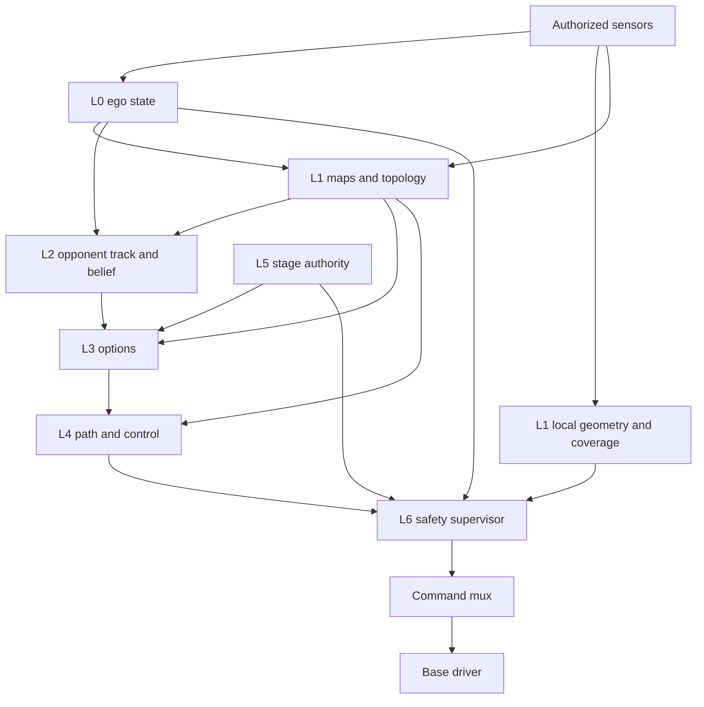
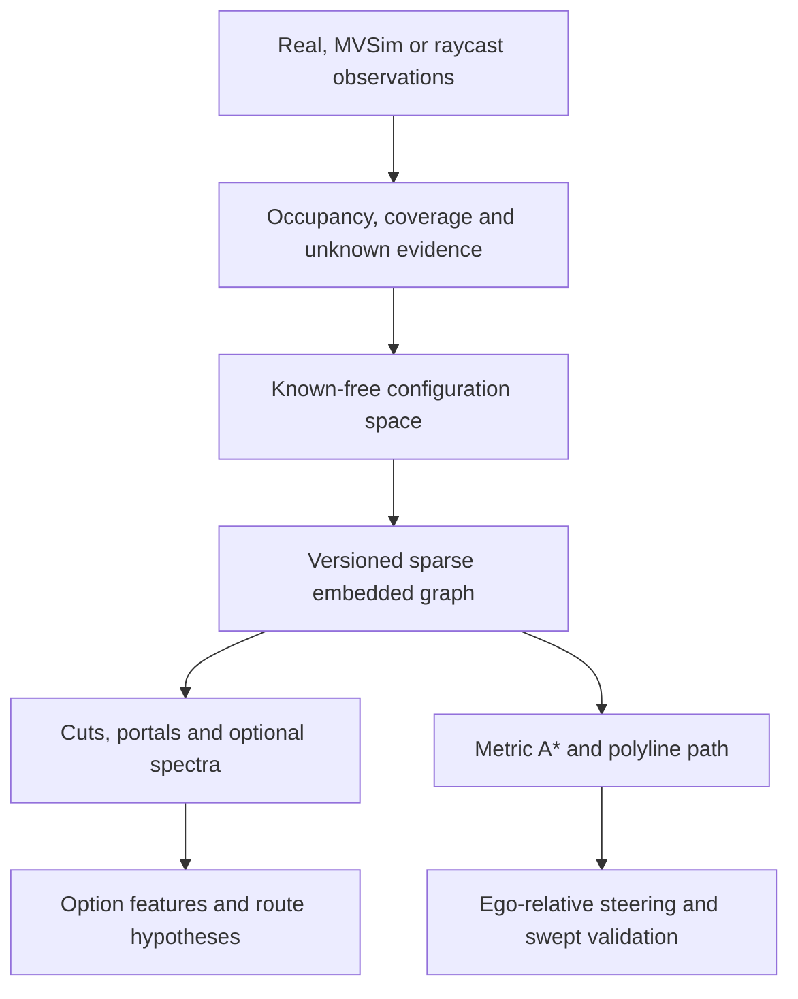

# HSL26 — Final Engineering Architecture

**Revision:** 2.2 · **Date:** 2026-09-24 · **Language:** English  
**Status:** normative design baseline; implementation and hardware acceptance remain separate.  
**Companion:** `HSL26_TECHNICAL_SPECIFICATION.md`, revision 2.2 (abbreviated **TS** below).

## Contents

1. Scope, evidence and precedence
2. Independent audit decisions
3. Competition requirements and unresolved inputs
4. Layers, dependencies and command authority
5. Frames, clocks and coherent contracts
6. Acquisition, mapping and topology
7. Opponent model, registration and belief
8. Competition predicates and stage lifecycle
9. Planning, options and local control
10. Safety admission and failure containment
11. Simulation, calibration and model artifacts
12. Offline learning and bounded evolution
13. Repository alignment and release workflow
14. Acceptance gates and residual risks
15. Traceability and sources

## 1. Scope, evidence and precedence

The system controls one differential-drive TurtleBot2 in either role of the HSL26 pursuit–evasion competition. The delivery is CPU-only, without neural networks, with the same decision and control core in simulation and on hardware. The chosen hierarchy is deterministic options/FSM → non-negative-cost A* → regulated pursuit or bounded arc evaluation → independent command admission. Statistical tactical learning is optional and offline.

This revision independently reviews the five supplied files: the previous `HSL26_FINAL_ARCHITECTURE.md`, `HSL26_REPO_STRUCTURE.md`, `HSL26_SESSION_CHANGELOG.md`, `rev1.md`, and the six-page official `Регламент HSL26 - v06092026(1).pdf`. Claims concerning other documents quoted by those inputs were not independently verified because those documents and the live repository were not supplied. References to nonexistent equation numbers, appendices and monograph theorems have therefore been replaced by explicit definitions here or in TS.

**Precedence:** official rulebook and documented organizer clarifications → this architecture → TS contracts → repository layout report → implementation notes and rev1. Architecture and TS form one baseline: any future conflict requires a versioned correction and tests, not a developer's silent interpretation. The changelog is evidence of reported work, not proof that algorithms, ROS launch wiring or hardware behavior have passed acceptance.

The supplied changelog reports package/interface scaffolding, configuration and Docker corrections, and static checks. It explicitly reports that perception, planning, safety, match runtime, simulation wiring and integration tests remain unfinished. This revision does not claim to have executed or modified that repository. New classes, messages and tools below are **required implementation contracts**, not assertions that files already exist.

## 2. Independent audit decisions

| ID | Finding in the supplied drafts | Decision and reason |
|---|---|---|
| A01 | “Freeze means the robot must not move.” | The rule prohibits crossing the start boundary. HSL26 deliberately adopts zero motion during freeze; this is a stricter engineering policy. |
| A02 | “MID-360 is the single authorized sensor.” | The rule calls it the main data source and prohibits extra sensors. Use supplied base odometry and supplied IMU only after inventory confirmation; do not assume an additional NUC IMU exists. |
| A03 | Unknown competition coordinates become permissible when moved to YAML. | False. R9 concerns information, not file extensions. All competition-specific metadata needs permitted provenance. |
| A04 | Watchdog and mux both publish `/commands/velocity`. | Eliminate this race. Only the mux publishes the physical driver input. Independent watchdog publishes zero only on a dedicated, highest-priority mux input. |
| A05 | Watchdog shares the supervisor process and prevents its failure. | A timer in a blocked/dead process cannot detect that process's failure. Use a separate process plus a verified driver timeout. |
| A06 | Closest-obstacle `Float64` is sufficient for safety. | It lacks time, frame, coverage and geometry. Use bounded local geometry plus observed-free coverage; evaluate the proposed and stopping swept footprint. |
| A07 | Fast safety path removes the structural background. | Unsafe: that would remove walls. Safety includes all relevant returns, static structure and unknown coverage. Background suppression belongs only to object recognition. |
| A08 | Clamp linear speed while leaving angular speed unchanged. | This changes curvature; the previously checked trajectory no longer applies. Recheck every transformed command, including pure rotation. |
| A09 | The low-yaw-rate integrator is exact without a sinc factor. | Use the continuous sinc formula in §6.1. The draft midpoint formula is an approximation. |
| A10 | A corridor edge length equals endpoint distance. | Only for a straight edge. Store and sum its centerline polyline. A* endpoint distance remains a lower-bound heuristic. |
| A11 | A normalized Laplacian has the constant vector as its null vector. | For non-isolated vertices the null vector is proportional to square-root degree. Define isolated vertices explicitly. |
| A12 | Three eigenvalues identify geometry; localization jumps preserve the extracted graph. | A spectrum is non-injective; extraction may change under noise or grid resampling. Invariance holds for the same abstract graph under consistent relabeling/rigid embedding changes. |
| A13 | Occlusion forces a single centerline track with high confidence. | Keep multiple corridor hypotheses and lateral uncertainty. Use a speed-capped reachable envelope; no invented 30 cm guarantee. |
| A14 | Earlier portal arrival or base defense guarantees capture. | It creates an opportunity only. Capture still requires distance, guardian bearing and unoccluded geometry at the same time. |
| A15 | Guardian may ignore the explorer as a physical obstacle. | Target semantics never remove collision occupancy. Both roles enforce physical traversability. |
| A16 | Missing goal means select the farthest dead end. | Rejected. Geometry cannot identify the opponent's start zone without semantic evidence. Publish unresolved goal, allow only explicitly authorized fallback behavior. |
| A17 | GPIS is globally a signed-distance field; cluster centroid is the robot origin. | Neither follows. Use an implicit field with a supported domain and a calibrated model-to-base transform. Partial-view centroids are biased observations. |
| A18 | MVSim automatically supplies realistic MID-360 data. | Pin and inspect the installed sensor model. Generic scans/point clouds do not establish scan-pattern, timing or blind-zone fidelity. |
| A19 | Symmetric Dirichlet prior 0.1 is uniform over the simplex. | Its mean is uniform; its density favors sparse distributions. Uniform simplex density uses all parameters equal to 1. |
| A20 | Equal expected option duration is enough for discounted state fusion. | Require equality of expected discounted reward and discounted transition kernel; equal mean duration is insufficient. |
| A21 | Fixed genome mutation invents arbitrary new options. | It changes selection/timing among existing realizers. New option structures require a separate constrained grammar and new verification; excluded from MVP. |
| A22 | Unit tests “certify” physical safety and fixed CPU throughput. | Tests provide scoped evidence. Timing, friction, sensor coverage and failure response require final-platform measurements. |

A further covariance clarification is necessary: a six-dimensional ROS pose covariance is not intrinsically invalid for a planar platform. It can explicitly represent `[x,y,z,roll,pitch,yaw]`, with the planar submatrix extracted at indices `[0,1,5]`. The chosen custom `EgoState` contract uses nine values for `[x,y,yaw]`; the error is an undocumented mismatch between representation and consumer, not the mere existence of 36 elements.

These corrections retain the useful separation in rev1: pure domain code, typed ROS interfaces, thin adapters, graph-based planning, explicit track uncertainty, stage authority and offline learning. They remove incompatible names and unsupported guarantees rather than adding another control hierarchy.

## 3. Competition requirements and unresolved inputs

| ID | Rulebook fact | Engineering interpretation |
|---|---|---|
| R1 | TurtleBot2 with MID-360 as main data source, p. 4 | Differential base; confirm all supplied sensor interfaces. |
| R2 | Approximately 1 m modules, p. 4 | Module size is not clear corridor width; measure footprint and clearance. |
| R3 | Maze configuration announced on day 1 and fixed during competition, p. 4 | Support approved structural map and online-only profiles; retention permission remains an organizer decision. |
| R4 | Static obstacles at least 0.1 m in width/length and 0.15 m high, p. 4 | Demonstrate detection at the stopping distance, including low and nearby obstacles. |
| R5 | Opaque, non-mirror surfaces, p. 4 | Do not infer guaranteed returns or treat missing returns as free space. |
| R6 | Two symmetric 10-minute stages with swapped roles, p. 5 | Same executable and contract registry for both roles. |
| R7 | Four preparation minutes after stage start; do not cross the starting line, p. 5 | Default 600 s total, 240 s freeze, 360 s active; zero-motion freeze is our policy. Organizer clarification can revise the signed timing profile. |
| R8 | Preparation through organizer PCs and SSH, p. 5 | Headless cold start; no mandatory GUI or cloud dependency. |
| R9 | Do not fix in software information tied to previously unknown trial specifics, p. 5 | Metadata provenance and permission matter equally for source, YAML, maps and policies. |
| R10 | Source editing during preparation before crossing and with organizer agreement, p. 5 | Hash the approved executable, configuration and artifacts before release. |
| R11 | No extra sensors, networking equipment, compute enhancements or appearance changes, p. 5 | Use supplied hardware. CPU-only/no-NN is a project decision, not a literal ban on all neural algorithms. |
| R12 | Arrival, capture or timeout ends a stage; uncaptured explorer wins, p. 5 | Timeout is not explorer failure. Keep internal estimates separate from adjudication. |
| R13 | Detailed points announced on day 1; match sums two stages, pp. 5–6 | Versioned score profile; no invented official numeric rewards. |
| R14 | Arrival at first robot-contour/start-zone-contour contact, p. 6 | Physical footprint, continuous event detection, known zone geometry. |
| R15 | Frame distance <0.45 m, guardian X-axis deviation ≤45°, no intervening obstacle, p. 6 | Exact inequalities and tri-state LOS; estimated confidence separate from true predicate. |
| R16 | Informative terminal indication recommended, p. 6 | SSH-readable stage/event/safety diagnostics. |
| R17 | Static collisions unpenalized; critical displacement may trigger restart, p. 6 | Collision avoidance remains a reliability objective; no intentional collision policy. |
| R18 | Access ends 30 minutes before competition; robots off and handed over, p. 3 | Reproducible offline cold start and archived release. |
| R19 | One complete restart by both captains or organizer; stopping concedes maximum score, p. 5 | Internal safety hold is not an official concession or permission to restart. |

**Open-input register.** Before G6, record organizer decisions for map retention, stage-to-stage data retention, goal/start-zone identity and coordinates, allowed metadata entry, stage-start signal, numerical scoring, simultaneous terminal events, reference-frame origins and any timing clarification. No software fallback may invent these answers. Development proceeds using explicitly labeled simulation assumptions.

The default goal is `UNRESOLVED`. Valid providers are organizer-approved metadata, approved map semantics, or a separately validated onboard semantic detector using permitted sensors. A farthest node, a rectangular room or a high-reflectance return is not by itself the guardian's start zone. If goal identity is unavailable, explorer survival/search may run under an explicit fallback policy, but autonomous arrival is unavailable. Guardian base defense additionally requires its own start-zone geometry.

## 4. Layers, dependencies and command authority

| Layer | Owner | Output | Authority boundary |
|---|---|---|---|
| L0 acquisition/state | `hsl_perception`, fusion in `hsl_world` | `EgoState`, normalized cloud/IMU/odom | Reports estimates and health, never motion authority. |
| L1 world | `hsl_world`, fast obstacles in `hsl_perception` | `WorldSnapshot`, `LocalObstacleSnapshot` | Keeps structural, collision and semantic information distinct. |
| L2 opponent | `hsl_perception` | `OpponentTrack`, `OpponentBelief` | Does not claim observable yaw or exact identity without evidence. |
| L3 tactics | `hsl_decision` | `ExecuteOption` goals | Selects effects; no driver publisher. |
| L4 navigation | `hsl_navigation` | `PathPlan`, `MotionCandidate` | Proposes feasible motion; cannot override safety. |
| L5 stage | `hsl_match` | `MatchState`, approved zones, events | Grants expiring stage authority; cannot declare physical command safe. |
| L6 safety | `hsl_safety` | admitted autonomous twist, status, stop channel | Sole autonomous admission; independent of recognition and learning. |
| L7 offline | `hsl_core.learning`, training tools | frozen policy artifacts | Cannot modify physical limits, rules or live competition state. |

**Canonical physical chain:** supervisor → `/hsl/cmd_vel_final` → mux → `/commands/velocity` → driver. Testing teleop enters `/teleop/cmd_vel`, priority 100, above autonomy 50. Independent stop watchdog enters `/hsl/cmd_vel_stop`, priority 200. Only the mux publishes `/commands/velocity`. The stop channel publishes zeros while inhibited; it publishes nothing when healthy and armed. Stop release requires rearming after a fault and a fresh candidate; it does not replay pre-fault commands. Competition profile disables teleop motion. A human stop must remain possible during permitted testing.

A zero stream is not a heartbeat proving safety. The watchdog requires a newly sequenced supervisor decision heartbeat and fresh stage authority. Mutual supervisor/watchdog health leases prevent normal autonomy from continuing unnoticed if the watchdog itself fails. Driver timeout handles complete process/host communication failure; its actual semantics and bound must be measured. Separate processes remove shared interpreter GIL blocking, but not CPU, memory, middleware or OS scheduling contention.

## 5. Frames, clocks and coherent contracts

Use right-handed `map`, `odom`, `base_link`, `lidar_frame`: X forward, Y left, Z up; positive yaw counterclockwise. Define `T_A_B` as mapping B coordinates into A. Only fusion owns `odom→base_link`; only localization owns `map→odom`; calibrated static extrinsics own `base_link→lidar_frame`. Do not publish duplicate TF edges.

Local collision checking uses `odom` to avoid discontinuous global corrections. Global graph, goals and opponent belief use `map`. Every message declares its frame and localization epoch. A discontinuous localization correction invalidates map-dependent paths, goals and tracks. An ordinary occupancy update increments `map_version`; graph rebuild increments `topology_version`. It does not automatically destroy every option if its route can be revalidated against the new map. IDs are meaningful only within their stated topology version.

Use integer nanoseconds in the pure domain and ROS time on public ROS interfaces. Receiver-local steady time controls communication leases and hardware failure timers. Do not compare these clock domains. In simulation/replay, a clock reset increments `clock_epoch` and resets temporal state. Replay never has physical actuator access. Fresh publication cannot refresh an old measurement: retain observation/state time and last actual observation separately. A candidate must bind stage, option instance, path/map/epoch provenance and an absolute expiry. TS §§3–5 define exact fields, enums, acceptance predicates and topic ownership.

## 6. Acquisition, mapping and topology

### 6.1 Motion and deskew

For wheel radius `r_w` and wheel separation `b_w`,

\[
v=\frac{r_w}{2}(\dot\phi_R+\dot\phi_L),\qquad
\omega=\frac{r_w}{b_w}(\dot\phi_R-\dot\phi_L),\qquad
\dot p=v[\cos\theta,\sin\theta]^T.
\]

Let `a=omega*dt/2` and `sinc(a)=sin(a)/a`, extended by `sinc(0)=1`. Exact integration for constant executed twist is

\[
p_{k+1}=p_k+v\Delta t\,\operatorname{sinc}(a)
 [\cos(\theta_k+a),\sin(\theta_k+a)]^T,
\quad \theta_{k+1}=\operatorname{wrap}(\theta_k+\omega\Delta t).
\]

This follows by integrating sine/cosine and applying the half-angle identities. The small-argument series `1-a²/6+a⁴/120` avoids cancellation. This is exact for constant twist, not for an accelerating real robot; simulated actuator dynamics must be integrated separately.

Deskew each LiDAR point acquired at `t_i` to `t_r`:

\[
{}^{L_r}\bar p_i=(T_{O B}(t_r)T_{B L})^{-1}
 T_{O B}(t_i)T_{B L}\,{}^{L_i}\bar p_i.
\]

Use point times and interpolated poses, not one untimed scan pose. Preserve 3D extrinsics/attitude until height filtering is complete; planar deskew is an explicitly validated approximation. Own-motion correction does not remove opponent motion: smear is bounded by opponent displacement over accumulation time. A 0.1–0.2 s accumulation window is a tunable starting point, not a universal constant.

### 6.2 Occupancy layers and observed free space

Maintain: (i) persistent structural evidence, (ii) collision occupancy including movable/unknown objects, (iii) opponent semantic identity and uncertainty, and (iv) observed-free coverage with age. A stationary opponent is not automatically promoted to a wall. Conversely, uncertain identity never removes its physical returns.

For occupancy log-odds `l_c`, update with a bounded inverse-sensor model:

\[
l_{c,k}=\operatorname{clip}(l_{c,k-1}+\operatorname{logit}p(c|z_k)-l_{c,0},l_{min},l_{max}).
\]

A valid ray clears only the traversed observable segment before its first hit; it never clears the space behind an opponent. Invalid/no-return beams and blind zones need an explicit sensor model, not unconditional clearing. Obstacles too low for the sampled rays remain a coverage limitation. Unknown is not free. The collision layer includes structural walls even when object recognition subtracts them.

For a circular planning approximation,

\[
r_{plan}=r_{body}+\epsilon_{pose}+\epsilon_{map}+\epsilon_{grid}+m.
\]

Each term has a named owner and occurs once. With noncircular footprints, use Minkowski inflation or orientation-aware swept polygons. `clearance_radius_m` is distance to the nearest blocking boundary; `min_width_m` is a separately defined corridor width, not an interchangeable name.

### 6.3 Graph extraction and metric embedding

Known free cells → distance transform → skeleton → junction clusters/dead ends/portals/frontiers → polyline edges → footprint validation. Wall classification is not necessary for collision occupancy: poles and boxes also block motion. Group adjacent skeleton branch pixels into one junction. Insert anchor nodes on pure cycles with no degree-one/three vertices. Preserve frontier endpoints as unknown continuations, not proven dead ends. Prevent diagonal corner cutting.

An edge stores a navigable polyline `P_0…P_m`, length `sum ||P_{k+1}-P_k||`, minimum clearance, structural connectivity and versioned current traversability. Nodes are not uniformly spaced. Source grid cells may be uniformly spaced; LiDAR points are not. Transient blockage changes an overlay without deleting structural connectivity. The blocked edge is nonetheless excluded from motion planning while physically impassable.

### 6.4 Spectral features: what they do and do not mean

For symmetric nonnegative affinity `W`, `D_ii=sum_j W_ij`. Define `L_sym=D^{-1/2}(D-W)D^{-1/2}`, with inverse-square-root degree zero on isolated nodes. This yields zero isolated-node rows. For positive degrees it equals `I-D^{-1/2}WD^{-1/2}`. A graph with N nodes has N eigenvalues, not three; use selected values only as optional features. The nullity counts components under this convention. For connected nontrivial graphs, `L_sym sqrt(d)=0`; a constant null vector belongs to the combinatorial Laplacian `D-W`.

The quadratic form is a sum of nonnegative weighted squared differences, so eigenvalues are nonnegative; normalized eigenvalues lie in [0,2]. A node permutation produces `P L P^T`, preserving the spectrum. Rigidly transforming the same embedded graph preserves geometric distances and thus distance-based weights. It does not guarantee identical graph extraction after resampling or localization failure.

If `W_ij=1/length_ij` and all lengths scale by `s>0`, then `W'=W/s`, `D'=D/s`, and `L_sym'=L_sym` exactly. The combinatorial Laplacian scales by `1/s`. Fixed footprint, grid resolution, distance cutoffs and dimensionful kernels can break scale invariance of the *extracted* graph. Local features use an explicitly induced k-hop subgraph with recomputed degrees; they differ from a principal submatrix of the global normalized Laplacian. Missing lambda3 for N<3 is marked unavailable, never silently zero.

Small lambda2 alone does not prove a narrow passage, and large lambda2 alone does not count alternative routes. Store width, exits, bridges and articulation points explicitly. Eigenvectors have arbitrary signs, and repeated eigenspaces arbitrary bases. Do not turn eigenvector sign into left/right. Steering uses the metric embedding and ego orientation (§9).

### 6.5 Complete data-to-graph-to-decision closure

The canonical graph pipeline is the same conceptual operation in every non-oracle profile:

Real hardware and a sufficiently capable MVSim profile provide sensor observations through their adapters. The NumPy profile raycasts from world truth to produce observations, then passes those observations through the same occupancy and topology logic. An approved prior-map profile may initialize structural evidence with explicit provenance. Only an `oracle` ablation may provide truth topology directly, and its results are not evidence of deployable perception.

The canonical structure is a sparse embedded multigraph `G=(V,E)`. Nodes are semantic topological events—junction regions, validated endpoints, portals, frontiers and deterministic cycle anchors—not points at a fixed spacing. Each edge retains a unique ID, endpoint IDs and a collision-validated map-frame polyline; parallel corridors therefore remain distinct. Runtime blockage is an overlay tied to observation time and map/topology versions. It never erases the structural edge, but the planner excludes the edge while its physical swept route is blocked.

Spectral computation is downstream of this graph and optional. For a selected scope with `N` nodes, it creates exactly `N` eigenvalues; the complete vector may be stored for analysis, while a schema may expose selected values such as `lambda_2` or `lambda_3` only when they exist. Those values describe the declared operator and scope, not a physical direction or node identity. Left/right comes exclusively from the signed lateral coordinate after transforming a metric target into `base_link`. Dense matrices are temporary and bounded to spectral analysis; map and planning storage remain sparse.

Three meanings of “graph” must never be conflated:

| Structure | State space | Edge/transition meaning | Version/owner |
|---|---|---|---|
| Physical topology `G` | Embedded places/corridors | Traversable geometric connection | `topology_version`, world owner |
| Opponent belief | Edge progress, nodes and unknown support | Finite-speed reachable probability flow | Track/belief timestamp and topology version |
| Tactical SMDP | Abstract feature states/options | Empirical discounted outcome transition | Policy/schema version, offline owner |

Identifiers do not cross these structures without an explicit mapping. In particular, a tactical state index is not a graph node ID, and opponent belief mass is not a structural edge cost unless a named risk transform produces that cost.

## 7. Opponent model, registration and belief

### 7.1 Hermite-GPIS-W prior

The prior is an offline fitted 3D implicit field in a documented robot-model frame, not a live CAD parser and not necessarily a global signed-distance function. Inputs may be a verified complete mesh or aligned real scans with normals and units. A base-only mesh may omit shelves, sensor, mounting and other visible geometry. No specific mesh path in rev1 is considered verified.

The training pipeline samples surface values, derivative observations and signed off-surface anchors, fixes the model-to-base-frame transform, fits a sufficiently smooth positive-definite compact kernel, and evaluates held-out views. Surface values alone with zero prior mean could yield an identically zero field; derivative/offset data are therefore material, not decoration. Store kernel version, support scale, observation operators, coefficients, noise, coordinate normalization, training hashes, validation and covariance factors where predictive uncertainty is used. Compact support does not imply that a dense factorization is cheap.

TS §8 derives the Hermite covariance blocks and online registration Jacobian. Online registration estimates planar translation/yaw while evaluating 3D points; it rejects unsupported points and unobservable solutions. Outside kernel support, zero mean is not evidence of a surface. Do not use GPIS as the emergency obstacle detector.

### 7.2 Tracking and observability

Registration residuals use field units consistently:

\[
E(\xi)=\sum_j\rho\left(f(z_j(\xi))/\sigma_{f,j}\right),\quad
\sigma_{f,j}^2=\sigma_{GP,j}^2+
\nabla f(z_j)^T\Sigma_{z,j}\nabla f(z_j)+\sigma_{model}^2.
\]

An axisymmetric body has little or no yaw information. Publish `yaw_valid=false`; do not infer body heading from velocity without an explicit behavioral assumption. Invalid yaw does not automatically invalidate position. A raw cluster centroid is not a replacement for the robot-frame origin: use a calibrated visible-surface model with increased error bounds or reject the pose measurement.

The minimal opponent kinematic state is `[x,y,vx,vy]`. For a continuous white-acceleration model,

\[
F=\begin{bmatrix}I&\Delta t I\\0&I\end{bmatrix},\qquad
Q=q_a\begin{bmatrix}\Delta t^3I/3&\Delta t^2I/2\\\Delta t^2I/2&\Delta t I\end{bmatrix}.
\]

Use `q_a` in m²/s³. Position measurements make this a linear Kalman filter; the retained filename `ekf_opponent.py` does not require nonlinear EKF mathematics. Gate all initialized-track updates with innovation covariance and use a Joseph covariance update. Initial acquisition uses shape/association checks and repeated support, not a nonexistent prior-track gate.

### 7.3 Occlusion and finite-speed belief

Lifecycle: `SEARCHING → TRACKED → COASTING → OCCLUDED_BELIEF → LOST`, with validated reacquisition. Coasting and lost thresholds are configuration, not new physical truths. Separate track-state prediction time, last measurement time and expiry. `LOST` withdraws a precise pose but may retain broad reachable support.

A free-plane CV prediction may cross walls; do not repair it by projecting to one corridor and keeping the same covariance. Transfer probability into multiple reachable corridor/edge-position hypotheses, including unknown-space mass. A node-only diffusion can teleport across long edges; the belief discretization must include edge progress or travel-time history.

For initial speed upper bound `v0<=vmax`, acceleration bound `a>0`, `t_a=(vmax-v0)/a`, the maximum path length is

\[
s_{max}(t)=\begin{cases}v_0t+\tfrac12at^2,&t\le t_a,\\
v_0t_a+\tfrac12at_a^2+v_{max}(t-t_a),&t>t_a.
\end{cases}
\]

If initial speed is unknown, `vmax*t` is the safe speed-bound envelope; do not add an acceleration term beyond an already enforced maximum speed. Expand from the initial uncertainty set. On known free space, geodesic distance ≤ this envelope is a necessary reachable-set condition, not a complete nonholonomic reachability solution. A skeleton can overestimate shortest free-space distance and under-approximate reachability; use conservative cell connectivity or documented approximation plus unknown mass when safety-relevant.

Negative observations update `b_j^+ ∝ (1-P_D(j)) b_j^-` only when a fresh, valid scan actually covers region j. Occluded cells have `P_D≈0`. With equal priors and likelihoods 0.05 and 1, the second region posterior is `1/1.05≈0.95238`, not an automatic 0.98 or 1. Repeated correlated scans must not be treated as independent perfect evidence. Probability does not become certainty merely because alternatives were not seen.

## 8. Competition predicates and stage lifecycle

Let `r=p_E-p_G`, `d=||r||`, and `e_G=[cos(theta_G),sin(theta_G)]`. For distinct frame origins,

\[
C=(d<0.45)\land(e_G^Tr\ge d\cos(\pi/4))\land LOS.
\]

The distance boundary is strict; the angle boundary is inclusive. The rulebook illustration supports the directed guardian-forward interpretation. At coincident origins bearing is undefined and physical overlap dominates: return invalid geometry rather than divide by zero or claim certified capture. LOS is TRUE/FALSE/UNKNOWN in estimation; UNKNOWN cannot certify capture. The simulator's ideal predicate uses obstacle geometry and reports any adopted LOS interpretation.

With bounded relative position error `epsilon_r<d_hat` and guardian yaw error `epsilon_theta`, sufficient estimated conditions are

\[
\hat d+\epsilon_r<0.45,\quad
|\hat\beta|+\epsilon_\theta+\arcsin(\epsilon_r/\hat d)\le\pi/4,
\]

plus robust obstacle-free LOS for the uncertainty tube. Gaussian covariance is not a hard bound unless a confidence interpretation and risk level are explicitly attached. For physical radii `rG,rE`, residual clearance m and distance-estimation error epsilon (not already included in radii), a nominal range can satisfy

\[
r_G+r_E+m+\epsilon<\hat d_*<0.45-\epsilon
\]

only if `rG+rE+m+2epsilon<0.45`. This is sufficient for the circular robust construction, not a proof that every possible polygonal capture is impossible when it fails.

Arrival is the first contour contact with the guardian start-zone contour from an initially outside configuration. Filled-polygon overlap alone is not the same predicate for arbitrary initial conditions. Use continuous swept collision/event detection; a footprint can enter and leave a small zone within one simulation step. Starting inside is an invalid initial condition or an organizer-defined special case, not an invented successful event.

The stage manager owns `INIT, FREEZE, ACTIVE, TERMINAL`; safety owns a separate hold/stop state. Internal `CAPTURE_ESTIMATE` and `ARRIVAL_ESTIMATE` may latch a local event hold pending adjudication, but do not assign official points. A safety fault does not automatically mean official `ABORT`. Preserve event times and uncertainty; unresolved simultaneous capture/arrival is `AMBIGUOUS`, with organizer resolution. TS §10 supplies transition priorities and reset semantics.

## 9. Planning, options and local control

### 9.1 Path and interception

Use `c_e=length_e*(1+lambda_o*phi_o+lambda_r*phi_r)`, with all penalties nonnegative. Then `c_e>=length_e>=||p_v-p_u||`; triangle inequality gives consistent Euclidean A* heuristic. A* optimizes this graph cost, not game outcome. If costs are seconds, use distance/vmax or zero as heuristic. Store polyline paths and revalidate smoothing; straight shortcuts through walls are prohibited.

Free-space interception solves

\[
(\|v_E\|^2-s_G^2)t^2+2r^Tv_Et+\|r\|^2=0.
\]

Handle linear/degenerate cases and select the least positive real root within a horizon. Maze interception compares route-time intervals, including acceleration, turns and uncertainty. `upper(TG)+buffer < lower(TE)` supports earlier arrival for that hypothesis; it is not a capture proof. A target must be a collision-free standoff pose, not the opponent's occupied center.

### 9.2 Options and deterministic tactics

An option is `(initiation predicate, controller/realizer, termination predicate, timeout, invariant)`. Options never own the final command channel. `OptionKind` identifies the reusable behavior; `option_instance_id` identifies one execution. One ROS action is authoritative; an option-goal topic is diagnostic only. Reject inadmissible goals before acceptance; cancel and revoke the previous instance before activating a replacement.

Guardian options: `SEARCH_PORTAL`, `INTERCEPT_PORTAL`, `PRESSURE_ROUTE`, `APPROACH_CAPTURE`, `RECOVER_VIEW`, `FALLBACK_DEFEND_BASE`. Explorer options: `ADVANCE_BASE`, `BREAK_LOS`, `TAKE_ALTERNATE_PORTAL`, `KEEP_ESCAPE_ROUTE`, `OBSERVE_SAFE`. Both share `HOLD_SAFE`. TS §11 defines each initiation, target, effect, termination and failure.

Rank feasible options using explicit geometry, belief and role. Prefer lexicographic safety/feasibility and urgent threat constraints before weighted utility. For bounded features, utility can include base-distance reduction, capture opportunity/risk, visibility gain, alternative exits and duration. An unspecified “large capture weight” does not mathematically guarantee dominance. Use utility hysteresis in utility units and minimum dwell time, with immediate preemption for safety, expiry or invalid preconditions.

Corner peeking uses feasible sensor viewpoints, not a raw wall vertex. Base defense uses coverage of valid approach paths, not a universal 0.50 m offset. Neither guarantees preventing arrival. Explorer timeout survival is a legitimate outcome; any shorter-time preference must reflect the actual score profile.

### 9.3 Control

Transform a lookahead point by `p_L=R(theta)^T(p_goal-p_ego)`. Positive `y_L` means left; negative means right. With `L²=x_L²+y_L²>0`, use `kappa=2*y_L/L²` and `omega=v*kappa` **after** selecting v. Bound speed by configured speed, wheel feasibility, yaw rate, lateral acceleration `sqrt(a_lat_max/|kappa|)` when applicable, braking and goal approach. Handle near-zero lookahead and targets behind the robot using a swept-checked rotate-in-place phase.

Bounded arc evaluation samples commands reachable from measured twist under acceleration limits and evaluates executed trajectory plus stopping tail. Regulated pursuit is the MVP; arc search is enabled only within measured compute budget. Reverse is disabled until rear coverage and reverse braking pass acceptance. Regardless of nominal control, L6 reevaluates the actual outgoing command.

## 10. Safety admission and failure containment

For speed magnitude `s>=0`, bounded total response delay tau and guaranteed braking magnitude `b_min>0`, constant-speed latency followed by braking travels

\[
d_{stop}=s\tau+s^2/(2b_{min}).
\]

If clearance along the validated stopping sweep is d and an additional, not-yet-accounted margin is m, require `d_stop<=d-m`. Solving gives

\[
s_{lim}=\max(0,-b_{min}\tau+\sqrt{b_{min}^2\tau^2+2b_{min}\max(0,d-m)}).
\]

A stable equivalent for positive effective clearance is `2*b_min*(d-m)/(sqrt((b_min*tau)^2+2*b_min*(d-m))+b_min*tau)`. This scalar result is exact only for the stated model. If the robot can accelerate during delay, include `s*tau+0.5*a_plus*tau²+(s+a_plus*tau)²/(2*b_min)`. Treat actual measured speed, command following error and current acceleration explicitly; sending a low command cannot instantly lower actual speed.

Moving-object advance over the reaction and stopping horizon must also be included or swept dynamically. Blind regions are unknown; the horizon must fit within observed/validated coverage. Rotating a noncircular footprint can collide at v=0. A radial minimum by itself does not encode these cases.

**Per-cycle order:** hard faults/stop latch → stage and leases → schema, freshness and frame coherence → hardware/wheel/acceleration admissibility → full stopping sweep against geometry and coverage → command publication and fresh decision heartbeat. Numerical failure, infeasibility or overrun causes stop. Recheck modified commands; a normal acceleration limiter must never undo an emergency stop request. The measured actuator response to that request defines the stopping model.

A distance CBF for a fixed obstacle has correct sign `h_dot+gamma*h>=0`, where `h=||p-o||²-R²` and `h_dot=2(p-o)^T e(theta)v`. Integration gives `h(t)>=exp(-gamma*t)h(0)` under continuous satisfaction and appropriate regularity. This proof excludes sampled-data error, moving obstacles, infeasibility and actuator mismatch; the CBF-QP is not a required MVP safety mechanism.

Guarantees are conditional on conservative coverage, state error, latency, braking and obstacle-motion bounds. An opponent may deliberately drive into a stopped robot. The design reduces that risk; it cannot promise universal noncontact.

## 11. Simulation, calibration and model artifacts

| Execution profile | What the controller receives | Validates | Does not validate |
|---|---|---|---|
| `kinematic`, `observed_map` | Noisy raycast observations and synthetic, occlusion-aware detections | Rules, options, belief and mapping/topology logic | Real cloud recognition or contact dynamics |
| `kinematic`, `approved_map` | Explicitly approved-style prior map plus synthetic detections | Tactics with a prior; same graph code | Online map discovery performance |
| `kinematic`, `oracle` | Truth-labeled ablation inputs | Upper-bound diagnostic only | Competition performance; never training default |
| `mvsim` | Version-verified sensor topics, odometry and dynamics | ROS wiring, dynamics, supported sensor pipeline | Exact MID-360 equivalence without evidence |
| `real` | Authorized actual sensors | Hardware acceptance within tested envelope | Universal generalization |
| `replay` | Recorded observations and clock | Deterministic estimator regression | Closed-loop counterfactual behavior after changed commands |

The NumPy simulator can generate sparse 2D hit points from rays. The same map→graph extraction applies; no dense 3D cloud is required for topology. Synthetic opponent measurements enter at the detector boundary and bypass GPIS only in that explicitly labeled fidelity profile. MVSim needs suitable verified 3D observations before it can validate full GPIS recognition; planar scans are insufficient to establish 3D model fidelity. No throughput claim is accepted without measurement.

World truth, observation generation and referee are separate capabilities. Policies receive no truth handle and no unobserved wall map except in declared prior/oracle profiles. Runtime namespace checks and forbidden-import checks both matter. In two-robot simulation, namespace every policy and expose only each robot's own observations. Physical output is absent in simulation/replay.

Maintain separate `hardware.yaml` (controller assumptions), simulator dynamics/sensor profiles (plant), perception configuration, and measurement artifacts. Share geometry deliberately, but do not automatically copy randomized true friction into the controller's knowledge. Calibration records include robot identity, floor, battery/load range, methods, samples, uncertainty and valid operating range. Invalidation of a bound disables the corresponding high-speed mode; one new b_min number does not eliminate all sim-to-real error.

GPIS pipeline and artifacts: `tools/train_gpis_prior.py` → `artifacts/models/opponent_gpis/{model.npz,manifest.json,validation.json}`. These are target paths to implement. Store models separately from physical safety calibration and learned tactics. No untrusted executable pickle is required. Exact schemas and promotion checks are in TS §§8, 14–15.

### 11.1 Fidelity boundaries and permitted bypass points

The controller-facing boundary is observations, not simulator truth. All profiles share rule evaluation, filter lifecycle, belief propagation, tactics, navigation and safety. A profile may replace only the capability it explicitly models:

| Profile/input | May bypass | Still required | Invalid conclusion |
|---|---|---|---|
| Synthetic detection | GPIS segmentation/registration only | Measurement covariance, association, filter, occlusion belief | GPIS accuracy |
| Approved structural map | Online structural discovery only | Runtime collision layer, topology validation, planning, safety | Permission to hard-code unknown competition data |
| Oracle ablation | Declared estimator components for upper-bound analysis | Separate result labels and no physical output | Deployable performance |
| Replay | Live sensor transport | Original time semantics and estimator/control inputs | Closed-loop outcome after changed commands |

A bypass terminates at one named adapter and emits the same typed record, with fidelity and provenance fields preserved. It may not expose a truth object that downstream code can query opportunistically. This makes comparisons interpretable and prevents a simulator-only shortcut from becoming an undeclared runtime dependency.

## 12. Offline learning and bounded evolution

There are three distinct graphs/tables: physical connectivity `G`, opponent location belief `b`, and abstract tactical option transitions `P(s'|s,o)`. Their node IDs are not interchangeable. The tactical state includes role, local structural features, goal relation, opponent belief features and remaining-time bucket. It is an approximate belief abstraction, not automatically a Markov state.

For each `(s,o)`, store counts `n_j`, prior `alpha_j>0`, duration and reward statistics. Posterior mean is `(alpha_j+n_j)/A`, variance `pbar_j*(1-pbar_j)/(A+1)`. Parameter certainty does not remove physical outcome randomness. Failure, cancellation, timeout and supervisor intervention are outcomes, not deleted samples. Counts only increase in the stationary conjugate model; other categories' probabilities can fall as the denominator grows. Forgetting factors for nonstationarity are a different model and require separate labeling.

For option duration tau, use continuous-time discount `exp(-beta*tau)` and actual integrated discounted reward, or an explicitly fixed-timestep SMDP equivalent. Terminal transitions have no bootstrap. Optional state fusion requires, for each option and class C, equality of `E[discounted reward]` and `E[exp(-beta*tau)*1{S' in C}]`. Equal destination probabilities and mean duration alone fail because exponential expectation depends on the duration distribution and its association with destination.

Bounded evolution optimizes a small versioned vector of tactical weights, horizons and hysteresis. Use projected mutations within approved bounds, held-out maps, both roles and a fixed opponent bank. A Gaussian mutation is not automatically CMA-ES. Keep official scoring, surrogate training rewards and diagnostic fitness separate. Safety parameters, capture thresholds, sensor truth access and runtime contracts are immutable. Hard safety feasibility filters cannot be traded for a higher reward. L7 stays out of the critical runtime and competition updates remain disabled.

## 13. Repository alignment and release workflow

Retain `kobuki/` as inherited hardware code, with only the reported controlled mux output-topic compatibility change. Do not switch upstream branches based solely on the repository report's claim of ABI compatibility. Record actual tested commit hashes and dependency/image digests. The changelog §9 supersedes its earlier base-image description: the reported base is `nickodema/kobuki:humble-22.04-100625`; availability and successful build were not rechecked here.

Use repository-root `docker/Dockerfile` and chain `/opt/ros/humble/setup.bash`, `/workspace_kobuki/install/setup.bash`, `/workspace_hsl26/install/setup.bash`. Development editable installs and bind mounts are acceptable; release images contain frozen code and artifacts. A tag is not an immutable digest. Conda/venv runs core and lightweight simulation; Linux/WSL2 Docker runs ROS/MVSim integration; the robot runs the onboard profile.

TS defines required additions: typed local obstacles/coverage, belief, zone, path, temporal metadata, option results and supervisor heartbeat; pure-core safety evaluator; independent stop watchdog; contract adapters; model-training and calibration tools; migration tests. Do not claim existing message schemas already conform. Introduce the interface revision atomically across producers/consumers and reject mixed schema versions.

## 14. Acceptance gates and residual risks

| Gate | Required evidence | Stop condition |
|---|---|---|
| G0 | Container/interface build, topic/TF ownership, clock handling, startup zero, mux stop priority, driver timeout | Any unauthorized physical writer or uncertain timeout blocks autonomy. |
| G1 | Measured footprint, low/minimum obstacles, blind zones, reverse/rotation coverage as enabled, braking and latency under load | Restrict speed/modes or fix sensing; never shrink geometry to pass. |
| G2 | Navigation through turns, cycle/junction topology, unknown-space handling, obstacle insertion and recovery | Retain a tested lower-complexity controller. |
| G3 | Robot-origin error, yaw observability, stationary rival, occlusion/reacquisition and confidence calibration | Disable unsupported capture certification; reduce operating envelope. |
| G4 | Both roles, options/actions, freeze, expiry, reset, arrival/capture ambiguity and timeout | No competition deployment until complete stage behavior works. |
| G5 | Held-out learned-policy improvement with unchanged safety and robust uncertainty evidence | Deploy deterministic FSM; optional gate does not block MVP. |
| G6 | Frozen release, cold start, complete two-stage rehearsal, hashes, approved metadata and rollback | Return to last accepted release. |

Target rates are initially ego 30–50 Hz, supervisor 50 Hz, control 20 Hz, detection 5–10 Hz, tactics 2–5 Hz, topology event-driven up to approximately 2 Hz. They are scheduling targets, not hard real-time claims. Report p50/p95/p99, worst observed, dropped samples and deadline violations; an observed maximum is not a proven WCET. Budget for logging and thermal/CPU stress. Driver loss, supervisor loss and stale perception require separate fault-injection tests.

Residual risks include repeated-corridor localization ambiguity, undetected low objects, stationary-opponent confusion, imperfect semantic goal information, model mismatch, opponent-driven collision and release-environment drift. The authorized response is degradation, hold or reduced capability with diagnostics, not fabricated certainty.

## 15. Traceability and sources

| rev1 question group | Architecture | Detailed blueprint |
|---|---|---|
| Packages, classes, messages and naming | §§4–5, 13 | TS §§2–6, 16.1–16.9 |
| Braking, watchdog, mux and process isolation | §§4, 10 | TS §§5, 12, 17 |
| NumPy versus MVSim and GPIS bypass | §11 | TS §14 |
| Robot parameters versus simulator truth | §§10–11 | TS §§14–15 |
| GPIS prior source, training and storage | §7 | TS §8 |
| Goal designation variability | §§3, 8 | TS §§6, 10 |
| Graph extraction, spacing and occlusion | §6 | TS §§7, 9 |
| Eigenvalues, locality, invariance and left/right | §§6.4, 9.3 | TS §§7, 12 |
| Tactics, probabilities, genetic search and rewards | §§9, 12 | TS §§11, 15 |
| State machines, sequences, tests and migration | §§8, 13–14 | TS §§10–13, 16–18 |

The companion blueprint §16.5–16.9 additionally fixes the class, adapter and tool contracts for offline learning, secondary ROS nodes, the kinematic simulator and calibration/model scripts. Its file-to-contract registry distinguishes behavior-bearing modules from declarative IDL, launch, configuration and scenario files. The numbered phase documents derive their gates from this baseline and do not change its runtime semantics.

Primary supplied source: official rulebook, pp. 3–6; supplied repository report and changelog for reported implementation state; rev1 as a reviewed proposal. External checks consulted on 2026-09-24: [ROS 2 time design](https://design.ros2.org/articles/clock_and_time.html), [ROS 2 Humble QoS](https://docs.ros.org/en/humble/Concepts/Intermediate/About-Quality-of-Service-Settings.html), and [MVSim project documentation](https://mvsimulator.readthedocs.io/en/latest/). These support clock/QoS separation and simulator capability checking; they do not certify the team's installed versions. Mathematical conclusions above follow the displayed assumptions and derivations. Implementation acceptance must attach its own measured evidence.
