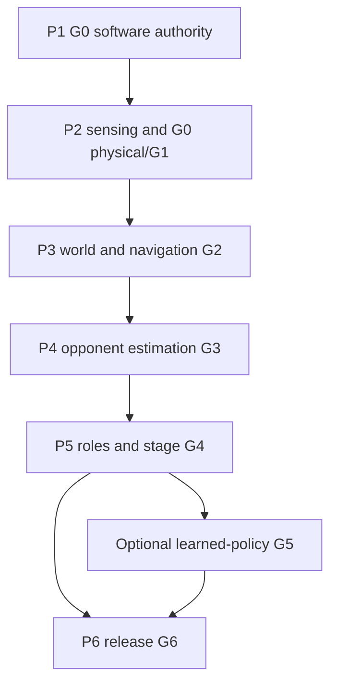

# HSL26 — Verifiable Delivery Roadmap

**Revision:** 1.0 · **Date:** 2026-09-24  
**Design authority:** `HSL26_FINAL_ARCHITECTURE.md` and `HSL26_TECHNICAL_SPECIFICATION.md`, revision 2.2.  
**Repository contract:** `HSL26_REPO_STRUCTURE.md`, revision 2.2.  
**Status:** planned work and acceptance criteria; no completed implementation or test is implied.

## 1. Purpose and precedence

This is the work breakdown for the complete system described in the blueprint. The blueprint fixes names, data models, formulas, process boundaries and behavior. Phase documents schedule deliverable work and tests; they cannot authorize a weaker safety predicate, a competing topic owner, a simulator truth leak or guessed official metadata. A discovered design conflict is recorded, resolved in a versioned blueprint correction and reflected in all affected phase tests before proceeding.

The supplied changelog is evidence of a reported scaffold and selected corrections. The live repository has not been inspected for this roadmap; all file paths below are target paths until verified against a checkout.

## 2. Gates, dependencies and execution profiles

| Phase / document | Outcome and gate | Depends on | Evidence needed to advance |
|---|---|---|---|
| P1 / `HSL26_PHASE1_IMPLEMENTATION_PLAN.md` | Contract/command containment; G0 software | Repository inventory and design baseline | IDL build, pure-core fixtures, zero startup, independent stop, process/clock fault logs |
| P2 / `HSL26_PHASE2_SENSING_AND_CALIBRATION.md` | Sensor/state/coverage and measured envelope; G0 physical + G1 | P1 software gate; access to permitted test hardware for physical subgate | Driver timeout and response traces, low-object/blind-zone evidence, timestamp/deskew tests |
| P3 / `HSL26_PHASE3_WORLD_AND_NAVIGATION.md` | Valid structural world and controlled route following; G2 | P2 observation contracts; physically enabled motion only after G0 physical/G1 | Maze fixtures, graph/spectrum tests, A* versus reference, path/control and obstacle insertion |
| P4 / `HSL26_PHASE4_OPPONENT_PERCEPTION.md` | Registered opponent origin and finite-speed occlusion belief; G3 | P2 sensors and P3 graph/version contract | Held-out view/error and yaw-valid reports, filter/reacquisition and belief propagation |
| P5 / `HSL26_PHASE5_MATCH_AND_TACTICS.md` | Both roles, stage lifecycle and full baseline; G4 | P1 safety, P3 routes, P4 belief or validated degraded input | Stage/action races, zone provenance, two-role integration, sampled-event ambiguity |
| P6 / `HSL26_PHASE6_LEARNING_AND_RELEASE.md` | Optional G5 learned promotion; mandatory G6 frozen rehearsal | G4 baseline; physical/organizer gates before real release | Paired optional policy evidence, immutable manifests, offline cold start, two-stage rehearsal |

Gate numbers refer to blueprint architecture §14 and test IDs to blueprint §17. The order is logical, not a blanket prohibition on parallel pure-core and simulation work. A later phase may build/test its own pure code while an earlier hardware test remains BLOCKED; it cannot mark an integrated or real-motion gate PASS until its actual prerequisites pass. If optional G5 fails, keep the accepted baseline and still evaluate G6.

## 3. Uniform task and evidence record

Each phase names numbered work packages `Px.y` and subtasks `Px.ya`, with owner role, files, required input, produced artifact, verification IDs and exit condition. Assign people during execution; no fictional owner names appear here. Every test/evidence line records `PASS`, `FAIL`, `BLOCKED` or `NOT_RUN`, environment and mode (`mock`, `kinematic`, `mvsim`, `replay`, `hardware`), commit/image/config/model/policy hashes, exact command, seed where applicable, raw log and observed-versus-expected result.

`PASS` in mock/kinematic does not transfer automatically to MVSim or hardware. `BLOCKED` preserves the dependency and its reason. An observed worst latency is reported as an observation, not proven WCET. A gate matrix includes a responsible reviewer, signoff date and links to test evidence; gate closure is an evidence judgment, never an automatic effect of checking tasks off.

| Evidence family | Target location | Required content |
|---|---|---|
| Per-phase results | `artifacts/reports/phaseN/` | Gate matrix, machine-readable test results, command/log links, limitations |
| Physical calibration | `artifacts/calibration/` | Identity, method, raw trials, condition range, conservative limits and uncertainty |
| Perception model | `artifacts/models/opponent_gpis/` | Arrays, manifest and held-out validation |
| Policy | `artifacts/policies/<policy_id>/` | Schema hashes, bounds, validation, baseline/shadow/learned status |
| Release | `artifacts/releases/` | Approved metadata, immutable hashes, two-stage run and rollback |

## 4. Workstream and test traceability

| Blueprint authority | Work packages | Primary tests |
|---|---|---|
| TS §§3–6, 13, 16.1/16.4/16.6 | P1.1–P1.8; P5.1–P5.2 | T01–T07, T12–T14, T20–T24, T30; I01–I05/I11 |
| TS §§7, 12, 16.2–16.3 | P2.2–P2.4; P3.1–P3.5 | T07/T10–T13/T15–T17/T29; I06–I09 |
| TS §§8–9, 16.2/16.7/16.8 | P4.1–P4.5 | T08/T09/T18/T19/T25/T26; I10 |
| TS §§10–11, 13, 16.6 | P5.1–P5.5 | T01–T05/T14/T21/T28/T30; I04/I11–I14 |
| TS §§14–15, 16.5/16.7–16.8 | P3.4; P4.4; P6.1–P6.5 | T18/T19/T27; I14–I16 |

Test names and expected values are normative in the blueprint. A work package may add tests but must not silently redefine a blueprint fixture.

## 5. Global release blockers

No real autonomous motion while any enabled mode lacks valid sensor coverage, braking/latency bounds, physical stop behavior, stage authority, unique command ownership or permitted configuration provenance. No competition release while goal/start zone semantics, official stage trigger, score/tie interpretation or memory retention needed by the chosen policy remain unapproved. Degraded capability is documented explicitly: missing yaw does not invalidate a good position track; missing goal identity prevents claiming arrival; optional learning may be absent; a missing safety input prevents motion.

## 6. Change control

For each merged work package, record modified paths, contract/diagram references, migration scope, tests actually run and limitations. Any interface rename, new message, planner transport, timing guarantee or capability boundary requires updating the blueprint, repository registry and affected phase acceptance tests together. The release candidate retains the original reports so failures remain auditable.
