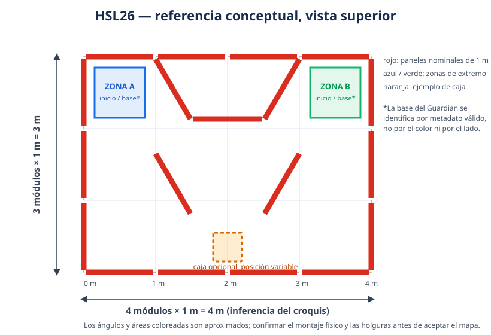

# HSL26 — referencia del laberinto, etapas y puntuación

**Estado:** modelo de desarrollo basado en el croquis y las aclaraciones recibidas; no es un levantamiento del polígono ni sustituye una decisión del árbitro.  
**Uso:** diseño, simulación SIL y evolución táctica. La geometría y las puntuaciones oficiales solo se habilitan tras verificar el montaje y el perfil de la etapa.

## 1. Evidencia y límites

- El reglamento disponible describe módulos de pared de aproximadamente **1 × 1 m**, obstáculos estáticos desconocidos de al menos **0.1 m** por lado y **0.15 m** de alto, y un polígono que no cambia durante el concurso.
- El croquis aportado muestra un contorno rectangular, dos zonas cuadradas en extremos opuestos, un deflector central superior en forma de U abierta hacia abajo y dos deflectores diagonales inferiores. Las fotografías confirman paneles ensamblados y cajas en el montaje, pero la perspectiva no sirve para medir el plano.
- La figura siguiente interpreta cuatro módulos de ancho por tres de alto: **4 × 3 m nominales**. Es una inferencia visual para un primer modelo, no una dimensión confirmada del campo real. Ángulos, huecos, espesores, tamaño exacto de las zonas y holguras de paso requieren medición/confirmación.



Convención del esquema: origen en la esquina inferior izquierda; X hacia la derecha, Y hacia arriba; las paredes son segmentos de 1 m. Los pequeños cortes gráficos entre módulos indican juntas, no puertas. Los bordes exteriores se consideran continuos. Las paredes oblicuas de la imagen son aproximaciones geométricas compatibles con módulos de 1 m; su posición final se debe ajustar al medir el montaje.

### Modelo paramétrico de referencia

| Elemento | Definición para SIL | Fuente / límite |
|---|---|---|
| Contorno exterior | Rectángulo nominal 4 × 3 m; 4 paneles por lado largo y 3 por lado corto | Conteo aproximado del croquis; no usar como coordenada oficial |
| Deflector superior | Dos diagonales nominales de 1 m y tramo horizontal nominal de 1 m; anclado al borde superior | Trazo conceptual, orientación y puntos finales por confirmar |
| Deflectores inferiores | Dos segmentos diagonales nominales de 1 m, simétricos como fixture inicial | El dibujo sugiere simetría, no la garantiza |
| Zonas de extremo A/B | Dos cuadrados de colocación en extremos opuestos; permiten variar la pose inicial dentro del área marcada | El tamaño y el color del croquis no asignan un rol |
| Base objetivo | `guardian_base_zone_id` explícito por etapa y asociado a geometría aprobada | No deducirla del lado, color, pose inicial ni mapa aprendido |
| Pared raster para planificación | Malla ortogonal de 0.5 m que aproxima el plano y despeja las diagonales de forma conservadora | Solo discretización de software; no son módulos físicos |
| Geometría de raycast | Segmentos métricos explícitos; separada de la malla de planificación | Mejora la reproducibilidad del fixture, pero no acredita fidelidad del sensor MID-360 |

El fixture para evolución está en [`hsl26_maze_evolution_bank.json`](../sim/kinematic/scenarios/hsl26_maze_evolution_bank.json). Su banco contiene dos escenarios de entrenamiento, dos de validación y uno reservado (*held out*), intercambia qué extremo aloja la base del Guardian y cambia las poses dentro de las zonas. Las variantes con cajas las mantienen estáticas como aproximación conservadora. Este banco no es un mapa del concurso, no modela la dinámica de empuje y no puede usarse para declarar G4/G5/G6 ni para promoción.

Ejecución explícita del trainer de fixtures, si se necesita para comprobar la integración:

```powershell
python tools/train_evolution.py --development-fixtures --bank sim/kinematic/scenarios/hsl26_maze_evolution_bank.json --generations 1 --population-size 2 --elite-count 1 --output-dir artifacts/reports/phase6/hsl26_maze_smoke
```

El resultado sigue siendo `SIL_DEVELOPMENT_FIXTURE_NOT_PROMOTION_ELIGIBLE`. El benchmark actual no resuelve la llegada a la marca con puntuación oficial y su *training return* es una señal sustituta, no esta fórmula.

## 2. Colocación y roles

1. Guardian y Explorer pueden empezar en cualquiera de las dos zonas de extremo. No existe una asociación fija «Guardian = izquierda» o «Explorer = derecha»; se prueban ambos sentidos y varias poses válidas.
2. La base del Guardian sí es conocida para la etapa y se representa como zona marcada explícita. La marca que debe alcanzar Explorer es esa base, no simplemente cualquier extremo.
3. Al intercambiar roles para la segunda etapa, se carga el `guardian_base_zone_id` correspondiente a esa etapa. La política no debe adivinarlo por color ni asumir que el robot comienza dentro de su base.
4. Explorer conserva su objetivo: evitar la captura y alcanzar la marca del Guardian. Guardian persigue/captura a Explorer y defiende su base; conocer la base no convierte la llegada temprana a un portal en captura.
5. En el perfil de concurso, mapa, zona objetivo, marco, procedencia y permiso de uso deben venir del organizador o de percepción autorizada. El fixture geométrico no da permiso para codificar coordenadas ocultas.

La llegada es el primer contacto entre el contorno del robot Explorer y el contorno de la marca, según el reglamento. La captura conserva sus tres condiciones simultáneas: distancia entre centros <0.45 m, eje X del Guardian dentro de 45° de la línea hacia Explorer y línea de visión sin obstáculo. Estimación interna y adjudicación real son señales diferentes.

## 3. Relojes: preparación frente a juego

Cada etapa nominal de 10 minutos se descompone así:

| Intervalo de etapa | Duración | Movimiento permitido en este diseño |
|---|---:|---|
| Preparación / `FREEZE` | 240 s (4 min) | Ninguno; robot detenido y sin cruzar la línea |
| Juego / `ACTIVE` | 360 s (6 min) | Control autónomo habilitado tras la transición válida |

`t_mark` y `t_catch` se cuentan desde el inicio de `ACTIVE`, con dominio `[0, 360]` segundos. No incluyen el freeze. Un contador de 360 s en la fórmula significa los seis minutos de juego, no los diez minutos completos de etapa. El temporizador de simulación debe mantener por separado la duración total de etapa, los 240 s de preparación y los 360 s activos; no comprimir ni puntuar el freeze como navegación.

## 4. Puntuación comunicada para las dos etapas

La hoja aportada y la aclaración del responsable de la tarea definen `t_mark` como el tiempo activo hasta que Explorer llega a la marca del Guardian; `t_catch` es el tiempo activo que Guardian tarda en capturar a Explorer.

Sea `M` el evento adjudicado de llegada de Explorer y `C` el evento adjudicado de captura:

| Rol que puntúa | Condición | Puntos |
|---|---|---:|
| Explorer | Si Guardian lo captura (`C`) | `0` |
| Explorer | Si alcanza la marca (`M`) dentro del juego | `1.3 × t_mark + (360 − t_mark) = 360 + 0.3 × t_mark` |
| Explorer | Si no es capturado, pero tampoco alcanza la marca antes de acabar `ACTIVE` | `0` |
| Guardian | Si captura a Explorer (`C`) dentro del juego | `t_catch + 1.3 × (360 − t_catch) = 468 − 0.3 × t_catch` |
| Guardian | Si no lo captura antes de acabar `ACTIVE` | `0` |

No hay puntos por supervivencia sin llegada. Los dos premios condicionados favorecen estrategias temporales distintas: Explorer maximiza su puntuación alcanzando la marca lo más cerca posible del segundo 360 sin ser capturado; Guardian maximiza la suya capturando lo antes posible. El optimizador no debe sustituir estas condiciones por «timeout = victoria con puntos» ni premiar un mero acercamiento a la marca.

Ejemplos, siempre con evento válido:

| Resultado | Cálculo | Puntos |
|---|---:|---:|
| Explorer llega en `t_mark = 60 s` | `360 + 0.3 × 60` | 378 |
| Explorer llega en `t_mark = 300 s` | `360 + 0.3 × 300` | 450 |
| Explorer llega en `t_mark = 359 s` | `360 + 0.3 × 359` | 467.7 |
| Explorer no llega al segundo 360, aunque siga libre | condición no cumplida | 0 |
| Guardian captura en `t_catch = 30 s` | `468 − 0.3 × 30` | 459 |
| Guardian captura en `t_catch = 300 s` | `468 − 0.3 × 300` | 378 |
| Guardian no captura antes del timeout | condición no cumplida | 0 |

La puntuación del match es la suma de los puntos de la misma **equipo** en sus dos etapas simétricas con roles intercambiados. No sumar la puntuación del rival como si fuera una recompensa de suma cero.

**Límite de adjudicación:** las reglas disponibles describen llegada, captura y timeout, pero no fijan aquí la prioridad si dos eventos ocurren en el mismo instante, ni tolerancias de cronometraje/redondeo. Para `t=360` y eventos simultáneos, el software registra la evidencia y consulta la precedencia publicada por los jueces; no crea un desempate propio. No redondear tiempos antes de evaluar ni declarar puntuación oficial desde la verdad del simulador.

## 5. Cajas y otros obstáculos

- Las reglas publicadas dicen que los choques con obstáculos estáticos no reciben penalización directa; los organizadores pueden reiniciar si se desplaza un elemento crítico. Esto no elimina el coste táctico, el riesgo de atasco ni las consecuencias de alterar el escenario.
- La descripción adicional recibida indica que algunas cajas están vacías y pueden desplazarse al contacto. Esa mecánica no queda cuantificada en el reglamento suministrado: masa, rozamiento, cantidad, posición, si se permite empujarlas intencionalmente y cómo se restituye el campo requieren confirmación del organizador.
- Hasta disponer de modelo físico medido, la evolución usa cajas opcionales como obstáculos **estáticos**, sin puntos de choque, y registra contacto/obstrucción como métrica de fiabilidad aparte de la puntuación. No simula impulso, deslizamiento, giro, apilamiento ni cambio de geometría por empuje.
- Evitar dos extremos de política: parar por cualquier objeto no valida la misión; colisionar deliberadamente tampoco es una estrategia segura. Un Explorer imprudente puede perder la ruta a la marca y ser capturado; una caja desplazada puede obstruir, favorecer o acorralar a cualquiera de los dos. Estos efectos se miden como tiempo hasta evento, ruta recuperable, contactos, intervenciones de seguridad y colisiones con el oponente, no como puntos inventados.
- Si se modela empuje en una futura versión, calibrar masa/rozamiento y usar estados de caja observables en ambos lados (plant y sensor). Los candidatos se comparan en pares con el mismo mapa, pose inicial, caja y semilla; held-out se reserva una sola vez.

## 6. Métricas para evolución y aceptación

**Objetivo primario cuando exista árbitro/modelo de llegada validado:** puntos por equipo según §4, reportados por rol y por las dos etapas. Los resultados deben acompañarse de intervalos de incertidumbre y desgloses por mapa, lado inicial, pose inicial, cajas, semilla y rival.

**Métricas de diagnóstico / fiabilidad (no puntos oficiales):**

- tasa de llegada a la marca sin captura; tasa y tiempo de captura; proporción de timeout sin llegada;
- distribución de `t_mark` y `t_catch` en éxitos, no promediarlos como si los fracasos tuvieran un tiempo de éxito;
- fracción de eventos no resueltos, llegadas/capturas falsas internas y desacuerdo entre estimación y árbitro;
- distancia restante a la marca al terminar, separada de llegada adjudicada;
- tiempo detenido, distancia recorrida, progreso, colisiones/contactos con paredes/cajas, atrapamiento y recuperaciones;
- intervenciones de seguridad, comandos limitados, violaciones de autoridad y CPU/deadlines.

Puntos oficiales se dejan como `null` cuando no hay llegada/captura adjudicada por el perfil válido. No transformar el fracaso en puntos por *shaping*. Si se usa un retorno sustituto para obtener señal en SIL, declararlo por separado y no ordenarlo como resultado oficial.

## 7. Criterio para reemplazar esta referencia

Antes de usar el mapa como perfil de concurso: (1) medir perímetro y cada tramo; (2) medir pose, ancho, altura y material de paredes; (3) medir las zonas y su contorno de adjudicación; (4) registrar ubicaciones posibles de cajas y reglas de contacto; (5) identificar base del Guardian de cada etapa por un canal autorizado; (6) fijar el inicio de reloj activo y reglas de simultaneidad/redondeo con los jueces; (7) versionar geometría, procedencia, huellas SHA-256 y permiso de retención. El informe debe separar lo observado, lo inferido y lo aprobado.
