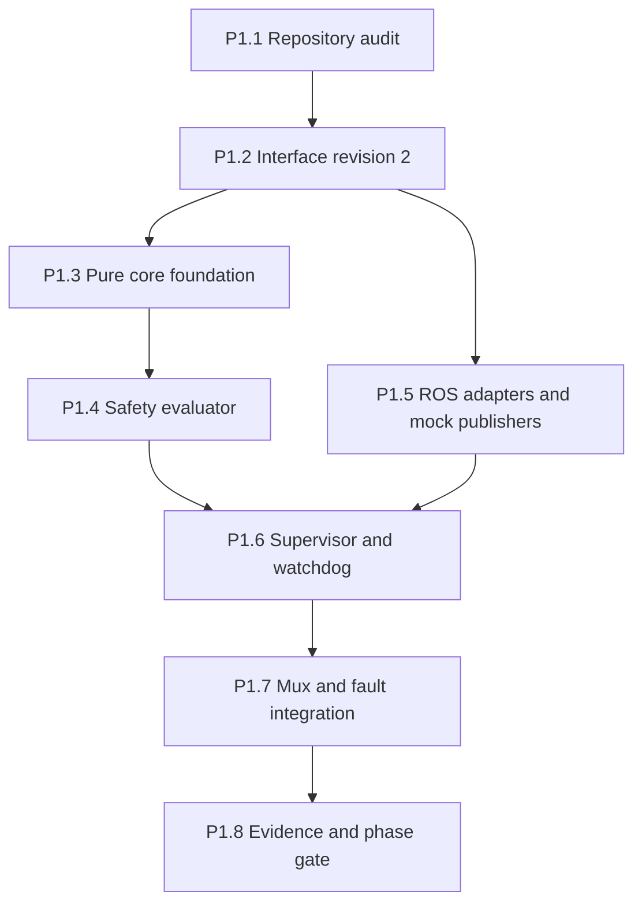
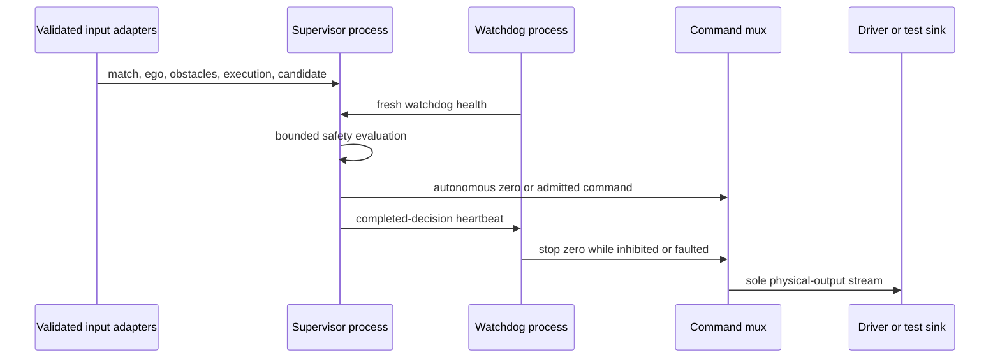

# HSL26 — Phase 1 Implementation Plan

**Revision:** 2.0 · **Date:** 2026-09-24  
**Normative baseline:** `HSL26_FINAL_ARCHITECTURE.md` and `HSL26_TECHNICAL_SPECIFICATION.md`, revision 2.2; `HSL26_IMPLEMENTATION_ROADMAP.md`, revision 1.0.  
**Scope:** revision-2 contracts, pure mathematical foundation, final-command safety supervisor, independent stop watchdog and G0 software evidence.  
**Out of scope:** full mapping, GPIS opponent recognition, tactical learning, competition-speed autonomous navigation and unsupervised hardware trials.

## 1. Phase objective

Phase 1 establishes a safe, testable vertical slice from a mock motion proposal to the Kobuki command boundary. At completion, the system can build revision-2 interfaces, validate time/frame/epoch contracts, compute exact planar kinematics and rule predicates, evaluate a latency-aware stopping envelope, admit or reject a motion candidate in a pure domain evaluator, and force zero through an independent watchdog/mux channel when the supervisor or its inputs fail.

Phase 1 is not successful because a robot moves. Its success condition is that nonzero movement cannot occur without fresh stage authority, fresh ego/obstacle/execution state, a valid candidate and a passing safety evaluation—and that failures reliably produce a measured zero request through an independent path.

## 2. Entry conditions and status convention

Before implementation begins:

- obtain the live repository checkout and record `git status`, current commit and existing user changes;
- confirm the reported Docker base, raw topics, `cmd_vel_mux` patch and package scaffolding;
- inspect current `.msg/.srv/.action`, `setup.py`, `package.xml`, launch and configuration files;
- agree that revision-2 interfaces replace, rather than silently extend, the bootstrap contracts;
- do not connect nonzero autonomous output to a real robot until P1.7 passes in simulation/mock transport and a supervised hardware test is explicitly authorized.

If current files diverge from the changelog, the live checkout wins as implementation evidence and the discrepancy is documented before edits.

Each task below has a stable ID and ends with one of `PASS`, `FAIL`, `BLOCKED`, `NOT_RUN`. `PASS` requires an artifact containing the command, environment/image digest, input profile/hash, result and log location. A mock-only PASS never satisfies a hardware check. Documented dependencies may be completed in parallel, but an exit gate cannot be waived by a successor phase. Test IDs refer to blueprint §17; G0 hardware evidence is carried forward as an explicit prerequisite for any enabled real motion in Phase 2.

## 3. Work packages and dependencies

### P1.1 — Repository audit and migration manifest

**Files:** no algorithm changes; create `docs/adr/ADR-003-interface-revision-2.md` and a machine-readable migration checklist under `artifacts/reports/phase1/` only after inspecting the checkout.

**Tasks:**

- **P1.1a** Inventory packages, entry points, interfaces, launch, tests and `git status` in a read-only checkout snapshot.
- **P1.1b** Map every bootstrap record producer/consumer to revision-2 field names and mark incompatible subscribers.
- **P1.1c** Inspect actual mux priorities, timeouts, physical output and Kobuki input/timeout in the installed source.
- **P1.1d** Identify Livox message type and point-time representation; record unknowns without inventing adapters.
- **P1.1e** Freeze a reviewable migration/authority manifest with hashes and open incompatibilities.

**Exit:** reviewed migration table with no unknown command publisher. Any unexpected direct `/commands/velocity` producer is a Phase-1 blocker.

### P1.2 — Interface revision 2

**Files:** `ros_ws/src/hsl_interfaces/{msg,srv,action}`, `CMakeLists.txt`, `package.xml`, contract tests.

**Minimum Phase-1 messages:**

- `ContractHeader`, `Polygon2`, `EgoState`;
- `CoverageGrid`, `Obstacle2`, `LocalObstacleSnapshot`;
- `MatchState`, `OptionGoal`, `ExecutionState`;
- `MotionCandidate`, `SafetyStatus`, `SupervisorHeartbeat`, `WatchdogHealth`;
- `RuleEvent` for unit/integration use.

**Minimum services/actions:** `ExecuteOption.action`, `StartStage.srv`, `ResetStage.srv`, `RearmSafety.srv`. `SetGoalZone` and `ResolveEvent` may be generated now even if their runtime logic arrives later, to freeze the IDL once.

**Tasks:**

- **P1.2a** Generate IDL with enum numeric values, field types/order and `ContractHeader` semantics from blueprint §§4–6.
- **P1.2b** Declare generated-message dependencies and build the interface package in the pinned ROS environment.
- **P1.2c** Reject mixed schema/epoch/session/authority messages and prepare sample encoding fixtures.
- **P1.2d** Produce a generated-API and producer/consumer compatibility report; mark missing later-phase publishers as mocks.

**Exit:** interface package builds; every array order, unit and enum has a test; an old revision-1 publisher cannot be mistaken for a valid revision-2 authority source.

### P1.3 — Pure core foundation

**Files:** `hsl_core/hsl_core/{types,contracts,geometry,kinematics,rules}.py` and corresponding tests.

**Required APIs:**

- immutable records and serialized enums;
- `validate_header`, finite-value/covariance/polygon validation;
- exact sinc-based differential-drive integration and wheel-rate conversion;
- robust segment intersection and polygon transforms;
- ideal capture predicate and robust sufficient capture-bound evaluator;
- capture-feasibility interval;
- first-contour-arrival event for simulated trajectories.

**Rules:** no ROS imports; no dictionaries with unstable implicit keys for core results; no internal wall-clock reads; invalid input returns typed rejection or a documented exception; NumPy arrays stored in immutable records are copied/read-only.

**Subtasks:** **P1.3a** implement immutable typed records and validators; **P1.3b** implement kinematics and geometry with units/frames; **P1.3c** implement capture/arrival predicates; **P1.3d** run generated boundary and degenerate fixtures. **Tests:** blueprint T01–T07, T14, T20, T22–T24 and T28, including strict 0.45 m distance, inclusive 45° angle, unknown LOS, coincident-frame invalidity and first-contact geometry.

**Exit:** tests pass in a clean Python environment without ROS. Coverage percentage is secondary to boundary and property tests.

### P1.4 — Braking and pure safety evaluator

**Files:** `hsl_core/hsl_core/control/{braking,safety}.py`, `test_braking.py`, `test_safety.py`.

**Required APIs:**

- `stopping_distance(speed,b_min,tau)`;
- `admissible_speed(clearance,margin,b_min,tau,speed_max)` using the stable rationalized root where appropriate;
- `stopping_distance_accelerating(speed,a_plus,b_min,tau)`;
- wheel/dynamic-limit checks;
- bounded `SafetySupervisor.evaluate(snapshot, now_ros_ns, now_steady_ns)`;
- typed `SafetySnapshot`, `LimitsProfile`, `TimingProfile`, `SafetyEvaluation`.

Phase 1 may use a conservative one-dimensional forward swept-corridor checker for nonzero motion only if its geometry and coverage contract are explicit and reverse/independent rotation are disabled. The final architecture still requires full footprint-and-rotation checking before those modes are enabled. A scalar distance without timestamp, frame and coverage is insufficient.

**Mandatory behavior:**

- **P1.4a** Implement both named braking models, inverse, wheel feasibility and configuration validity; test T12/T13/T24.
- **P1.4b** Implement bounded swept-corridor/coverage evaluator for explicitly enabled forward mode; all missing leases, mismatched epochs/stages/options and invalid calibration lead to zero.
- **P1.4c** Detect an already infeasible stopping state as `BRAKING_INFEASIBLE`; recheck a limited command and preserve reason ordering.
- **P1.4d** Produce one completed decision sequence/heartbeat per evaluation and enforce operation/time budgets; run T20–T22, T29/T30 as applicable with mocks.

**Tests:** numeric braking fixtures; property `stopping_distance(admissible_speed(c))≈c` within valid uncapped range; stale/future messages; old option IDs; unobserved coverage; candidate scaling; numerical invalidity; compute-budget path.

**Exit:** all nonzero outputs have an explicit trace to the inputs and assumptions that admitted them.

### P1.5 — ROS adapters and deterministic mocks

**Files:** per-package `adapters.py`; Phase-1 mock nodes under `tests/integration/fixtures` or a dedicated test package; launch-test fixtures.

**Tasks:**

- **P1.5a** Implement only the needed adapter functions from blueprint §16.6 with exact timestamp/array/enum round trips.
- **P1.5b** Validate before cache replacement and reject stale republished measurements.
- **P1.5c** Build deterministic mock publishers for ego-local, obstacles/coverage, match, execution, health and candidate with controllable clock/epoch/sequence.
- **P1.5d** Sink autonomy, stop and mux output without a physical driver; exclude mocks from real launch.

Mocks are test infrastructure, not production fallback nodes. Their executables are excluded from real launch files and release images where practical.

**Exit:** adapter round trips and rejection paths pass; integration tests can deterministically create freshness, expiry, process-death and epoch-change scenarios.

### P1.6 — Isolated supervisor and watchdog

**Files:** `hsl_safety/hsl_safety/{supervisor_node,watchdog,adapters}.py`, package metadata, entry points and `safety.launch.py`.

**Supervisor:**

- **P1.6a** Run a distinct supervisor process with validated immutable cache and receiver steady timestamps.
- **P1.6b** Evaluate on target periodic schedule (initially 50 Hz); publish autonomous twist/status and only then a completed-decision heartbeat; missing watchdog health forces zero.
- **P1.6c** Record deadline miss/exception as safe zero and ensure only lightweight core safety imports.

**Watchdog:**

- **P1.6d** Run a distinct watchdog process starting DISARMED with highest-priority zeros.
- **P1.6e** Require progressing decision sequence, stage/config identity and receiver steady leases; ACTIVE publishes no stop traffic only while every release prerequisite holds.
- **P1.6f** Latch on supervisor/authority failure; controlled rearm first revokes previous instance; publish health and never forward a nonzero twist.

**Exit:** killing either process yields the expected counterpart behavior; mutual-health startup reaches READY/ACTIVE only through fresh zero-safe states.

### P1.7 — Mux and fault integration

**Files:** `cmd_vel_mux.yaml`, inherited compatibility patch if already reported, bringup launch, `check_ros_graph_authority.py`, integration/launch tests.

**Priorities:** stop 200, authorized test teleop 100, autonomous supervisor 50. Exact syntax depends on the installed mux version and must be verified from its source/configuration. Only the mux output is `/commands/velocity`.

**Required tests:**

- zero-only cold start;
- nonzero autonomy passed only after all leases are valid;
- stop input overrides autonomy and teleop;
- expired stop input does not accidentally replay stale autonomy after a fault latch;
- planner/candidate publisher death;
- supervisor hang/death;
- watchdog hang/death;
- mux death and downstream driver timeout in a safe test environment;
- stale transient-local `MatchState` after restart;
- source session/sequence replay;
- clock and localization epoch changes;
- runtime graph check for unauthorized physical command publishers.

**Subtasks and trace:** **P1.7a** validate installed mux configuration/output and priority under simultaneous inputs (I01/I02); **P1.7b** inject process death, stalled callback and lease expiry separately (I03/I04); **P1.7c** inject QoS mismatch, replay and clock/epoch jumps (I05, T20–T22/T30); **P1.7d** capture command request and physical response separately, with driver-timeout evidence pending until permitted hardware tests; **P1.7e** run live graph authority inspection (I14 without simulation truth). Preserve every input and timestamp in the report.

The driver timeout test measures request-to-zero/physical-stop behavior separately. A zero command receipt is not physical stop. Until hardware trials are authorized, mock transport validates logic but not the real base response.

**Exit:** Gate G0 software evidence complete; physical timeout/braking entries may remain explicitly pending, with real profile disarmed.

### P1.8 — Evidence, documentation and release candidate

**Files:** `artifacts/reports/phase1/*`, updated runbook, configuration schemas and release manifest draft.

**Tasks:**

- **P1.8a** Save reproducible commands, commit/image/dependency/config identities, test logs and expected/observed results.
- **P1.8b** Record `PASS/FAIL/BLOCKED/NOT_RUN` separately for software and hardware, with fault trace and ownership.
- **P1.8c** Publish safe startup/shutdown/rearm and fault-recovery procedures plus enabled/disabled motion modes.
- **P1.8d** Review G0 software evidence against the gate matrix and record remaining G0 physical prerequisites for Phase 2.

**Exit:** independent reviewer can reproduce the software evidence and identify every remaining hardware/organizer dependency.

## 4. Phase-1 interface flow

The mock input block is replaced later by actual stage, perception and navigation nodes without changing the supervisor contracts.

## 5. Configuration required in Phase 1

### 5.1 `timing.yaml`

Define supervisor/watchdog target periods, every application lease, allowed clock skew, compute budget, mux input timeouts and verified driver timeout. Normal-operation inequalities must be validated; for example, producer period plus accepted jitter/transport must remain below consumer lease.

### 5.2 `hardware.yaml`

Define footprint, wheel geometry/rates, forward speed and acceleration limits, disabled reverse flag, calibrated braking/latency identifiers and raw/logical topics. Example constants from rev1 are not accepted calibration. In a mock-only profile, use values explicitly labeled `test_only` and prevent real launch.

### 5.3 `cmd_vel_mux.yaml`

Define the three inputs and physical output, with timeouts and priority verified against the installed mux implementation. The competition profile disables teleop movement but preserves the tested stop path.

## 6. Definition of done

Phase 1 is complete only when all of the following are true:

- revision-2 interfaces build and all Phase-1 adapters round-trip;
- pure-core mathematical/contract tests pass without ROS;
- supervisor and watchdog are installed executable modules in distinct processes;
- startup is zero-only and no stale/transient-local message grants motion;
- stop authority overrides every other command input;
- old option/epoch/session commands are rejected;
- process-death and clock/epoch fault tests produce the expected stop request;
- the runtime graph has exactly one physical command publisher: the mux;
- all enabled motion modes have corresponding geometry, coverage and braking assumptions;
- mock/software evidence and hardware-pending evidence are clearly separated;
- no claim of complete autonomous operation is made.

## 7. Phase-1 blockers

Stop implementation or keep the real profile disarmed if any of these remains unresolved:

- live checkout contains an unidentified physical command writer;
- mux output/timeout semantics differ from the assumed model;
- revision-1 and revision-2 authority messages can coexist ambiguously;
- watchdog and supervisor cannot be isolated as separate processes;
- driver fails to stop after total command loss within an acceptable measured envelope;
- timing configuration excludes a known delay component;
- obstacle input lacks timestamp, frame, coverage or coherent ego association;
- an enabled rotation/reverse mode lacks coverage and braking evidence;
- build depends on unavailable/unpinned external resources during competition cold start.

## 8. Evidence record and handoff to Phase 2

| Gate item | Required evidence | Phase-1 exit status |
|---|---|---|
| Build and schema | ROS generator/colcon report; adapter round trips and T23 | Must PASS |
| Rules and dynamics | T01–T07/T12–T14/T20–T24/T28 | Must PASS for relevant enabled modes |
| Authority | I01–I05, I11, I14 authority slice, T21/T22/T30 | Must PASS in mock/ROS software environment |
| Physical response | Measured mux/driver timeout and braking under valid hardware conditions | May be BLOCKED at software exit; real profile remains disarmed |
| Audit/reproducibility | P1.1/P1.8 manifests with real command/log/hash links | Must PASS |

Phase 2 may begin after Phase 1 software Gate G0 passes. Its first vertical slice should be normalized sensor input → ego-local state → time-tagged local obstacle/coverage snapshot → supervisor, at restricted test speed. Full topology, opponent tracking, tactics and learning remain later work. This ordering ensures each additional capability proposes motion through an already functioning containment boundary.
