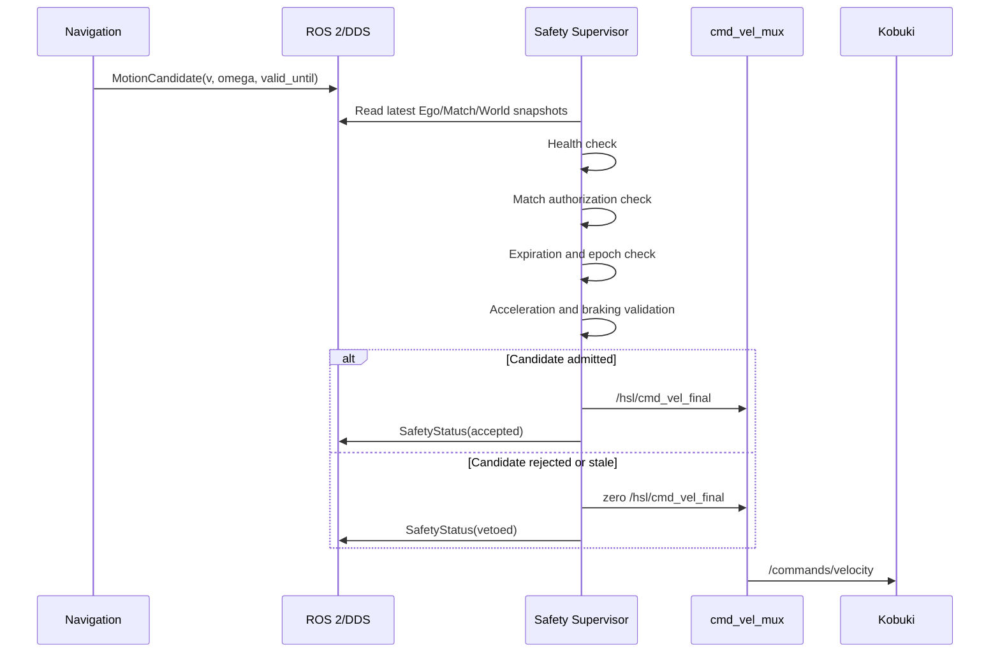

# HSL26 Phase 1 Technical Programming Specification

## 1. Purpose and status

This document is the implementation-level specification for **Phase 1:
Mathematical Core and Isolated Safety Supervisor**.

Phase 1 establishes the physical containment ring of the HSL26 robot. No
tactical planner, opponent strategy, or autonomous navigation behavior is
allowed to bypass this ring. Every motion command must be represented as a
candidate, validated against current system state and temporal validity, and
then admitted by the isolated safety process before it reaches
`cmd_vel_mux`.

The normative architectural sources are:

- `docs/HSL26_FINAL_ARCHITECTURE.md`
- `docs/HSL26_REPO_STRUCTURE.md`
- `docs/HSL26_SESSION_CHANGELOG.md`
- `ros_ws/src/hsl_interfaces/`
- the current Phase 1 technical brief

This document is a programming specification, not a statement that every
module is already implemented. It defines the contracts, algorithms, package
boundaries, APIs, execution model, test strategy, and acceptance conditions
that implementation must satisfy.

## 2. Phase 1 objectives

### 2.1 Primary objectives

1. Implement pure-Python, ROS-independent mathematical primitives in
   `hsl_core`.
2. Make the mathematical primitives deterministic, unit-testable, and safe
   under numerical edge cases.
3. Define immutable domain data structures that mirror the ROS interface
   contracts.
4. Implement an isolated ROS 2 safety supervisor in a dedicated operating
   system process.
5. Publish only supervisor-approved commands to `/hsl/cmd_vel_final`.
6. Maintain a hardware-facing watchdog at no less than 20 Hz.
7. Provide enough unit and integration tests to prove temporal expiration,
   braking limits, command clamping, and emergency stop behavior.

### 2.2 Explicit non-goals

Phase 1 does not implement:

- opponent strategy selection;
- A* graph construction;
- DBSCAN or point-cloud segmentation;
- GPIS registration;
- MVSim integration;
- competition scoring logic;
- online learning;
- direct hardware operation without the supervisor;
- a claim of absolute collision avoidance against an arbitrary opponent.

Those features may produce inputs to Phase 1 later, but they must not weaken
the authority boundary defined here.

## 2.3 Development and execution environments

HSL26 uses a hybrid workflow because the repository contains both
ROS-independent mathematics and Linux/ROS hardware integration:

| Surface | Windows Conda/venv | Docker Desktop WSL2/Linux |
|---|---:|---:|
| `hsl_core` unit tests | Primary | Supported |
| `sim/kinematic` | Primary | Supported |
| Offline Layer 7 training | Primary | Supported |
| ROS 2 and `colcon` | Not supported as the default | Primary |
| Kobuki/Livox drivers | Not supported as the default | Primary |
| MVSim and ROS integration | Not supported as the default | Primary |

The local Python path is intended to provide rapid feedback:

```powershell
conda create -n hsl26 python=3.10 -y
conda activate hsl26
python -m pip install numpy scipy open3d matplotlib pytest
python -m pip install -e .\hsl_core
python -m pytest .\hsl_core\tests -v
python .\sim\kinematic\engine.py
```

The ROS path uses the pinned HSL25 hardware image rather than a clean ROS
image, because the inherited workspace depends on Kobuki/ecl and Livox-SDK2:

```bash
docker build -f docker/Dockerfile -t hsl26:latest .
docker run --rm -it hsl26:latest bash
colcon test --packages-select hsl_interfaces hsl_safety hsl_bringup
colcon test-result --verbose
```

The lightweight simulator is the intended high-throughput environment for
rules, FSM evaluation, parameter sweeps, and offline Layer 7 training. MVSim
is the integration environment for ROS timing, sensor transport, and physical
effects; it is not the training loop. The real robot and replay modes require
their respective hardware or rosbag inputs and must not be represented as
working merely because a launch scaffold exists.

The intended simulation launch forms are:

```bash
ros2 launch hsl_bringup hsl26.launch.py mode:=sim role:=guardian
ros2 launch hsl_bringup hsl26.launch.py mode:=sim role:=explorer
```

GUI forwarding is optional. Headless execution with terminal diagnostics is
the preferred competition-oriented workflow.

## 3. Runtime architecture

### 3.1 Process topology

```text
                    OS Process A
        perception / world / decision / navigation
                         |
                         | MotionCandidate
                         v
                    ROS 2 transport
                         |
                         v
                    OS Process B
             hsl_safety supervisor process
              SingleThreadedExecutor
                         |
          +--------------+----------------+
          |                               |
          v                               v
/hsl/cmd_vel_final                 /hsl/safety_status
          |
          v
      cmd_vel_mux
          ^
          |
/teleop/cmd_vel  (higher emergency priority)
          |
          v
 /commands/velocity
          |
          v
       Kobuki
```

The supervisor must not be loaded into a composable container shared with
perception or planning. It must be a normal ROS 2 process with a dedicated
`SingleThreadedExecutor`.

### 3.2 Authority rules

| Producer | Topic | Authority |
|---|---|---|
| Navigation/local control | `/hsl/motion_candidate` | Candidate only |
| Safety supervisor | `/hsl/cmd_vel_final` | Sole autonomous command producer |
| Emergency teleoperation | `/teleop/cmd_vel` | Highest mux priority |
| `cmd_vel_mux` | `/commands/velocity` | Final physical arbitration |

No planner, tactic node, perception node, or world node may publish directly
to `/commands/velocity`.

### 3.3 Safety evaluation order

The supervisor evaluates every candidate in this order:

1. hardware and process health;
2. match authority (`freeze`, finished, motion authorization);
3. temporal validity and localization/map epoch validity;
4. dynamic actuator limits;
5. free-space and braking envelope;
6. final publication and status reporting.

Any failed stage produces a bounded zero command unless a stricter policy
requires process termination and external watchdog intervention.

## 4. Package and module design

### 4.1 `hsl_core`

`hsl_core` is a pure Python package. It must not import `rclpy`, ROS message
types, DDS APIs, launch APIs, or hardware drivers.

#### Required modules

```text
hsl_core/
├── types.py
├── kinematics.py
├── rules.py
├── mapping.py
├── control/
│   ├── braking.py
│   ├── dwa_local.py
│   └── regulated_pursuit.py
├── perception/
│   └── (future Phase 2 modules)
├── planning/
│   └── (future Phase 3 modules)
├── tactics/
│   └── (future Phase 4 modules)
└── learning/
    └── (offline only)
```

Phase 1 implementation priority is `types.py`, `kinematics.py`, `rules.py`,
and `control/braking.py`.

### 4.2 `hsl_safety`

The ROS package is a thin adapter:

```text
hsl_safety/
├── hsl_safety/
│   ├── __init__.py
│   ├── supervisor_node.py
│   ├── watchdog.py
│   └── braking_envelope.py
├── launch/
│   └── safety.launch.py
├── package.xml
├── setup.py
└── setup.cfg
```

The adapter converts ROS messages into `hsl_core` dataclasses, invokes pure
functions, and converts results back into ROS messages. It must not duplicate
the mathematical formulas inside callbacks.

## 5. Domain data model

### 5.1 Immutability

Domain snapshots should use frozen dataclasses or equivalent immutable value
objects. A callback must never mutate a state object that another callback
may be reading.

Recommended Python shape:

```python
@dataclass(frozen=True)
class MotionCandidate:
    linear_velocity_mps: float
    angular_velocity_rps: float
    observation_time_s: float
    valid_until_s: float
    horizon_s: float
    source_id: str
    map_version: int
    localization_epoch: str
```

The exact implementation may differ, but units and validity semantics must be
explicit.

### 5.2 Required domain objects

#### `EgoState`

Fields:

- planar pose `(x, y, theta)`;
- planar twist `(v, omega)`;
- 3x3 covariance;
- localization epoch;
- health flag;
- wheel-slip flag;
- observation timestamp;
- frame identifier.

The ROS mirror uses `float64[9] pose_covariance`.

#### `OpponentTrack`

Fields:

- stable track identifier;
- planar pose and velocity;
- 4x4 covariance over `[x, y, vx, vy]`;
- yaw validity;
- last measurement time;
- explicit `valid_until`;
- localization epoch;
- map version;
- lifecycle state.

Lifecycle constants:

```text
STATE_SEARCHING = 0
STATE_TRACKED = 1
STATE_COASTING = 2
STATE_OCCLUDED_BELIEF = 3
STATE_LOST = 4
```

#### `MotionCandidate`

Represents a proposed velocity, never a certified command. It must include
source and temporal validity metadata.

#### `SafetyStatus`

Must expose:

- whether the candidate was vetoed;
- a stable reason code or reason string;
- free distance;
- measured latency;
- admissible velocity;
- supervisor health;
- publication timestamp.

## 6. Mathematical implementation contracts

### 6.1 Differential-drive integration

For state `(x, y, theta)` and body command `(v, omega)`:

For `abs(omega) > epsilon`:

```text
x_next = x + v/omega * (sin(theta + omega*dt) - sin(theta))
y_next = y - v/omega * (cos(theta + omega*dt) - cos(theta))
theta_next = wrap(theta + omega*dt)
```

For `abs(omega) <= epsilon`, use a numerically stable straight-line limit:

```text
x_next = x + v*dt*cos(theta)
y_next = y + v*dt*sin(theta)
theta_next = wrap(theta)
```

The implementation must not divide by a near-zero angular velocity.

### 6.2 Braking envelope

Given:

- current speed `v`;
- latency `tau`;
- minimum measured deceleration `b_min > 0`;
- free distance `d`;
- safety margin `m`;

The admissibility condition is:

```text
v*tau + v^2/(2*b_min) <= max(0, d - m)
```

The maximum admissible speed is:

```text
v_brake = max(
    0,
    -b_min*tau
    + sqrt(b_min^2*tau^2 + 2*b_min*max(0, d-m))
)
```

Required functions:

```text
stopping_distance(v, latency_s, deceleration_mps2) -> float
admissible_speed(distance_m, margin_m, latency_s,
                 deceleration_mps2) -> float
is_speed_admissible(...) -> bool
```

Invalid inputs must raise explicit `ValueError` exceptions. Silent fallback
to unsafe defaults is forbidden.

### 6.3 Official geometric predicates

The capture predicate must be implemented as a pure function and must require:

```text
distance < 0.45 m
guardian bearing <= 45 degrees
line of sight is clear
```

The arrival predicate must use footprint/zone contact, not only center-point
proximity. Swept motion between samples must be considered by the eventual
implementation.

### 6.4 Command limiting

The supervisor must apply:

```text
abs(v_new - v_previous) <= a_max * dt
abs(omega_new - omega_previous) <= alpha_max * dt
```

The command is then limited by the braking envelope. Braking is an admission
constraint, not an after-the-fact warning.

## 7. Supervisor class and function design

### 7.1 `SupervisorNode`

Responsibilities:

- subscribe to `MotionCandidate`;
- subscribe to `MatchState`;
- subscribe to `EgoState`;
- subscribe to `WorldSnapshot` or safety-relevant obstacle state;
- subscribe to `OpponentTrack` when opponent validity affects braking;
- publish `Twist` on `/hsl/cmd_vel_final`;
- publish `SafetyStatus`;
- maintain the last accepted command;
- invoke the watchdog heartbeat.

The node should contain orchestration only. It should delegate pure decisions
to a `SafetyPipeline` or equivalent domain service.

### 7.2 `SafetyPipeline`

Recommended interface:

```python
evaluate(
    candidate: MotionCandidate,
    ego: EgoState,
    match: MatchState,
    world: WorldSnapshot,
    now_s: float,
) -> SafetyDecision
```

`SafetyDecision` contains:

- final velocity;
- veto flag;
- reason;
- admissible speed;
- validity deadline;
- diagnostic values.

### 7.3 `Watchdog`

The watchdog must:

- publish a zero command or safe heartbeat at 20-30 Hz;
- continue publishing when no candidate is available;
- detect stale candidate publication;
- force zero output after supervisor state becomes invalid;
- use monotonic time for local deadlines;
- avoid heavy imports and long-running callbacks.

The watchdog must not rely on a planner callback to publish its safety output.

## 8. ROS 2 QoS and timing policy

Recommended defaults:

| Data | History | Depth | Reliability |
|---|---|---:|---|
| Sensor-derived state | KEEP_LAST | 1 | BEST_EFFORT |
| `MotionCandidate` | KEEP_LAST | 1 | RELIABLE |
| `MatchState` | KEEP_LAST | 1 | RELIABLE |
| `SafetyStatus` | KEEP_LAST | 10 | RELIABLE |
| Final command | KEEP_LAST | 1 | RELIABLE |

All expiration checks must compare timestamps in one clock domain. ROS time
and monotonic process time must not be mixed without an explicit conversion.

## 9. Sequence diagram



## 10. Design patterns

### 10.1 Hexagonal architecture

`hsl_core` is the domain center. ROS 2 nodes, message conversion, launch,
logging, and hardware are adapters around it.

### 10.2 Chain of Responsibility

Each safety stage is an independent validator with a common decision shape.
The chain stops at the first veto and returns an explicit reason.

### 10.3 Immutable snapshot

Callbacks replace complete snapshots rather than mutating shared objects.
Evaluation reads a coherent snapshot set.

### 10.4 Fail-safe default

Missing, stale, inconsistent, or invalid data results in zero motion. There is
no success-shaped fallback for malformed input.

### 10.5 Ports and adapters

Time, command publication, and ROS message conversion are injectable at unit
test level. Pure safety calculations remain runnable without ROS.

## 11. Testing specification

### 11.1 Unit tests

Required tests include:

- straight-line integration;
- curved integration;
- angular velocity near zero;
- angle wrapping;
- braking distance monotonicity;
- zero-distance braking;
- invalid deceleration rejection;
- latency-aware admissible speed;
- acceleration and angular acceleration clamping;
- capture distance boundary;
- capture angle boundary;
- line-of-sight veto;
- expired candidate rejection;
- expired opponent track rejection;
- localization epoch mismatch rejection;
- map version mismatch rejection.

### 11.2 Integration tests

Required ROS tests include:

1. supervisor starts as an independent process;
2. no final command is published before valid authorization;
3. a valid candidate reaches `/hsl/cmd_vel_final`;
4. an expired candidate produces zero;
5. `freeze=true` produces zero;
6. stale supervisor output is covered by the watchdog;
7. emergency teleoperation has higher mux priority;
8. final command reaches `/commands/velocity`;
9. supervisor output rate is at least 20 Hz during inactivity.

### 11.3 Acceptance thresholds

- No unsafe command after candidate expiry.
- No positive command during freeze or match completion.
- No command above the braking envelope.
- No command above configured actuator limits.
- Watchdog output frequency: `>= 20 Hz`.
- All pure-core tests pass without ROS 2.

## 12. Implementation constraints

- Do not import Open3D, SciPy, Torch, or DBSCAN code into the supervisor
  process.
- Do not place maze or opponent coordinates in Python source.
- Do not publish directly to the Kobuki driver from HSL26 nodes.
- Do not use numeric lifecycle literals where interface constants are
  available.
- Do not silently coerce invalid timestamps, negative deceleration, or missing
  frame/epoch information into valid state.
- Do not claim collision certification from A* alone.

## 13. Definition of done

Phase 1 is complete only when:

1. `hsl_core` domain types and formulas are implemented.
2. All required unit tests pass.
3. `hsl_safety` launches as a separate process.
4. The supervisor publishes final commands only after all gates pass.
5. The watchdog maintains the required output rate.
6. Expiration, freeze, epoch, and map-version invalidation are tested.
7. The full ROS workspace builds inside the pinned Docker image.
8. A minimal end-to-end command path is demonstrated:

```text
MotionCandidate
    -> hsl_safety
    -> /hsl/cmd_vel_final
    -> cmd_vel_mux
    -> /commands/velocity
```

## 14. Operational acceptance workflow

The recommended order for a new development machine is:

1. Create the local Python environment and run all `hsl_core` tests.
2. Run the lightweight kinematic simulator without requiring visualization.
3. Build the pinned Docker image.
4. Run ROS package tests and inspect `colcon test-result`.
5. Launch simulation or replay only after the package and interface checks are
   green.
6. Record logs, timing measurements, and failure behavior in the roadmap and
   changelog.

The offline learning command is intentionally separate from ROS 2:

```bash
python -m hsl_core.learning.evolution --episodes 5000 --workers 4
```

Generated policies require review, provenance, and a SHA-256 integrity value
before deployment. Competition runtime adaptation remains disabled.
