# HSL26 — System Architecture and Engineering Blueprint

**Revision:** 2.2 · **Date:** 2026-09-24  
**Companion baseline:** `HSL26_FINAL_ARCHITECTURE.md`, revision 2.2.  
**Audience:** robotics architects, developers, reviewers and implementation agents.  
**Status:** normative full-system blueprint: definitions, structure, contracts and behavior; not a schedule, phase plan or claim of completed runtime implementation.

## Contents

1. Blueprint scope and reading rules
2. Packages, ownership and dependency direction
3. Canonical notation, frames, time and validity
4. Domain records and wire schema
5. ROS graph, QoS and authority
6. Actions, services and transactional behavior
7. Mapping, topology and spectral algorithms
8. Hermite-GPIS-W model and registration
9. Opponent filter and occlusion belief
10. Rules, stage state machine and adjudication
11. Tactical options and their lifecycle
12. Navigation, control and safety mathematics
13. Runtime algorithms and sequence diagrams
14. Simulation and calibration
15. Learning, policies and artifact formats
16. Class, object and function contract catalog
   - 16.5 Offline learning modules
   - 16.6 Runtime nodes and adapter boundary
   - 16.7 Kinematic simulator object model
   - 16.8 Tools and artifact flows
   - 16.9 File-to-contract coverage registry
17. Verification matrix and numerical fixtures
18. Blueprint conformance and unresolved-input register
19. Sources and evidence boundaries

## 1. Blueprint scope and reading rules

**MUST** is required for conformance. **SHOULD** requires a documented reason to deviate. **MAY** is optional. Numbers explicitly labeled examples are not deployment calibration. No statement here grants official permission to inject competition data or assigns official scoring values.

This document defines the complete intended HSL26 system independently of any implementation order. It is the shared technical dictionary for humans and coding agents: component boundaries, names, data models, algorithms, classes, functions, processes, message schemas, states, flows, timing contracts, mathematical assumptions and failure behavior. The companion architecture explains why the design is selected; this blueprint states exactly what the selected design means.

The supplied changelog reports scaffolding and static validation, then later Docker, network/topic and covariance corrections. It does not report successful runtime node implementations, Docker/ROS builds or robot trials. The source checkout was not attached. Consequently, all paths here are target structural contracts unless the changelog explicitly reports them. A class or node shown in a diagram is a normative definition, not evidence that its executable already exists.

This document deliberately resolves the draft's incompatible definitions. There is one canonical field spelling, one command owner per channel, one option command protocol, and a strict distinction between physical truth, estimates and adjudication. Diagrams are different views of the same model; they do not introduce alternative names or parallel implementations. Measured hardware bounds and organizer inputs remain explicit unresolved parameters (§18); they cannot be replaced by convincing-looking constants.

## 2. Packages, ownership and dependency direction

| Location | Responsibility | Allowed dependencies | Forbidden dependency/authority |
|---|---|---|---|
| `hsl_core/hsl_core/types.py` | Immutable domain records/enums and structural validation | Python standard library | ROS, simulator or model-loading side effects |
| `hsl_core/.../kinematics.py`, `geometry.py`, `rules.py` | Pure math, geometry and predicates | Standard math; numerical libraries only outside safety-hot imports | ROS, runtime clocks read internally |
| `hsl_core/.../mapping.py`, `topology.py` | Grid evidence and graph extraction | NumPy and selected tested geometry/skeleton library | Physical command publication |
| `hsl_core/.../perception/` | GPIS, registration, filter and belief | NumPy/SciPy as budgeted | Ground truth from simulator |
| `hsl_core/.../planning/` | A*, path realization, interception | Domain and geometry | Ignoring dynamic collision layer |
| `hsl_core/.../tactics/` | Option registry, ranking and FSM | Domain, planner query interfaces | Motor commands |
| `hsl_core/.../control/` | Nominal control, braking, bounded safety evaluation | Lightweight domain/math on safety path | Implicit ROS dependencies |
| `hsl_core/.../learning/` | Offline statistics and search | Domain and offline dataset APIs | Imported by competition critical nodes |
| `ros_ws/src/hsl_interfaces` | `.msg`, `.srv`, `.action`, constants | ROS interface packages | Algorithm implementation |
| `ros_ws/src/hsl_perception` | Sensor normalization, ego record, obstacle and track adapters | Core, generated messages, ROS | Mux/driver command publisher |
| `ros_ws/src/hsl_world` | Map, topology and localization/fusion adapters | Core, ROS, selected estimator | Duplicate TF owners |
| `ros_ws/src/hsl_decision` | Tactical action client | Core and ROS actions | Competing goal topic writer |
| `ros_ws/src/hsl_navigation` | One option action server and path/control nodes | Core, ROS | Physical command publisher |
| `ros_ws/src/hsl_safety` | Supervisor and independent stop watchdog | Lightweight core, ROS | GPIS, DBSCAN, A*, training in safety process |
| `ros_ws/src/hsl_match` | Stage state, event estimates, zone acceptance | Core, ROS | Official result fabrication |
| `ros_ws/src/hsl_bringup` | Profiles, launch, configuration validation | ROS launch and schemas | Algorithm duplication |
| `ros_ws/src/hsl_diagnostics` | Read-only terminal/status/logging | Messages and serialization | Movement authority |
| `kobuki/` | Tested inherited drivers and mux | Pinned upstream stack | Unreviewed ABI/branch migration |
| `sim/kinematic`, `sim/mvsim` | Plant, sensor generation and referee | Core rules/physics; simulator API | Policy access to private truth |

**Required additions to the supplied layout:** `hsl_core/.../geometry.py`, `control/safety.py`, `contracts.py`; a thin ROS conversion module in each adapter package or one deliberately shared adapter package; interface records listed in §4; `hsl_navigation/option_executor_node.py`; typed zone/event/heartbeat publishers; model tools and artifacts in §§8 and 15. Adding a shared adapter package is optional; sharing the domain types is mandatory. Do not put `to_ros_msg()` inside core records, despite rev1's UML.

### 2.1 System context and end-to-end data flow

The autonomous system observes only authorized sensor interfaces and approved metadata. It produces one admitted base command and diagnostic evidence. The organizer/referee is external: onboard predicates estimate events, while official adjudication remains distinguishable. Offline learning consumes completed logs and may produce a frozen artifact; it never writes directly to runtime control.

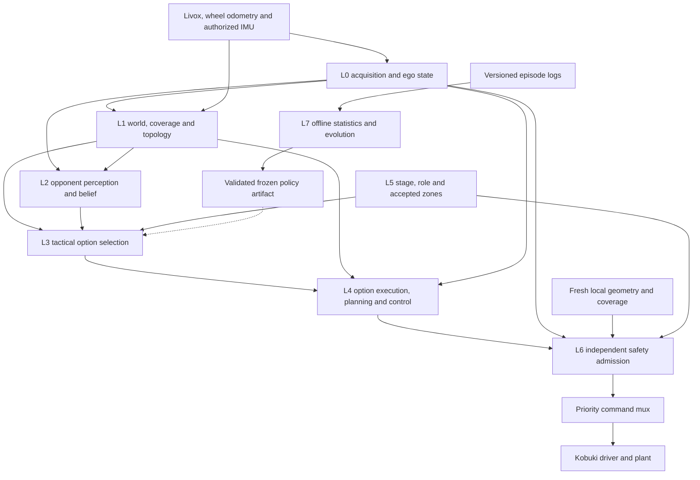
```mermaid
flowchart TD
    Sensors["Livox, wheel odometry and authorized IMU"] --> L0["L0 acquisition and ego state"]
    L0 --> L1["L1 world, coverage and topology"]
    Sensors --> L1
    L0 --> L2["L2 opponent perception and belief"]
    L1 --> L2
    L1 --> L3["L3 tactical option selection"]
    L2 --> L3
    Match["L5 stage, role and accepted zones"] --> L3
    L3 --> L4["L4 option execution, planning and control"]
    L1 --> L4
    L0 --> L4
    L4 --> L6["L6 independent safety admission"]
    L0 --> L6
    Fast["Fresh local geometry and coverage"] --> L6
    Match --> L6
    L6 --> Mux["Priority command mux"]
    Mux --> Base["Kobuki driver and plant"]
    Logs["Versioned episode logs"] --> L7["L7 offline statistics and evolution"]
    L7 --> Frozen["Validated frozen policy artifact"]
    Frozen -.-> L3
```

The direct `Sensors → Fast → L6` path is deliberately shorter than recognition and tactics. It still passes through ego-time alignment and coverage validation; it is not a bare scalar range. The world path maintains structural topology, while the fast path answers whether the outgoing stopping tube is currently observable and unoccupied.

### 2.2 Runtime process and deployment view

Process isolation is an authority property, not a package-style preference. Heavy perception and planning can consume CPU, but they cannot share the Python interpreter or callback queue that must complete safety decisions. The watchdog must also be separate from the supervisor it monitors.

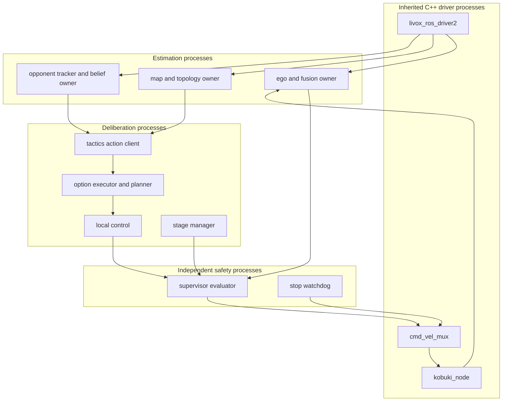
```mermaid
flowchart TB
    subgraph Drivers["Inherited C++ driver processes"]
        Livox["livox_ros_driver2"]
        Kobuki["kobuki_node"]
        Mux["cmd_vel_mux"]
    end
    subgraph Estimate["Estimation processes"]
        Ego["ego and fusion owner"]
        World["map and topology owner"]
        Opp["opponent tracker and belief owner"]
    end
    subgraph Deliberation["Deliberation processes"]
        Tactics["tactics action client"]
        Executor["option executor and planner"]
        Control["local control"]
        Stage["stage manager"]
    end
    subgraph Safety["Independent safety processes"]
        Supervisor["supervisor evaluator"]
        Watchdog["stop watchdog"]
    end
    Livox --> Ego
    Livox --> World
    Livox --> Opp
    Kobuki --> Ego
    Ego --> Supervisor
    World --> Tactics
    Opp --> Tactics
    Tactics --> Executor
    Executor --> Control
    Control --> Supervisor
    Stage --> Supervisor
    Supervisor --> Mux
    Watchdog --> Mux
    Mux --> Kobuki
```

The diagram shows logical processes. A later implementation may separate map and topology workers further, but it may not merge the supervisor or watchdog into perception/planning. DDS, OS scheduling and shared CPU remain common failure resources; process separation removes shared-interpreter blocking, not every form of contention.

### 2.3 Design-pattern registry

| Pattern | Concrete use | Invariant gained | Misuse explicitly rejected |
|---|---|---|---|
| Hexagonal / ports and adapters | `hsl_core` domain surrounded by ROS, simulator and file adapters | Same mathematics in tests, simulation and real runtime | Core dataclasses importing ROS messages or simulator APIs |
| Single writer / authority owner | One owner for TF edges, active option, stage state and each physical command channel | Removes conflicting state and command races | Watchdog and mux both publishing `/commands/velocity` |
| Immutable snapshot | Every timer evaluates a coherent, versioned input set | Reproducible decisions and stale-result rejection | Callbacks mutating shared arrays during evaluation |
| Chain of responsibility | Ordered safety admission filters | First causal stop reason and deterministic fail-safe order | A later limiter undoing an earlier emergency stop |
| State machine | Track, stage, option, watchdog and tactical lifecycles | Explicit guards, terminal causes and reset semantics | Scattered booleans that encode contradictory states |
| Strategy | Regulated pursuit, optional bounded arc evaluator; simulation observation profiles | Replaceable algorithms under one contract | Strategy changing safety authority or message meaning |
| Adapter | Livox/Kobuki/MVSim/replay and ROS-domain conversion | Stable logical topics and domain types | Treating topic remapping as a message-type conversion |
| Capability separation | Observation, actuation, simulation control and referee truth ports | Prevents simulator ground-truth leakage | One adapter object handed to policy with `truth()` access |
| Repository/artifact | Validated model, policy and calibration manifests | Reproducible immutable runtime inputs | Executable pickle or unversioned numeric blobs |
| Circuit breaker / lease | Expiring candidates, stage authority, heartbeats and watchdog latch | Bounded consequence of silent failure | Fresh publication timestamp disguising an old observation |

### 2.4 Core-to-runtime boundary

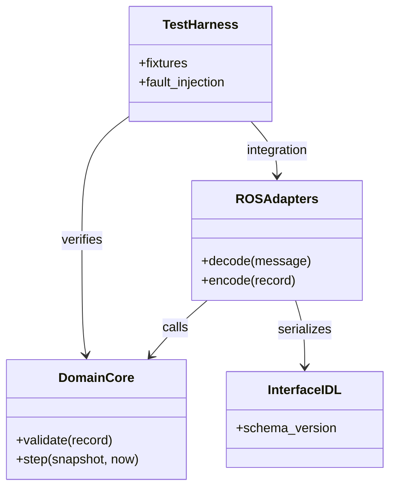
```mermaid
classDiagram
    class DomainCore {
        +validate(record)
        +step(snapshot, now)
    }
    class ROSAdapters {
        +decode(message)
        +encode(record)
    }
    class InterfaceIDL {
        +schema_version
    }
    class TestHarness {
        +fixtures
        +fault_injection
    }
    ROSAdapters --> DomainCore : calls
    ROSAdapters --> InterfaceIDL : serializes
    TestHarness --> DomainCore : verifies
    TestHarness --> ROSAdapters : integration
```

Each mutable estimator has one process/thread owner. Callbacks validate and replace immutable cached records; timer callbacks capture a coherent snapshot and compute without mutation of shared arrays. `dataclass(frozen=True)` does not freeze an array: use tuples or read-only copies. Worker results include input versions and are discarded when those inputs are obsolete. Bounded queues favor the latest complete sample; sequence gaps are logged, not silently interpreted as negative detections.

## 3. Canonical notation, frames, time and validity

### 3.1 Symbols and units

| Symbol/field | Meaning | Units/convention |
|---|---|---|
| `p`, `x`, `y` | Position of specified frame origin | m |
| `yaw` | Planar body heading | rad, wrapped to `[-pi,pi)` |
| `v` | Signed body forward speed | m/s; reverse disabled by default |
| `omega` | Body yaw rate | rad/s |
| `vx`, `vy` | Cartesian velocity components | m/s in the record's declared frame |
| `r_w`, `b_w` | Wheel radius and separation | m, calibrated |
| `r_body` | Conservative physical footprint radius about base origin | m; not inflated |
| `epsilon_*` | Named uncertainty/margin contributions | m or rad as named |
| `b_min` | Lower bound on achieved braking magnitude | m/s²; not a controller gain |
| `tau_response` | Bounded reaction/communication/mechanical delay | s |
| `q_a` | Continuous white acceleration spectral density | m²/s³ |
| `W`, `L_sym` | Graph affinity and normalized Laplacian | Declared affinity convention; L dimensionless |
| `b_j` | Opponent belief mass in support cell j | Probability |
| `P(s'|s,o)` | Tactical option transition law | Probability, distinct from `b_j` |
| `beta` | Continuous-time discount rate | 1/s |
| `G`, `E` subscripts | Guardian, explorer | Role, not robot hardware identity |

All mandatory numerical fields MUST be finite. Unknown values use explicit flags/status or omitted optional fields in offline JSON, not NaN in the wire protocol. Covariance is row-major, symmetric within tolerance and positive semidefinite within numerical tolerance. A 3×3 pose covariance contains m², m·rad and rad² entries; a 4×4 state covariance additionally contains m²/s and m²/s². It is not dimensionally correct to call every covariance entry “m²”.

### 3.2 Coordinate conventions

`T_A_B` transforms B coordinates into A. ROS TF edges are `map→odom→base_link→lidar_frame`. Pose in `EgoState` is in map; body `v,omega` are explicitly body quantities. Optional local pose is supplied as a separate `EgoState` instance in odom on a distinct topic. For MVP safety, `/state/ego_local` is mandatory; `/state/ego` is global. Both share state origin and health but have their own pose/covariance/frame.

`OpponentTrack` Cartesian position and velocity use map. The guardian's own yaw is required for capture; opponent yaw is not. `LocalObstacleSnapshot` uses odom; `WorldSnapshot`, `PathPlan`, graph nodes and zones use map. Transform a candidate path into odom using a single transform snapshot before safety evaluation. If transform validity cannot cover the requested time interval, stop or reject that candidate.

Do not use a frame name as evidence of accurate localization. `localization_epoch` changes on discontinuities/reinitialization; normal continuous estimates keep it. Local odometry may remain valid when map localization fails, but MVP holds map-dependent navigation until recovery. Any future local recovery mode must state its own authority and coverage contract.

### 3.3 Clocks and versions

The domain receives time as an argument. It never calls wall clock internally. Public timestamps are ROS-time integer nanoseconds, mapped to `builtin_interfaces/Time`; durations map to `Duration`. `clock_epoch` disambiguates simulator resets. Receiver-local `steady_now_ns` is never transmitted as a globally comparable timestamp.

`publication_stamp` is serialization time, not freshness of the physical observation. `state_stamp` is the time represented by a predicted state. `observation_stamp` is the earliest relevant observation in a fused/accumulated input. `last_measurement_stamp` is the most recent accepted real opponent measurement. A predicted track may advance state time while last measurement remains old.

For any leased record, validate:

1. Known schema, expected stage/clock/localization epoch and authorized source session.
2. Strictly advancing sequence per `(source_id,source_session)`; retransmitted duplicates may be ignored but MUST NOT refresh steady leases.
3. `observation_stamp <= publication_stamp + allowed_clock_skew`, `state_stamp <= publication_stamp + allowed_prediction_lead`, and `publication_stamp < valid_until` for valid records.
4. `now_ros < valid_until` (expiry is exclusive), observation age and prediction age within record-specific bounds.
5. Receipt-age on steady time within local lease; future-dated messages outside tolerance are rejected.
6. Finite payload, valid frame, consistency with associated versions.

A coherent snapshot does not require identical sequence numbers across producers. Choose an evaluation reference time, interpolate/predict only within validated bounds, transform using a common TF snapshot, and expand uncertainty for skew. Reject combinations whose temporal support does not overlap the required prediction interval. Store the contributing sequence IDs in diagnostics. Refreshed coverage may not certify space behind an earlier occluder. The current footprint must be initialized from a verified free placement or an explicit conservative local history; own-body masking alone is not evidence that all nearby space is free.

`map_version` tracks occupancy revisions; `topology_version` tracks graph rebuilds. Geometry changes may preserve an option after explicit route revalidation. Localization or clock epoch mismatch is a hard invalidation. IDs use `(topology_version,node_id)` or `(topology_version,edge_id)`; never reuse an unversioned integer in a delayed action result.

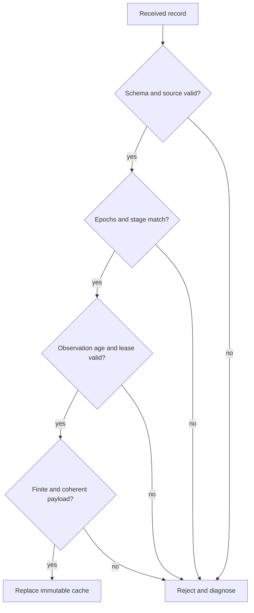
```mermaid
flowchart TD
    Input["Received record"] --> Schema{"Schema and source valid?"}
    Schema -->|yes| Epoch{"Epochs and stage match?"}
    Epoch -->|yes| Age{"Observation age and lease valid?"}
    Age -->|yes| Payload{"Finite and coherent payload?"}
    Payload -->|yes| Cache["Replace immutable cache"]
    Schema -->|no| Reject["Reject and diagnose"]
    Epoch -->|no| Reject
    Age -->|no| Reject
    Payload -->|no| Reject
```

A clock jump clears caches and revokes active motion. A paused simulator may pause virtual-time algorithms, but hardware never runs with simulator time. Steady watchdog behavior during slow offline simulation is selected by an explicit no-hardware test profile; disabling a real watchdog to make simulation convenient is prohibited.

## 4. Domain records and wire schema

### 4.1 Encoding rules

This is **interface revision 2**, requiring an atomic migration from the bootstrap schemas. Core names match message names without a `Data` suffix: `EgoState`, `OpponentTrack`, etc. Adapter functions are `decode_ego_state(msg)` and `encode_ego_state(record)`; use the corresponding snake-case name for each record. Do not invent `timestamp`, `theta`, `linear_velocity` aliases in new core code. Legacy aliases are accepted only in an explicit migration adapter.

The following schema notation is normative: `f64`→`float64`; `u8/u16/u32/u64`→ROS unsigned types; `text`→`string`; `Time`/`Duration`→builtin ROS types; `T[]`→variable sequence; `T[n]`→fixed array. Core uses immutable tuples and enum classes. ROS arrays additionally have configuration-enforced maximum sizes. `Pose2` is encoded with `geometry_msgs/Pose2D`, mapping core `yaw` to ROS `theta`; `Point2` uses `geometry_msgs/Point` with z=0. `Polygon2` is an HSL message containing `Point[] vertices` (float64 coordinates) to avoid loss of precision through Point32.

All top-level domain messages include `ContractHeader meta`:

```text
# ContractHeader.msg
uint16 schema_version
string source_id
string source_session
uint64 seq
string stage_id
string clock_epoch
string localization_epoch
string frame_id
builtin_interfaces/Time observation_stamp
builtin_interfaces/Time state_stamp
builtin_interfaces/Time publication_stamp
builtin_interfaces/Time valid_until
uint64 map_version
uint64 topology_version
uint8 validity
```

`validity`: `INVALID=0, VALID=1, DEGRADED=2`. Metadata-only records may use `frame_id=""`; geometric records may not. Before a stage is configured, `stage_id=""` is allowed only for sensors/diagnostics, never authority or commands. Nonapplicable versions are zero. Producers publish invalid records on failure with no motion authority; these are diagnostic, not substitutes for a valid lease.

### 4.2 Enumeration registry

Values below are serialized constants and MUST NOT be reordered. Unknown values fail decoding.

| Enum | Values |
|---|---|
| `Role` | `EXPLORER=0, GUARDIAN=1` |
| `TrackState` | `SEARCHING=0, TRACKED=1, COASTING=2, OCCLUDED_BELIEF=3, LOST=4` |
| `StagePhase` | `INIT=0, FREEZE=1, ACTIVE=2, TERMINAL=3` |
| `TerminalKind` | `NONE=0, CAPTURE=1, ARRIVAL=2, TIMEOUT=3, OFFICIAL_ABORT=4, AMBIGUOUS=5` |
| `EvidenceKind` | `ESTIMATE=0, SIM_TRUTH=1, OFFICIAL=2` |
| `TruthValue` | `UNKNOWN=0, FALSE=1, TRUE=2` |
| `GoalStatus` | `UNRESOLVED=0, CANDIDATE=1, ACCEPTED=2, INVALID=3` |
| `OptionKind` | `HOLD_SAFE=0; SEARCH_PORTAL=1; INTERCEPT_PORTAL=2; PRESSURE_ROUTE=3; APPROACH_CAPTURE=4; RECOVER_VIEW=5; FALLBACK_DEFEND_BASE=6; ADVANCE_BASE=7; BREAK_LOS=8; TAKE_ALTERNATE_PORTAL=9; KEEP_ESCAPE_ROUTE=10; OBSERVE_SAFE=11` |
| `OptionPhase` | `IDLE=0, PLANNING=1, EXECUTING=2, REPLANNING=3, CANCELING=4, FINISHED=5` |
| `OptionOutcome` | `SUCCESS=0, CANCELED=1, TIMEOUT=2, PRECONDITION_FAILED=3, FEASIBILITY_LOST=4, SAFETY_STOP=5, STAGE_ENDED=6, INTERNAL_ERROR=7` |
| `ControlMode` | `HOLD=0, TRACK_PATH=1, ALIGN=2, APPROACH_CAPTURE=3` |
| `SafetyMode` | `DISARMED=0, READY=1, ACTIVE=2, BRAKING=3, FAULT_LATCHED=4` |
| `SafetyDecision` | `STOP=0, ADMIT=1, LIMIT=2` |
| `NodeKind` | `ANCHOR=0, JUNCTION=1, DEAD_END=2, PORTAL=3, FRONTIER=4, ZONE_ACCESS=5` |
| `EdgeState` | `UNKNOWN=0, OPEN=1, BLOCKED=2` |
| `SensorProfile` | `REAL_CLOUD=0, SIM_CLOUD=1, SYNTHETIC_DETECTION=2, REPLAY_CLOUD=3` |
| `CoverageState` | `UNKNOWN=0, OBSERVED_FREE=1, OCCUPIED=2` |

`SafetyReason` is a serialized string restricted to: `NONE`, `NOT_ARMED`, `HARDWARE_FAULT`, `STOP_LATCH`, `MATCH_INACTIVE`, `STALE_MATCH`, `STALE_EGO`, `STALE_OBSTACLES`, `STALE_CANDIDATE`, `STALE_EXECUTION`, `STALE_WATCHDOG`, `INVALID_PAYLOAD`, `EPOCH_MISMATCH`, `OPTION_REVOKED`, `TF_UNAVAILABLE`, `LIMITS_INVALID`, `OUTSIDE_COVERAGE`, `COLLISION`, `BRAKING_INFEASIBLE`, `COMPUTE_OVERRUN`, `COMMAND_LIMITED`. Preserve one primary reason in evaluation order and a bounded list of contributing reasons; free-form detail is diagnostic only.

### 4.3 Ego, perception and world records

| Record | Fields after `meta` | Required semantics |
|---|---|---|
| `EgoState` | `Pose2 pose; f64 v; f64 omega; f64[9] pose_covariance; f64[4] twist_covariance; bool healthy; bool slip; bool localization_valid; text calibration_id` | Twist covariance order `[v,omega]`. Local/global variants differ only in frame/pose covariance and localization validity. |
| `OpponentTrack` | `text track_id; TrackState state; f64 x,y,vx,vy; f64[16] covariance; bool position_valid; f64 yaw; f64 yaw_variance; bool yaw_valid; Time last_measurement_stamp; SensorProfile sensor_profile; text model_id; text association_status` | Covariance order `[x,y,vx,vy]`. Invalid yaw uses zero payload and `yaw_valid=false`; consumers must honor the flag. No invented omega estimate. |
| `OpponentBelief` | `text track_id; BeliefCell[] cells; f64 unknown_mass; Time last_measurement_stamp; text transition_model_id; text visibility_model_id` | Nonnegative finite masses sum with unknown mass to 1 within tolerance; precision pose may be unavailable. |
| `BeliefCell` | `u64 edge_id; f64 s_begin_m,s_end_m; f64 lateral_bound_m; f64 mass` | Interval along a versioned edge. Node junction dwell may use an explicitly registered zero-length support edge. |
| `LocalObstacleSnapshot` | `Obstacle2[] obstacles; CoverageGrid coverage; f64 pose_error_bound_m; f64 map_error_bound_m; text bounds_id; bool complete` | Includes walls and unidentified objects. `complete=false` makes unavailable coverage unknown. Max obstacle/cell count bounded. |
| `Obstacle2` | `u64 obstacle_id; Polygon2 polygon; f64 vx,vy; f64 speed_bound_mps; f64 position_error_bound_m; bool motion_estimate_valid; bool is_opponent; Time last_observed_stamp` | Polygon is physical estimated occupancy; uncertainty added once by checker. Invalid motion estimate invokes configured conservative speed bound. |
| `CoverageGrid` | `Point2 origin; f64 resolution_m; u32 width,height; u8[] cells; Time[] observed_stamps` | Axis-aligned in parent's odom frame; row-major `index=iy*width+ix`; arrays length width×height; UNKNOWN outside. Cell age checked individually. |
| `WorldSnapshot` | `TopologyNode[] nodes; TopologyEdge[] edges; GoalZone[] zones; text grid_snapshot_id; text grid_hash; text map_profile; bool localization_valid` | Atomic graph snapshot. Local collision geometry is a separate fast record, not duplicated as stale graph fields. |
| `TopologyNode` | `u64 node_id; Point2 position; NodeKind kind; f64 clearance_radius_m; bool articulation; text semantic_zone_id` | No invented BASE label from shape alone. Empty semantic ID allowed. |
| `TopologyEdge` | `u64 edge_id,from_id,to_id; Point2[] polyline; f64 length_m; f64 min_clearance_radius_m; f64 min_width_m; bool width_valid; bool structural_bridge; EdgeState state; f64 cost; Time overlay_valid_until` | Undirected structural graph stored once with canonical endpoint ordering; adjacency derived both ways. Cost units fixed by planner profile. |
| `SpectralSignature` | `u64 center_node_id; u32 hops,node_count,component_count; f64[] eigenvalues; text affinity_definition; bool valid` | Optional diagnostic/tactical feature, versioned by same topology; not required by safety. |
| `GoalZone` | `text zone_id; GoalStatus status; Polygon2 boundary; text provider; text approval_ref; text provenance_hash; text frame_id; f64 position_error_bound_m` | Accepted semantic identity plus geometry in the explicitly declared frame, with a finite non-negative position-error bound. Unknown geometry has empty polygon and cannot be ACCEPTED. |

A `CoverageGrid` is local and bounded; the structural occupancy map may remain an internal `GridSnapshot` plus `nav_msgs/OccupancyGrid` visualization. Publishing full topology at sensor rate is unnecessary. `min_width_m` is optional because nearest-obstacle distance is not always half of an actual corridor width; clearance remains mandatory.

### 4.4 Stage, option, path and command records

| Record | Fields after `meta` | Semantics |
|---|---|---|
| `MatchState` | `u8 stage_number; Role role; StagePhase phase; Time stage_started_at,freeze_ends_at,stage_ends_at; bool motion_authorized; bool event_hold; TerminalKind terminal_kind; EvidenceKind terminal_evidence; text score_profile_id; text own_start_zone_id,target_zone_id; text config_hash` | Stage IDs change on reset. Authoritative phase and leased permission must agree; terminal/time fields are not independently editable booleans. |
| `OptionGoal` | `text option_instance_id; OptionKind kind; Role role; bool has_target_node; u64 target_node_id; Pose2 target_pose; bool target_yaw_required; f64 position_tolerance_m,yaw_tolerance_rad; Time deadline; text goal_zone_id; text parameters_id` | No arbitrary executable predicate strings. Preconditions come from versioned registry. Target node belongs to metadata topology version. |
| `OptionFeedback` | `text option_instance_id; OptionPhase phase; bool has_current_node; u64 current_node_id; f64 remaining_path_m; Duration elapsed; bool eta_valid; Duration eta; text reason; u64 last_candidate_seq,last_safety_seq` | Progress is path-based; can increase after replanning. ETA invalid rather than fake infinity. |
| `OptionResult` | `text option_instance_id; OptionOutcome outcome; Duration elapsed; text reason; text terminal_event_id` | Exactly one application result for an accepted instance; no result for a rejected ROS goal. |
| `PathPlan` | `text path_id,option_instance_id; Point2[] points; f64[] speed_limits_mps; bool final_yaw_required; f64 final_yaw; f64 cost; text planner_profile_id` | At least two points for movement; zero-length hold uses no path. Same count for points and speed limits. |
| `MotionCandidate` | `text option_instance_id,path_id; u64 ego_seq,obstacle_seq; f64 v,omega; Duration horizon; ControlMode control_mode; text limits_id` | Body command, short lease, valid from current state; not evidence of achieved velocity. Bind to active action instance. |
| `SafetyStatus` | `SafetyMode mode; SafetyDecision decision; text primary_reason; text[] reasons; u64 candidate_seq; f64 proposed_v,proposed_omega,applied_v,applied_omega; f64 checked_clearance_m,required_stop_distance_m,response_bound_s; bool clearance_valid; text limits_id; Duration evaluation_time` | `LIMIT` is distinct from veto. “Applied” means published/admitted command, not measured motor actuation. |
| `SupervisorHeartbeat` | `u64 decision_seq; SafetyMode mode; bool permit_motion; text config_hash; text active_option_instance_id` | Emitted only after a completed safety cycle; the watchdog rejects duplicates/replays. |
| `RuleEvent` | `text event_id; TerminalKind kind; EvidenceKind evidence; TruthValue predicate; Time event_time_lower,event_time_upper; text[] input_ids; f64 distance_m,bearing_rad; TruthValue los; text reason` | Interval accommodates sampled evidence. A capture estimate is not official adjudication. |

`PathPlan` is expressed in map; `MotionCandidate.meta.frame_id` is `base_link`, while associated ego/obstacle records retain their frames. All command consumers validate active option ID and stage/epoch, not only sequence or timestamp.

`ExecutionState` and `WatchdogHealth` complete the authority message registry; their exact schemas and publishers are specified in §§6.1 and 13.6. They use the same ContractHeader validation. Their presence is mandatory, not an optional diagnostic extension.

### 4.5 Validation and serialization contract

Validate polygon simplicity, at least three distinct noncollinear vertices, no repeated closing vertex, counterclockwise order, and coordinate bounds. Convexity is not required generally; algorithms must either support simple nonconvex polygons or triangulate them. SAT is valid for convex polygons only. Footprint may be a measured conservative convex polygon; goal zone may be nonconvex.

Graph validation rejects duplicate IDs, missing endpoints, nonfinite or negative costs, inconsistent polyline endpoints and mismatched stored length beyond tolerance. Array-size bounds are release configuration and tested at maximum size. `edge.cost >= edge.length_m` is required only for the meter-cost profile; time-cost profiles use their own lower bound.

Encoding round trips preserve enum values, integer times, IDs, frame, array ordering and validity flags. Each field must have a test fixture. Runtime input validation uses explicit exceptions/results, not Python `assert`, which can be disabled. Invalid external data returns a typed rejection and safe behavior; programming invariant failures are logged with crash containment.

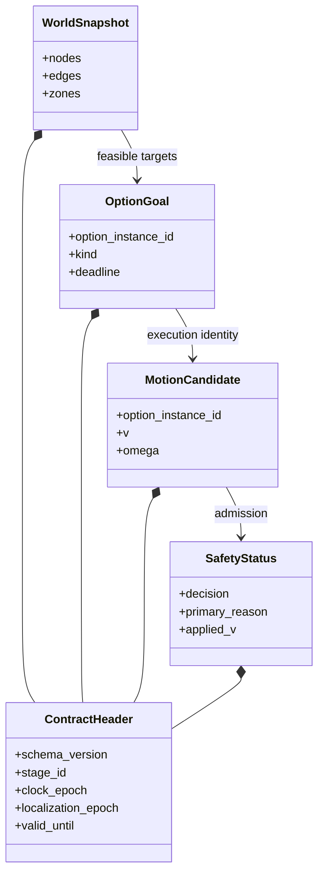
```mermaid
classDiagram
    class ContractHeader {
        +schema_version
        +stage_id
        +clock_epoch
        +localization_epoch
        +valid_until
    }
    class WorldSnapshot {
        +nodes
        +edges
        +zones
    }
    class OptionGoal {
        +option_instance_id
        +kind
        +deadline
    }
    class MotionCandidate {
        +option_instance_id
        +v
        +omega
    }
    class SafetyStatus {
        +decision
        +primary_reason
        +applied_v
    }
    WorldSnapshot *-- ContractHeader
    OptionGoal *-- ContractHeader
    MotionCandidate *-- ContractHeader
    SafetyStatus *-- ContractHeader
    WorldSnapshot --> OptionGoal : feasible targets
    OptionGoal --> MotionCandidate : execution identity
    MotionCandidate --> SafetyStatus : admission
```

## 5. ROS graph, QoS and authority

Topic names below are canonical inside a robot namespace. A single physical robot may use root names; two-robot simulation uses `/guardian/...` and `/explorer/...` with no shared command namespace. The inherited raw driver names are remapped once at bringup.

| Topic/interface | Type | Sole producer → consumers | QoS and rate target |
|---|---|---|---|
| `/sensors/points` | Verified `PointCloud2` normalized from Livox custom format if needed | Sensor adapter → perception/world | Best effort, volatile, depth 1; sensor rate |
| `/sensors/imu` | `sensor_msgs/Imu` | Driver adapter → fusion | Best effort, volatile, depth 1 |
| `/wheel_odom` | `nav_msgs/Odometry` | Kobuki adapter → fusion | Match actual driver offered QoS |
| `/state/ego_local` | `EgoState`, odom | Ego adapter → safety/navigation | Reliable, volatile, depth 1; 30–50 Hz target |
| `/state/ego` | `EgoState`, map | Ego adapter → world/perception/tactics/navigation | Reliable, volatile, depth 1 |
| `/world/local_obstacles` | `LocalObstacleSnapshot` | Fast obstacle adapter → safety/navigation | Best effort, volatile, depth 1; each valid processed cloud |
| `/world/topology` | `WorldSnapshot` | Topology node → tactics/navigation/belief | Reliable, transient local, depth 1; event-driven |
| `/world/opponent_track` | `OpponentTrack` | Tracker → tactics/navigation/rules | Reliable, volatile, depth 1; 5–10 Hz target |
| `/world/opponent_belief` | `OpponentBelief` | Tracker/belief owner → tactics | Reliable, volatile, depth 1 |
| `/match/match_state` | `MatchState` | Stage manager → all authority consumers | Reliable, transient local, depth 1; event plus heartbeat |
| `/match/rule_events` | `RuleEvent` | Stage manager rule evaluator → diagnostics/event consumers | Reliable, bounded event queue; deduplicate event ID |
| `/navigation/path` | `PathPlan` | Global planner → option executor/control | Reliable, volatile, depth 1 |
| `/navigation/execute_option` | `ExecuteOption.action` | Tactics client ↔ option executor server | ROS action transport; per-goal deadline |
| `/navigation/execution_state` | `ExecutionState` | Option executor → control/supervisor | Reliable, volatile, depth 1; periodic lease |
| `/hsl/watchdog_health` | `WatchdogHealth` | Independent watchdog → supervisor/diagnostics | Reliable, volatile, depth 1; periodic lease |
| `/hsl/motion_candidate` | `MotionCandidate` | Local control → supervisor | Reliable, volatile, depth 1; 20 Hz target |
| `/hsl/safety_status` | `SafetyStatus` | Supervisor → tactics/diagnostics | Reliable, volatile, depth 1; every decision or decimated diagnostics |
| `/hsl/supervisor_heartbeat` | `SupervisorHeartbeat` | Supervisor → watchdog | Reliable, volatile, depth 1; every completed cycle |
| `/hsl/cmd_vel_final` | `geometry_msgs/Twist` | Supervisor → mux autonomous input | Volatile, depth 1; 50 Hz target, priority 50 |
| `/teleop/cmd_vel` | `geometry_msgs/Twist` | Authorized test teleop → mux | Volatile; priority 100; disabled for competition motion |
| `/hsl/cmd_vel_stop` | `geometry_msgs/Twist`, zero only | Independent watchdog → mux | Volatile; priority 200; ≥20 Hz while stop asserted |
| `/commands/velocity` | Driver-verified `Twist` | **Mux only** → base driver | Output cadence and timeout measured |

The table is the normative ownership registry. The following diagram is only a data-flow view; an arrow does not grant write authority beyond the table.

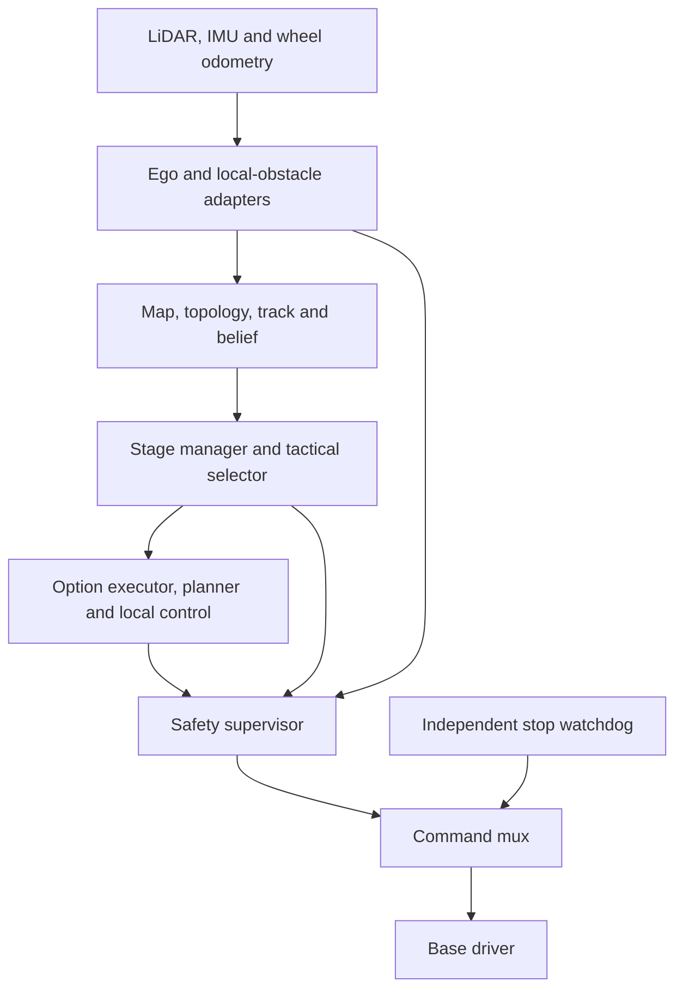
```mermaid
flowchart TD
    Sensors["LiDAR, IMU and wheel odometry"] --> State["Ego and local-obstacle adapters"]
    State --> World["Map, topology, track and belief"]
    World --> Decide["Stage manager and tactical selector"]
    Decide --> Navigate["Option executor, planner and local control"]
    Navigate --> Admit["Safety supervisor"]
    State --> Admit
    Decide --> Admit
    Admit --> Mux["Command mux"]
    Watchdog["Independent stop watchdog"] --> Mux
    Mux --> Driver["Base driver"]
```

| Name category | Required convention | Example | Prohibited ambiguity |
|---|---|---|---|
| Domain record | PascalCase noun; immutable value | `WorldSnapshot` | Reusing a node name as a record type |
| ROS message | Same semantic name as the domain record when lossless | `OpponentTrack.msg` | `OpponentState`, `Rival`, and `Target` for the same concept |
| Node class | PascalCase ending in `Node` | `SafetySupervisorNode` | Calling the pure evaluator a node |
| Executable | lower snake case ending in `_node` where applicable | `supervisor_node` | Multiple executables owning one canonical output |
| Topic | lower snake case, robot-relative namespace | `/world/topology` | Role-specific aliases for identical data |
| Function | verb-first lower snake case | `extract_topology` | Hidden mutation in a function named `get_*` |
| Identifier | semantic prefix plus immutable scope | `option_instance_id` | A bare `id` whose namespace is unstated |

Raw mappings reported by changelog: `/livox/lidar→/sensors/points`, `/livox/imu→/sensors/imu`, `/odom→/wheel_odom`. A remap changes names, not message type or per-point time semantics. If the Livox driver uses `CustomMsg`, implement a decoder preserving offset times and timebase; do not pretend a remap converts it.

QoS is an engineering design, not a freshness proof. Reliable delivery may deliver old samples; transient-local authority may be old on restart. Application leases always apply. A reliable subscriber cannot receive from a best-effort publisher under incompatible offered/requested policies. Match actual endpoints in integration tests. Depth 1 does not prevent old data from being processed if execution is delayed.

**Independent stop channel contract.** At startup the watchdog asserts zero before autonomy or teleop is armed. While armed it publishes no stop messages. If heartbeat progression, stage lease, configuration identity or local steady-time deadline fails, it latches stop and publishes zeros at a validated rate shorter than the mux input timeout. Fresh nonzero commands cannot outrank stop. Rearm requires explicit authorized testing/operational action after fault clearance; it must flush/revoke old candidate identity. In competition, rearm is an onboard state transition only if permitted by the frozen recovery policy; it is never an undocumented remote control path.

Mux silence is not assumed to create zero. Verify actual inherited mux behavior on input expiry, and verify downstream driver timeout when all publishers disappear. Do not refresh stale nonzero commands as a keepalive. During normal freeze, supervisor publishes zeros and the watchdog maintains stop authority. During a complete host failure, only downstream timeout/hardware behavior remains.

## 6. Actions, services and transactional behavior

### 6.1 ExecuteOption

```text
# ExecuteOption.action
hsl_interfaces/OptionGoal goal
---
hsl_interfaces/OptionResult result
---
hsl_interfaces/OptionFeedback feedback
```

The ROS action UUID is recorded alongside `option_instance_id`; they are distinct identifiers with a one-to-one binding. An `OptionGoal` topic MAY mirror accepted goals for observation, but MUST NOT execute them. There is one execution owner.

**Admission:** reject unknown schema/kind/role, mismatched stage/epoch, expired deadline, unresolved required zone, missing node/version, invalid target geometry, incompatible active goal or failed initiation predicate. A rejection does not produce an accepted execution. `HOLD_SAFE` needs no movement target; target fields are ignored under its tagged semantics and zeroed by the encoder.

**Accepted goal:** enters PLANNING; produces finite-time plan or a terminal `FEASIBILITY_LOST`/`INTERNAL_ERROR`. Planner timeout is bounded. Success means the option's declared effect, not automatically capture or arrival. A waypoint goal may require position and optionally yaw tolerance plus dwell. `APPROACH_CAPTURE` succeeds only on the chosen evidence predicate; it cannot succeed simply by reaching an old opponent pose.

**Preemption:** tactics sends cancel, immediately revokes the old instance in the shared execution authority, waits for cancellation acknowledgment or bounded timeout, then submits the new goal. Supervisor candidates with the revoked ID are rejected. If cancellation stalls, stop; do not run both options. To avoid a second loose command topic, the option executor publishes its current active-instance identity as part of its leased execution status consumed by supervisor (required `ExecutionState` below).

```text
# ExecutionState.msg: required authority companion
hsl_interfaces/ContractHeader meta
string active_option_instance_id
uint64 lease_generation
uint8 phase
bool candidate_authorized
```

Topic `/navigation/execution_state`: option executor → local control/supervisor, reliable volatile depth 1, periodic lease. `candidate_authorized=false` during cancel, replan without valid path, stage end or hold. `HOLD_SAFE` can authorize zero only. A missing execution lease uses the registered `STALE_EXECUTION` reason.
Every newly accepted option and each replan advances `lease_generation`; `MotionCandidate` carries that generation, and the safety boundary rejects a candidate whose generation differs from the current `ExecutionState`. Thus a delayed candidate from an earlier plan cannot regain authority merely because the `option_instance_id` is unchanged.

### 6.2 Stage and zone services

```text
# ResetStage.srv
string request_id
string expected_stage_id
uint8 stage_number
uint8 role
string memory_profile_id
string organizer_authorization_ref
---
bool accepted
string new_stage_id
string reason

# SetGoalZone.srv
string request_id
string expected_stage_id
hsl_interfaces/GoalZone zone
string organizer_authorization_ref
---
bool accepted
string reason

# StartStage.srv
string request_id
string expected_stage_id
builtin_interfaces/Time official_start_stamp
string organizer_authorization_ref
---
bool accepted
string reason
```

`ResetStage` is not an autonomous competition restart. It is allowed only while stopped in INIT or after a terminal stage, or with an explicit organizer-authorized restart record. The server rejects `keep_map=true`-style unrestricted switches; `memory_profile_id` must be an approved profile. Stage reset atomically revokes commands, cancels actions, clears opponent state, resets time/version bindings as required, preserves only permitted map/model data, and publishes a new INIT stage. It does not immediately grant ACTIVE authority.

`SetGoalZone` is accepted only before ACTIVE in the configured permission window, with valid provenance and frame. No untyped `Float64MultiArray`, arbitrary radius default or unconditional network override is allowed. Duplicate `request_id` returns the original result; conflicting reuse is rejected. A service failure leaves previous state unchanged. `StartStage` latches one origin; repeated calls do not reset elapsed time. Exact official timestamp acquisition must be validated operationally; missing synchronization is not repaired by pretending the first sensor packet is stage start.

### 6.3 Event resolution and controlled rearming

The stage manager evaluates estimated predicates from coherent ego/track/world snapshots and publishes `/match/rule_events`. Its own internal event handler updates `event_hold`; it need not subscribe to its own event topic. The simulation referee publishes truth only to an evaluation recorder, not the policy; test harnesses may submit adjudication through the explicit test interface below.

```text
# ResolveEvent.srv
string request_id
string expected_stage_id
string event_id
uint8 resolution
uint8 terminal_kind
string organizer_authorization_ref
---
bool accepted
string reason

# RearmSafety.srv
string request_id
string expected_stage_id
string expected_config_hash
string recovery_policy_id
string authorization_ref
---
bool accepted
string reason
```

`resolution` is `DISMISS_ESTIMATE=0`, `CONFIRM_OFFICIAL=1`, or `SET_OFFICIAL_TERMINAL=2`. A dismiss applies only to a pending estimate and clears its hold after logging the decision; it cannot erase an official terminal. Confirmation requires an existing event; setting a terminal can represent an official event not detected onboard. Allowed `terminal_kind` is CAPTURE, ARRIVAL, TIMEOUT or OFFICIAL_ABORT, never an arbitrary numeric score. Only the permitted organizer/operator workflow can submit official resolution; simulation-only authorization cannot run in a real profile. No automatic remote referee topic is assumed to exist in the competition.

`RearmSafety` is handled by the watchdog with supervisor coordination. Acceptance requires matching stage/configuration, cleared fault causes, measured near-zero v and omega for a configured dwell, fresh mutual-health and data leases, and an authorized frozen recovery policy or permitted test operator. Revoke old execution identity before releasing the stop channel. A service acceptance starts READY validation; it does not itself produce a nonzero command. Rejected or duplicate requests are idempotent and leave inhibition unchanged.

Without a permitted event-resolution channel, the conservative default keeps an estimated terminal hold latched until the stage ends or the authorized workflow resolves it. An optional automatic false-alarm release needs an explicit evidence policy and tests; it must not be improvised by an agent. This operational tradeoff is logged because a false positive can cost the stage even when physical safety is preserved.

## 7. Mapping, topology and spectral algorithms

### 7.1 Grid and obstacle processing

Inputs are time-valid 3D points, extrinsics, attitude/pose history and a sensor validity model. Output has two paths: collision/coverage updates immediately; structural interpretation and object recognition asynchronously. Do not wait for GPIS classification before registering a blocking return.

1. Decode per-point times and reject invalid/nonfinite ranges.
2. Apply own-motion compensation to a common reference time. Reject scans exceeding pose-history support; do not extrapolate arbitrarily.
3. Remove the robot's own measured body and ground only using calibrated masks and uncertainty. A height crop from rev1 is not universal; in particular it must retain all relevant 0.15 m obstacles and usable robot features.
4. Ray trace observable free cells to the first valid hit. A moving-object return truncates the ray just as a wall does. Unknown or blind cells remain unknown.
5. Update collision occupancy and coverage; retain timestamps. Structural mapping uses persistence, semantic exclusion masks and change detection, without suppressing collision evidence.
6. Apply bounded decay only to the appropriate transient layer. Aged-out occupied space becomes unknown until reobserved; it does not automatically become certified free.

Thresholds `p_free < p_occupied` leave an unknown band. Correlated points from one scan should be aggregated/capped so thousands of returns do not imply thousands of independent observations. Moving the observer requires transforming background models consistently; fixed-sensor background vetoes cannot remain fixed in lidar coordinates.

### 7.2 Deterministic topology extraction

`extract_topology(grid, footprint, config, previous_graph) -> WorldSnapshot`:

1. Build known-free configuration space. Inflate occupied **and unknown** cells for routes requiring known traversability. Separate frontier information for exploration.
2. Compute metric distance transform with grid resolution; for cell-center representations include raster discretization error conservatively.
3. Skeletonize with a fixed connectivity convention. Disallow diagonal crossing between two blocking corner cells.
4. Cluster adjacent junction pixels into junction regions. Trace degree-two chains between regions/endpoints. Prune short noise spurs only under a documented threshold without deleting validated goals/frontiers or disconnecting actual routes.
5. Insert portal nodes at meaningful local clearance minima, goal-access nodes at collision-free access locations, and one or more deterministic anchors on isolated cycles. A portal threshold is robot/profile dependent, not always 0.6 m.
6. Store each chain's polyline and physical length. Validate full swept footprint and turnability, not just endpoint spacing or circle clearance along a chord.
7. Compute graph bridges and articulation points on structural undirected connectivity in `O(V+E)`. Compute runtime blockage separately.
8. Match old/new nodes geometrically only as an aid; publish a new topology version and an explicit migration map if stable IDs cannot be proven. Consumers must never silently reinterpret old node IDs.

Nearest obstacle distance is useful clearance but not a semantic wall detector. A wide single-link portal can be a bridge; a narrow corridor in a loop need not be. A frontier degree-one node is not a confirmed dead end. A graph can contain parallel distinct corridors; give each its own edge ID instead of collapsing to a simple adjacency boolean and losing routes.

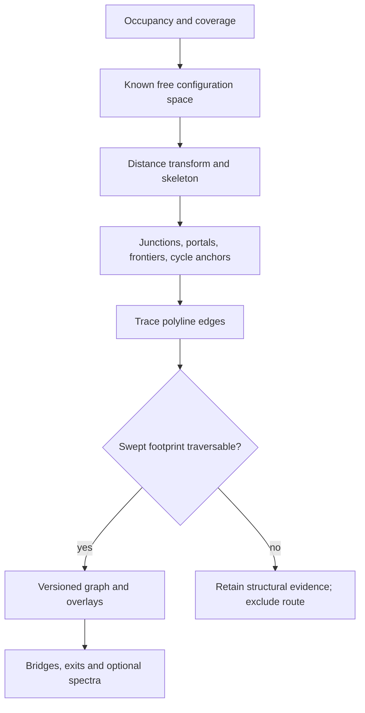
```mermaid
flowchart TD
    Grid["Occupancy and coverage"] --> Free["Known free configuration space"]
    Free --> Skeleton["Distance transform and skeleton"]
    Skeleton --> Nodes["Junctions, portals, frontiers, cycle anchors"]
    Nodes --> Trace["Trace polyline edges"]
    Trace --> Check{"Swept footprint traversable?"}
    Check -->|yes| Graph["Versioned graph and overlays"]
    Check -->|no| Blocked["Retain structural evidence; exclude route"]
    Graph --> Features["Bridges, exits and optional spectra"]
```

The resulting object model is deliberately richer than an adjacency matrix:

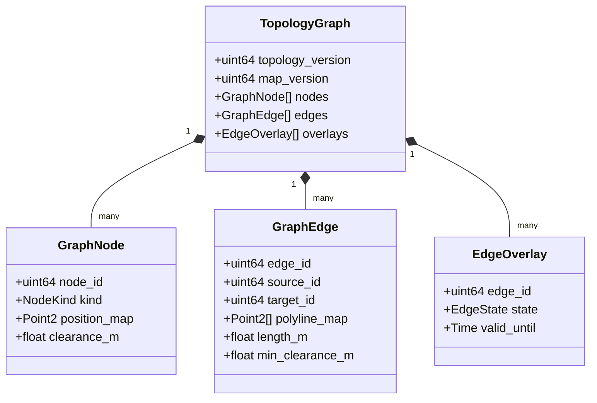
```mermaid
classDiagram
    class TopologyGraph {
        +uint64 topology_version
        +uint64 map_version
        +GraphNode[] nodes
        +GraphEdge[] edges
        +EdgeOverlay[] overlays
    }
    class GraphNode {
        +uint64 node_id
        +NodeKind kind
        +Point2 position_map
        +float clearance_m
    }
    class GraphEdge {
        +uint64 edge_id
        +uint64 source_id
        +uint64 target_id
        +Point2[] polyline_map
        +float length_m
        +float min_clearance_m
    }
    class EdgeOverlay {
        +uint64 edge_id
        +EdgeState state
        +Time valid_until
    }
    TopologyGraph "1" *-- "many" GraphNode
    TopologyGraph "1" *-- "many" GraphEdge
    TopologyGraph "1" *-- "many" EdgeOverlay
```

`GraphEdge.polyline_map` is the metric realization used for path length, collision validation and control. The sparse edge collection is the canonical topology representation. A dense `N×N` matrix is constructed only as a bounded temporary object for a selected small spectral scope; it is not the runtime world model.

The class view is an internal projection of `WorldSnapshot`: `GraphNode` corresponds to `TopologyNode`, `GraphEdge` to `TopologyEdge`, and each overlay is serialized in its edge's `state` and `overlay_valid_until`. These are **not** additional ROS message types. Preserve the IDL's `uint64` version and node/edge ID domains (§4).

### 7.3 Spectral definition and proof obligations

For MVP spectra are disabled. If enabled, select `affinity=unweighted` or `inverse_length`; parallel-edge affinities sum. Use a symmetric matrix with zero diagonal unless a documented model requires self loops. Directed planning restrictions are not silently inserted into a symmetric spectral calculation.

Let `d_i=sum_j W_ij`. With `D_inv_sqrt[i]=1/sqrt(d_i)` for d_i>0 and zero otherwise,

\[
L_{sym}=D^{-1/2}(D-W)D^{-1/2}.
\]

For `z_i=x_i/sqrt(d_i)` on positive-degree vertices,

\[
x^TL_{sym}x=\frac12\sum_{ij}W_{ij}(z_i-z_j)^2\ge0.
\]

Since `(a-b)²<=2(a²+b²)`, this quadratic form is at most `2||x||²`; hence the eigenvalues lie in [0,2]. Every connected component provides a null vector with entries sqrt(d_i), with isolated-node unit vectors under the zero-row convention. Nullity equals component count. `lambda2>0` characterizes connected nontrivial graphs under this convention; `lambda1=0` alone does not prove connectedness.

**Local versus global:** a global spectrum describes the whole chosen graph. For node i, choose an induced k-hop subgraph, rebuild its degree matrix, and compute its own spectrum; do not reuse global degrees. This local descriptor depends on the chosen k and boundary truncation. A principal submatrix corresponds to a different boundary treatment. Persist `hops`, `affinity_definition`, node count, component count and version with every signature.

**Invariance:** node relabeling gives orthogonal similarity `P L P^T`. A rigid transform changes only the embedding; inverse-length affinities remain unchanged. Uniform scaling by s multiplies inverse-length W and D by 1/s; normalized L is unchanged because the two inverse square roots contribute s. Combinatorial L scales by 1/s. Fixed grid scale and robot size can change extraction and traversability, so this is not end-to-end scale invariance of the robot.

Spectra cannot recover left/right, metric location or unique graph geometry. Steering uses `R(yaw)^T(p_target-p_ego)` and edge polylines. Spectral features are accepted only after an ablation shows value beyond clearance, degree, bridge flags and goal/rival travel-time estimates.

| Symbol/artifact | Scope | Meaning | Permitted use | Must not be used as |
|---|---|---|---|---|
| `lambda_1...lambda_N` | One declared graph operator | Sorted eigenvalues of that operator | Connectivity diagnostics and optional bounded features | Coordinates, corridor IDs or steering signs |
| `lambda_2` | Connectedness-sensitive, when defined | Algebraic-connectivity feature | Auxiliary structural descriptor | Proof of a narrow portal or unique bottleneck |
| `lambda_3` | Graphs with at least three eigenvalues | Additional coarse spectral feature | Optional learned/tactical input after ablation | A required field when unavailable |
| Eigenvectors | Declared operator and ordering | Modal basis with sign/basis ambiguity | Diagnostics with invariant processing | Left/right orientation |
| Bridge/articulation flags | Exact structural graph | Single-edge/single-node cut facts | Escape and interception reasoning | Metric clearance |
| Edge polyline and clearance | Embedded graph | Physical route geometry | Planning, steering and swept checks | A spectral surrogate |

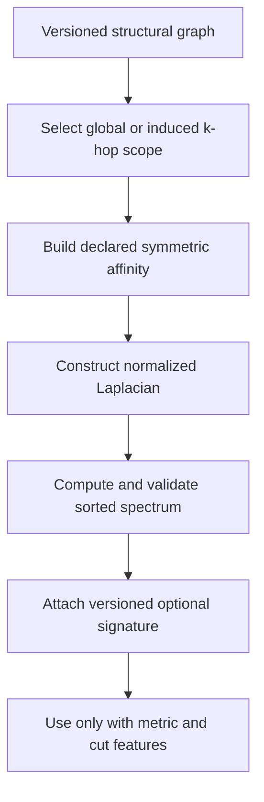
```mermaid
flowchart TD
    Graph["Versioned structural graph"] --> Scope["Select global or induced k-hop scope"]
    Scope --> Affinity["Build declared symmetric affinity"]
    Affinity --> Laplacian["Construct normalized Laplacian"]
    Laplacian --> Spectrum["Compute and validate sorted spectrum"]
    Spectrum --> Feature["Attach versioned optional signature"]
    Feature --> Tactics["Use only with metric and cut features"]
```

## 8. Hermite-GPIS-W model and registration

### 8.1 Offline model construction

**Purpose:** estimate the opponent base-frame origin from partial 3D surface observations with an explicit shape prior. This model is neither the world occupancy map nor the physical collision footprint.

`tools/train_gpis_prior.py` MUST implement the following reproducible pipeline:

1. Load complete, licensed mesh geometry or registration-verified stationary scans; record metric units and source hashes. Include the actual supplied configuration, not an assumed base-only model.
2. Define a model frame M and fixed `T_B_M`. Validate that the designated competition robot reference frame corresponds to the frame used in capture distance.
3. Clean geometry, sample surface locations, orient normals and reject unreliable normals. Multi-view scans must be aligned without leaking validation views into training.
4. Define the field convention. This baseline uses an SDF-like field in meters near the surface: `f(x_i)=0`, derivative constraints `grad f(x_i)≈n_i`, and optional offset values `f(x_i±delta*n_i)≈±delta`. This does not impose the global eikonal equation `||grad f||=1`.
5. Choose a positive-definite compact kernel smooth enough for derivative observations, support radius, noise per observation type, and optional coordinate normalization.
6. Solve a regularized Hermite GP system without explicitly inverting the matrix. Check numerical conditioning and posterior variance consistency.
7. Validate origin bias, residuals, coverage, runtime and yaw observability on held-out view angles, occlusions and ranges, then export immutable arrays plus manifest.

A valid illustrative three-dimensional Wendland C4 kernel is

\[
k(x,x')=\sigma_f^2\phi(r),\quad r=\|x-x'\|/\ell,\qquad
\phi(r)=(1-r)_+^6(35r^2+18r+3)/3.
\]

The `/3` normalizes `phi(0)=1`; omit it only if the amplitude convention is deliberately redefined everywhere. The stored `kernel_id` is `wendland_c4_d3_unit_center_v1`. Another validated kernel may replace it through a versioned model schema, not by changing coefficients under the same ID. At r=0, evaluate analytic limits of derivatives rather than dividing by r.

Let each observation be `y_a=L_a f(x_a)+noise`, where L_a is value or a directional derivative. Then

\[
K_{ab}=L_a^xL_b^{x'}k(x_a,x_b),\quad
A=K+\Sigma_{noise},\quad A\alpha=y-m_{obs}.
\]

Value-gradient blocks differentiate in the corresponding argument; gradient-gradient blocks use mixed derivatives. For stationary kernels `grad_x k=-grad_x' k`; missing this sign can destroy the covariance. Derivative observations have different units from field values; their noise entries must be expressed accordingly.

At query z, `k_z[a]=L_a^{x'} k(z,x_a)`,

\[
\mu(z)=m(z)+k_z^T\alpha,\quad
\sigma^2(z)=k(z,z)-k_z^TA^{-1}k_z.
\]

A Cholesky solve or validated sparse solve supplies the second term; coefficients alone do not suffice for exact predictive variance. Tiny negative variance from roundoff may be clamped within a documented tolerance; materially negative variance invalidates the model. Large systems require bounded support counts or a separately validated approximation.

With a zero mean compact-support kernel, far-away points may have mean zero and high uncertainty. A zero residual there must not be accepted as a surface match. Require active support, a gradient/coverage test and sufficient inlier geometry. This is essential for reliable registration.

### 8.2 Online registration

The observed points are in a leveled/map frame. For planar model pose `(p,psi)`, ignoring the known fixed base/model offset only for the derivation,

\[
z_j=R_z(\psi)^T(P_j-[p_x,p_y,0]^T).
\]

For planar coordinates with `J=[[0,-1],[1,0]]`,

\[
\frac{\partial z_j}{\partial p}=-R^T,\qquad
\frac{\partial z_j}{\partial\psi}=-Jz_j,
\qquad
J_{f,j}=\nabla f(z_j)^T[-R^T\; -Jz_j].
\]

The 3D implementation embeds these planar derivatives into x/y/z and includes the actual fixed transforms. Unit tests compare analytic Jacobians to finite differences across yaw wrap and translated poses.

Use residual `r_j=f(z_j)/sigma_fj`, where

\[
\sigma_{fj}^2=\sigma_{GP,j}^2+
\nabla f(z_j)^T\Sigma_{z,j}\nabla f(z_j)+\sigma_{model}^2.
\]

For an IRLS step with frozen denominators/weights, solve

\[
(J^TWJ+\lambda D)\Delta\xi=-J^TWr,
\]

using positive damping D and bounded steps. Recompute residuals/weights after accepted steps. This is a local damped Gauss–Newton approximation, not an exact likelihood Hessian when variance depends on pose. Bound candidate count, points per candidate, iterations and wall time. Failure returns typed status, not a plausible pose by default.

Assess information in position and yaw separately. A symmetric body can yield usable position but near-zero yaw information. Estimate position covariance conservatively, including model-origin calibration and ego-pose uncertainty. Shared ego error correlates all cloud points; it cannot be eliminated by dividing independent noise by point count. Do not equate inverse `J^TWJ` with complete estimator uncertainty.

**Fallback:** a calibrated circle/visible-contour fit with a known center relation may yield a position-only measurement. A bounding-box centroid with no partial-view bias model does not. Set `yaw_valid=false` only for yaw unobservability; reject position too if translation is unconstrained. The rulebook prohibits appearance modification, but partial views and model mismatch still occur.

### 8.3 Artifact contract

`artifacts/models/opponent_gpis/model.npz` contains non-object arrays: support points, operator kind/direction, alpha, model transform, kernel parameters, observation noise, normalization, and factorization data or an explicit uncertainty-approximation identifier. Load with `allow_pickle=False`.

`manifest.json` fields: `schema_version`, `model_id`, `kernel_id`, `field_units`, `coordinate_units`, `support_radius_m`, `model_frame`, `base_from_model`, `source_hashes`, `training_config_hash`, `array_shapes`, `artifact_sha256`, `uncertainty_method`, `supported_view_domain`, `created_by_version`. `validation.json` records dataset split hashes, origin/yaw errors, coverage failure rate, latency distributions and pass thresholds. No file is promoted with only a training residual.

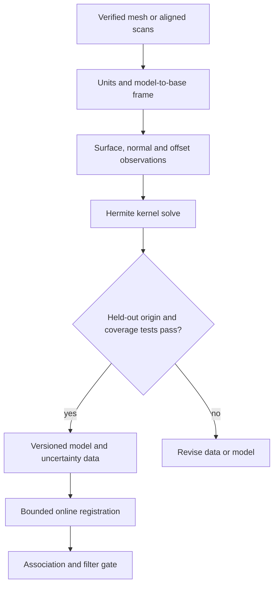
```mermaid
flowchart TD
    Source["Verified mesh or aligned scans"] --> Frame["Units and model-to-base frame"]
    Frame --> Samples["Surface, normal and offset observations"]
    Samples --> Fit["Hermite kernel solve"]
    Fit --> Validate{"Held-out origin and coverage tests pass?"}
    Validate -->|yes| Artifact["Versioned model and uncertainty data"]
    Validate -->|no| Revise["Revise data or model"]
    Artifact --> Register["Bounded online registration"]
    Register --> Gate["Association and filter gate"]
```

## 9. Opponent filter and occlusion belief

### 9.1 Detection and association

The opponent-estimation pipeline preserves two independent outputs: all valid returns remain in collision occupancy, while only accepted candidate evidence updates semantic identity.

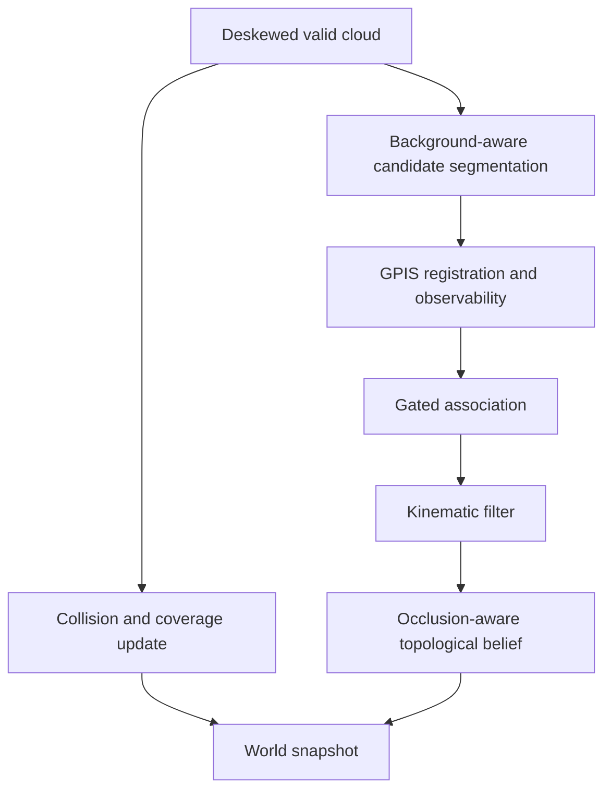
```mermaid
flowchart TD
    Cloud["Deskewed valid cloud"] --> Collision["Collision and coverage update"]
    Cloud --> Candidates["Background-aware candidate segmentation"]
    Candidates --> Register["GPIS registration and observability"]
    Register --> Associate["Gated association"]
    Associate --> Filter["Kinematic filter"]
    Filter --> Belief["Occlusion-aware topological belief"]
    Collision --> Snapshot["World snapshot"]
    Belief --> Snapshot
```

Pipeline: deskew/level → candidate segmentation → shape/size screening → supported GPIS or calibrated position-only fit → association → motion-filter gate. Background recognition may remove likely static returns only from the candidate cloud. The separate collision layer retains them. A stationary candidate near structural occupancy requires conservative ambiguity handling rather than unconditional background rejection.

DBSCAN parameters depend on point density/range and are configuration. A dimension labeled “volume” must use m³, not draft ranges in meters. Low point count may mean occlusion or range, not absence. Preserve false-positive and false-negative statistics for simulator observation models.

For an initialized state `s=[x,y,vx,vy]`, position observation `z`, `H=[I,0]`, use

\[
s^-=Fs,\quad P^-=FPF^T+Q,
\quad \nu=z-Hs^-,\quad S=HP^-H^T+R.
\]

Gate `nu^T S^{-1} nu <= g`, solving linear systems, not taking an explicit inverse. `g=5.991464547` corresponds to a two-dimensional 95% Gaussian innovation gate; it is an example, not guaranteed false-association probability under model mismatch. Multiple candidates require association scoring and a best-versus-second-best ambiguity check; accepting every gated candidate can mix objects.

On acceptance, `K=P^-H^TS^{-1}`, `s=s^-+K nu`,

\[
P=(I-KH)P^-(I-KH)^T+KRK^T.
\]

Symmetrize only numerical asymmetry, diagnose substantive non-PSD results. Invalid/nonpositive time steps require reset/drop rather than negative process noise. Initial acquisition requires a finite observation covariance and configured confirmation evidence; reinitialization after LOST must not be blocked forever by the stale old Gaussian gate.

### 9.2 Track lifecycle

| State | Entry | Published meaning | Exit |
|---|---|---|---|
| SEARCHING | New stage/no confirmed identity | No valid precise opponent state | Confirmed candidate → TRACKED |
| TRACKED | Accepted associated measurement | Valid current estimate, last actual measurement time | Missed valid update → COASTING; reset → SEARCHING |
| COASTING | Short observation gap | Bounded predicted state only while position remains admissible | Reacquire → TRACKED; gap/ambiguity threshold → OCCLUDED_BELIEF |
| OCCLUDED_BELIEF | Multiple paths/longer loss | Graph/edge support and uncertainty; precision pose may be invalid | Reacquire → TRACKED; confidence/age horizon → LOST |
| LOST | No useful precise identity support | No pursuit of a fabricated point; retain broad belief/unknown mass as allowed | New confirmed acquisition → TRACKED; reset → SEARCHING |

Times `t_coast`, `t_lost` satisfy `0<t_coast<t_lost`; the draft's 0.5 and 15 s are candidate values only. Blind-zone coasting has a separate reason flag and a validated maximum gap. The field does not magically become observable at capture range.

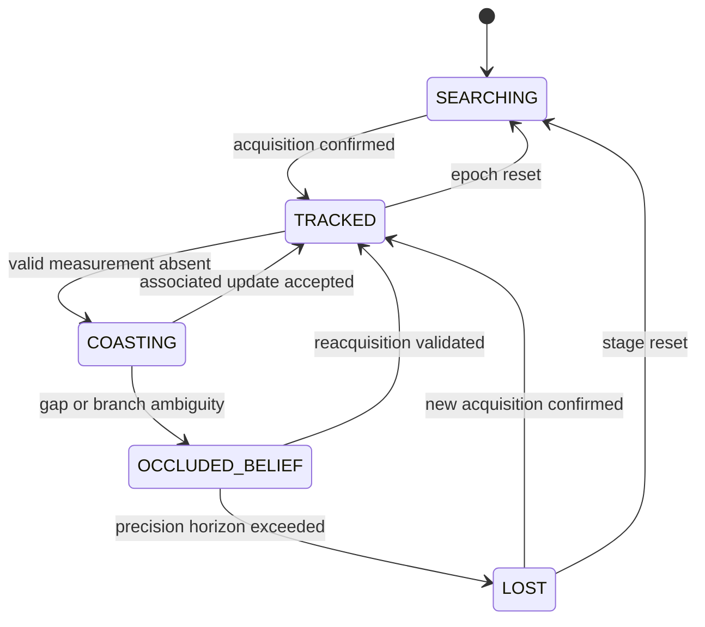
```mermaid
stateDiagram-v2
    [*] --> SEARCHING
    SEARCHING --> TRACKED: acquisition confirmed
    TRACKED --> COASTING: valid measurement absent
    COASTING --> TRACKED: associated update accepted
    COASTING --> OCCLUDED_BELIEF: gap or branch ambiguity
    OCCLUDED_BELIEF --> TRACKED: reacquisition validated
    OCCLUDED_BELIEF --> LOST: precision horizon exceeded
    LOST --> TRACKED: new acquisition confirmed
    LOST --> SEARCHING: stage reset
    TRACKED --> SEARCHING: epoch reset
```

### 9.3 Belief support and finite-speed propagation

Represent support as edge intervals plus lateral bounds, with mass for unmodeled/unknown space. Place the initial support using the measured pose uncertainty and all compatible nearby free regions. Do not force a single closest centerline.

Propagate using elapsed time, speed/acceleration bounds and connectivity. A transition matrix can be used only if each step's transitions respect travel distance. For long edges, discretize by arc-length bins and include speed/age state, or propagate intervals directly and split at junctions. A continuous-time diffusion kernel without truncation generally has nonzero mass arbitrarily far away and therefore is not itself a physical reachable-set bound.

A practical bounded scheme uses substeps no larger than the minimum travel-bin scale divided by the speed bound, carries fractional progress, and branches only when support reaches a junction. Probability weights reflect calibrated turn behavior or an explicitly uninformative prior. Turning and acceleration constraints can shrink this envelope if validated; simple vmax propagation is conservative in path length.

An incomplete graph cannot rule out unknown routes. Preserve `unknown_mass` and frontier-connected reachable regions. Uniform mass over nodes biases toward densely discretized areas; a fallback “uniform” distribution must name its measure, e.g. proportional to free-space area or edge arc length. At LOST, broaden with a declared model rather than resetting all probability to a confident preferred portal.

For negative evidence, calculate average detection probability over each support region from fresh valid visible coverage, range, occlusion and detection calibration. Update once per independent observation group:

\[
b_j^+=\frac{(1-P_D(j))b_j^-}{\sum_k(1-P_D(k))b_k^-+L_u b_u^-}.
\]

Unknown mass has likelihood `L_u` from its observation model, normally near 1 when unobserved. If denominator is numerically zero, report inconsistent evidence and broaden/reinitialize conservatively; never divide by zero. Multiple likelihoods from the same scan must not double-count evidence.

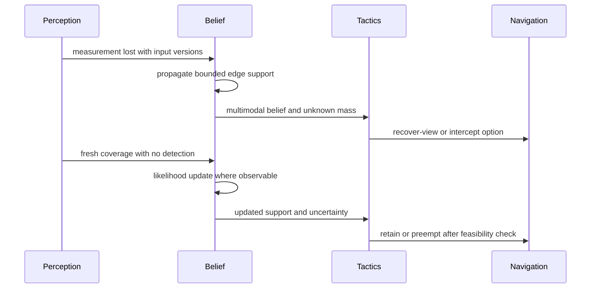
```mermaid
sequenceDiagram
    participant P as Perception
    participant B as Belief
    participant T as Tactics
    participant N as Navigation
    P->>B: measurement lost with input versions
    B->>B: propagate bounded edge support
    B->>T: multimodal belief and unknown mass
    T->>N: recover-view or intercept option
    P->>B: fresh coverage with no detection
    B->>B: likelihood update where observable
    B->>T: updated support and uncertainty
    T->>N: retain or preempt after feasibility check
```

## 10. Rules, stage state machine and adjudication

### 10.1 Capture and LOS

`evaluate_capture(guardian_pose, explorer_pose, los: TruthValue) -> CaptureEvaluation` returns predicate, range, directed bearing and reason. Required intermediate definitions:

\[
r=p_E-p_G,\quad d=\sqrt{r_x^2+r_y^2},\quad
\beta=\operatorname{wrap}(\operatorname{atan2}(r_y,r_x)-\theta_G).
\]

For `d>eps_geometry`, ideal capture is `d<0.45 AND abs(beta)<=pi/4 AND los=TRUE`. Use the equivalent dot inequality to avoid angle wrapping where helpful. `eps_geometry` detects undefined/coincident geometry; it must not widen the official 0.45 m threshold. Tolerances in numerical computations are logged and bounded; they are not altered game rules.

`LOS` uses the open segment between robot reference origins against intervening obstacle geometry, excluding the two participating bodies. Boundary tangency is conservatively blocked in the simulator unless organizer interpretation says otherwise. Estimated LOS checks an uncertainty tube and returns UNKNOWN for unmapped/aged regions. LiDAR visibility from its mounted sensor is not exactly the same geometry as rule LOS between robot frame origins; transform and evaluate both separately.

For segment intersection, the draft's one orientation comparison is insufficient. Noncollinear intersection requires opposite-side tests for **both** segments; collinear/touching cases additionally require interval/bounding-box checks. Use robust orientation predicates and tests for endpoint/tangent overlap.

### 10.2 Arrival and event timing

`evaluate_arrival_contact(footprint_world, goal_boundary)` checks contour contact, not merely center-in-zone. `first_arrival_event(trajectory_segment, footprint, zone)` finds first contact within a time interval starting outside. For a circular robot and a vertical zone edge at x=1.0, radius 0.22 means first contact when center x=0.78, not x=0.90. The draft's x=0.90 example is already intersecting.

Discrete simulation MUST use continuous collision/event detection or conservative temporal subdivision with a declared event-time bound. A relative distance function can be bracketed and root-refined, but endpoint-only sign changes miss enter-and-exit events; check swept geometry first. Capture similarly requires a conjunction over time, including heading and LOS, not only a distance crossing.

Initial footprint inside the goal is a scenario setup error unless an explicit official policy resolves it. The simulator referee validates initial conditions. A goal polygon is not automatically a circle or a node; route planning seeks a safe contact configuration using the physical footprint.

### 10.3 Stage and safety are separate automata

| Current phase | Event/guard | Next phase | Required side effects |
|---|---|---|---|
| INIT | Valid `StartStage`, approved config, unique request | FREEZE | Latch time origin; authority false; preserve only allowed memory. |
| FREEZE | `now>=freeze_ends_at` and `now<stage_ends_at` | ACTIVE | Stage may authorize motion; each consumer still requires health and leases. |
| FREEZE | `now>=stage_ends_at` after clock delay | TERMINAL | TIMEOUT; never emit a momentary ACTIVE command. |
| ACTIVE | Official capture/arrival/abort | TERMINAL | Latch result and revoke commands. |
| ACTIVE | Internal capture/arrival estimate | ACTIVE with `event_hold=true` | Stop and report evidence; await configured corroboration/adjudication handling. |
| ACTIVE | `now>=stage_ends_at` | TERMINAL | TIMEOUT estimate/onboard schedule event; official adjudication remains distinguishable. |
| Any nonterminal | Safety fault | Same stage phase | Safety stop/hold; stage time continues; no automatic official concession. |
| TERMINAL | Valid reset request | INIT with new stage ID | Revoke actions, clear tracks and reset permitted memory. |

Event ordering: first establish current epoch/stage, then consume official events and locally detected event intervals, then apply time boundaries. If capture and arrival intervals overlap and no official ordering exists, emit AMBIGUOUS and hold; do not invent a scoring tie-break. A capture proven earlier than deadline remains relevant even if delivered later; record its evidence time, not just receipt time.

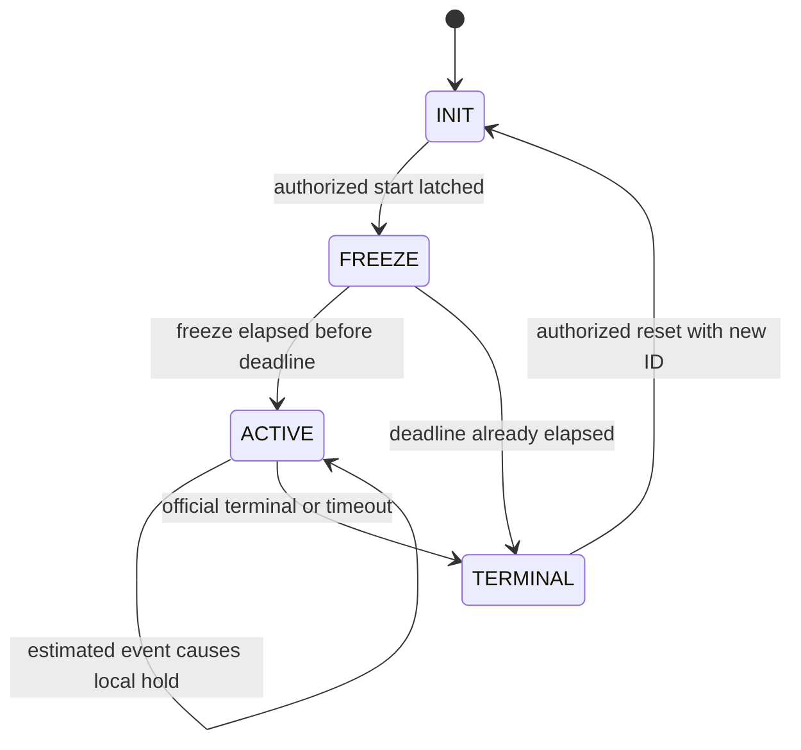
```mermaid
stateDiagram-v2
    [*] --> INIT
    INIT --> FREEZE: authorized start latched
    FREEZE --> ACTIVE: freeze elapsed before deadline
    FREEZE --> TERMINAL: deadline already elapsed
    ACTIVE --> ACTIVE: estimated event causes local hold
    ACTIVE --> TERMINAL: official terminal or timeout
    TERMINAL --> INIT: authorized reset with new ID
```

`motion_authorized` is derived from phase, no event hold and valid stage lease. It is not an independent switch callers may set. Freeze does not require turning off sensors. Our zero-motion freeze does limit how much of an unknown maze can be mapped; do not promise full-map discovery while stationary. No referee early-active override can bypass freeze except an explicit documented organizer rule change in the frozen profile.

## 11. Tactical options and their lifecycle

### 11.1 Option contracts

Every option shares these invariants: active stage/lease, matching role/epoch, collision-free current plan, finite deadline, valid required semantic data and no safety stop. Violation cancels/aborts the instance and revokes motion. Tactics receives reason-coded feedback; it cannot turn a safety veto into a stronger motor command.

| Kind | Initiation and target | Intended effect and success | Failure/reselection |
|---|---|---|---|
| HOLD_SAFE | Always admissible; no movement target | Publish no nonzero candidate; completes only on cancel/stage end | Health recovery does not autonomously resurrect an old goal. |
| SEARCH_PORTAL | Guardian, valid graph, no reliable precise rival | Visit reachable high-information portal/viewpoint; success on view acquired or search segment completed | Deadline, no route, new rival evidence → reselection. |
| INTERCEPT_PORTAL | Guardian, supported rival hypotheses, reachable standoff portal pose | Arrive/aligned at intercept viewpoint with positive time opportunity; this is option success, not capture | Rival support no longer traverses portal, route blocked, unsafe approach. |
| PRESSURE_ROUTE | Guardian, useful track/belief and safe route | Reduce route gap while retaining braking clearance; success at approach transition condition | Loss of informative support, flank threat, no physical passage. |
| APPROACH_CAPTURE | Guardian, current robot-origin estimate, robust feasible standoff interval, LOS assessment | Capture estimate satisfying configured evidence policy | Invalid track, unknown LOS, excessive error, closing rival or empty feasible interval. |
| RECOVER_VIEW | Guardian, recent occlusion and feasible visibility-improving pose | New observation or validated view of target support | No gain, deadline, unsafe corner geometry. |
| FALLBACK_DEFEND_BASE | Guardian, accepted own start-zone geometry and feasible approach coverage | Reach/hold a defense viewpoint; no guaranteed win | Base unresolved, rival threatens another uncovered access, capture opportunity. |
| ADVANCE_BASE | Explorer, accepted guardian start-zone target and feasible route | Rule arrival estimate or designated progress segment | Capture threat, blockage, target invalidation. |
| BREAK_LOS | Explorer, estimated threat and reachable occluding geometry | Reach pose with predicted/observed loss of guardian visibility and escape route | Predicted occlusion unavailable, dead-end risk, unsafe sweep. |
| TAKE_ALTERNATE_PORTAL | Explorer, at least one physically feasible alternate route | Pass alternate portal with improved threat/progress ranking | Rival physically blocks route, graph changes or route dominated. |
| KEEP_ESCAPE_ROUTE | Explorer, imminent trapping risk and verified retreat/escape path | Reach configuration preserving specified exits | Exits become blocked, uncertainty prevents route validation. |
| OBSERVE_SAFE | Explorer, safe viewpoint or stationary scan possible | Reduce localization/opponent/goal uncertainty to configured threshold or complete observation dwell | No information gain, deadline or increased threat. |

`BREAK_LOS` estimates the guardian sensor/view geometry; its success cannot be concluded merely from this robot not seeing the guardian. Mutual visibility is not guaranteed when sensor mounting/coverage differ.

### 11.2 Selection and scoring

First filter role, semantic and motion feasibility. Rank urgent safety/threat avoidance separately from nominal utility. For feasible options use bounded features with a fixed versioned definition. Example explorer feature vector: capture-risk rank, decrease in geodesic distance to accepted goal, predicted visibility loss, number of feasible exits, duration. Guardian: capture opportunity, portal time advantage, observation probability and duration. If no calibrated probabilities exist, name values `risk_score`, not `probability`.

Hysteresis compares utilities in utility units: switch only if `U_new > U_current + delta_U` after minimum dwell, except urgent invalidation. A distance threshold named `hysteresis_dist` cannot be applied to dimensionless utility. Stable tie-breaking uses a deterministic option order and target ID. To guarantee a weighted capture term dominates all others, bound the total range of the other terms and choose its weight accordingly, or use lexicographic ordering. “w_capture is large” is not a proof.

When no movement option is feasible, choose HOLD_SAFE. A blocked corridor is not traversable simply because stopping is tactically undesirable. The physical opponent stays in the collision layer for guardian and explorer alike.

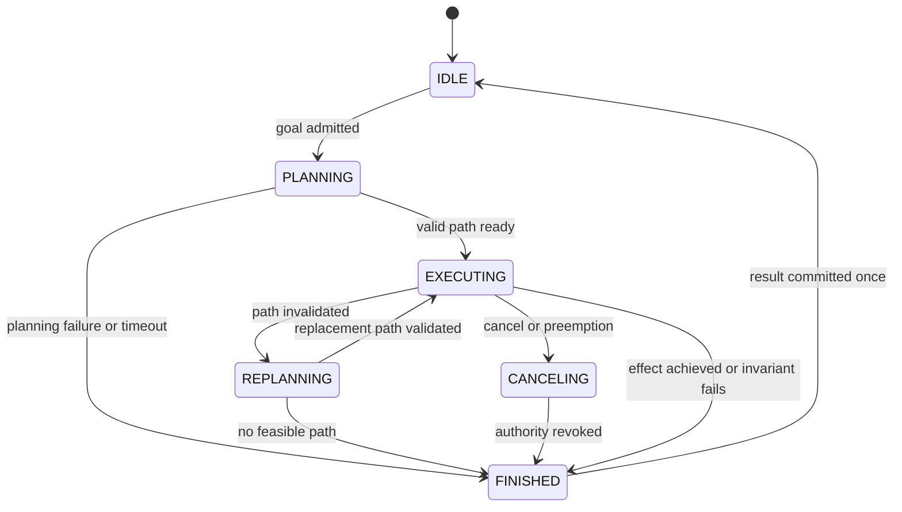
```mermaid
stateDiagram-v2
    [*] --> IDLE
    IDLE --> PLANNING: goal admitted
    PLANNING --> EXECUTING: valid path ready
    PLANNING --> FINISHED: planning failure or timeout
    EXECUTING --> REPLANNING: path invalidated
    REPLANNING --> EXECUTING: replacement path validated
    REPLANNING --> FINISHED: no feasible path
    EXECUTING --> CANCELING: cancel or preemption
    CANCELING --> FINISHED: authority revoked
    EXECUTING --> FINISHED: effect achieved or invariant fails
    FINISHED --> IDLE: result committed once
```

The guardian and explorer tactical FSMs share this selection engine; states are currently selected OptionKind, not separate undocumented controllers. The following priority tables define transitions more completely than a single illustrative diagram.

| Guardian priority | Guard | Requested option |
|---|---|---|
| 1 | Stage/health/authority invalid | HOLD_SAFE |
| 2 | Robust capture opportunity and feasible approach | APPROACH_CAPTURE |
| 3 | Credible imminent base threat and accepted defense geometry | FALLBACK_DEFEND_BASE or feasible intercept with superior time bound |
| 4 | Valid intercept hypothesis and feasible standoff route | INTERCEPT_PORTAL |
| 5 | Recent occlusion and feasible informative viewpoint | RECOVER_VIEW |
| 6 | Useful observed rival and safe pursuit corridor | PRESSURE_ROUTE |
| 7 | Graph search viewpoint exists | SEARCH_PORTAL |
| 8 | Otherwise | HOLD_SAFE |

| Explorer priority | Guard | Requested option |
|---|---|---|
| 1 | Stage/health/authority invalid | HOLD_SAFE |
| 2 | Immediate trap/capture threat with verified escape | KEEP_ESCAPE_ROUTE or BREAK_LOS by risk rank |
| 3 | Contested route and feasible alternate | TAKE_ALTERNATE_PORTAL |
| 4 | Accepted goal and acceptable threat | ADVANCE_BASE |
| 5 | Informative safe observation possible, including unresolved goal | OBSERVE_SAFE |
| 6 | Otherwise | HOLD_SAFE |

Priority ties and “or” candidates are resolved by the documented feasible-option utility, then deterministic tie-break. All choices are reevaluated on critical events as well as a 2–5 Hz timer; safety does not wait for that timer.

### 11.3 Role-specific transition views

These diagrams visualize the priority tables, not additional guards or fixed numeric thresholds. Every active state has the shared authority/feasibility exit to HOLD_SAFE. Critical guard evaluation precedes nominal hysteresis.

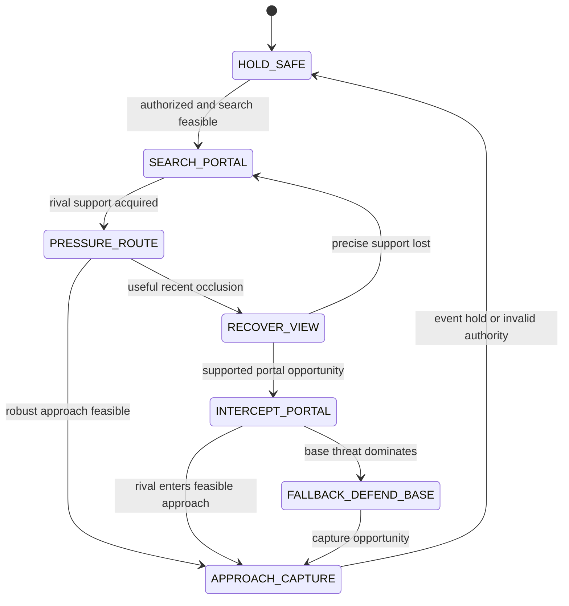
```mermaid
stateDiagram-v2
    [*] --> HOLD_SAFE
    HOLD_SAFE --> SEARCH_PORTAL: authorized and search feasible
    SEARCH_PORTAL --> PRESSURE_ROUTE: rival support acquired
    PRESSURE_ROUTE --> APPROACH_CAPTURE: robust approach feasible
    PRESSURE_ROUTE --> RECOVER_VIEW: useful recent occlusion
    RECOVER_VIEW --> INTERCEPT_PORTAL: supported portal opportunity
    INTERCEPT_PORTAL --> APPROACH_CAPTURE: rival enters feasible approach
    INTERCEPT_PORTAL --> FALLBACK_DEFEND_BASE: base threat dominates
    FALLBACK_DEFEND_BASE --> APPROACH_CAPTURE: capture opportunity
    RECOVER_VIEW --> SEARCH_PORTAL: precise support lost
    APPROACH_CAPTURE --> HOLD_SAFE: event hold or invalid authority
```

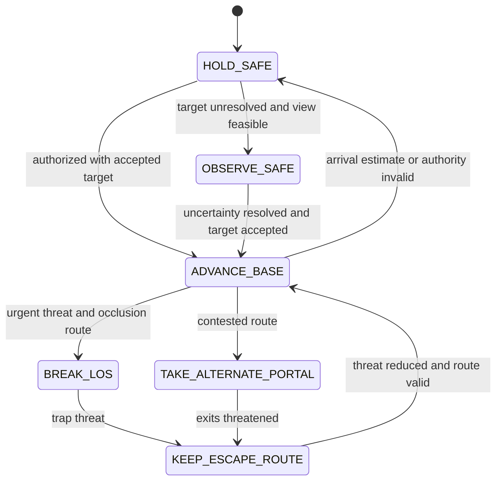
```mermaid
stateDiagram-v2
    [*] --> HOLD_SAFE
    HOLD_SAFE --> ADVANCE_BASE: authorized with accepted target
    HOLD_SAFE --> OBSERVE_SAFE: target unresolved and view feasible
    ADVANCE_BASE --> BREAK_LOS: urgent threat and occlusion route
    ADVANCE_BASE --> TAKE_ALTERNATE_PORTAL: contested route
    BREAK_LOS --> KEEP_ESCAPE_ROUTE: trap threat
    TAKE_ALTERNATE_PORTAL --> KEEP_ESCAPE_ROUTE: exits threatened
    KEEP_ESCAPE_ROUTE --> ADVANCE_BASE: threat reduced and route valid
    OBSERVE_SAFE --> ADVANCE_BASE: uncertainty resolved and target accepted
    ADVANCE_BASE --> HOLD_SAFE: arrival estimate or authority invalid
```

## 12. Navigation, control and safety mathematics

### 12.1 Kinematics and wheel feasibility

`integrate_diff_drive_exact(pose,v,omega,dt)` uses

\[
a=\omega\Delta t/2,\quad
\Delta p=v\Delta t\operatorname{sinc}(a)
[\cos(\theta+a),\sin(\theta+a)]^T.
\]

For small |a| evaluate `sinc(a)=1-a²/6+a⁴/120+O(a⁶)`. At zero angular rate this reduces continuously to straight motion; at v=0 position is unchanged. Reject negative dt and nonfinite values. Wrap only output heading, not unwrapped angle histories needed for interpolation. Python/NumPy's `np.sinc(x)` uses `sin(pi*x)/(pi*x)`; if used, pass `a/pi`.

Wheel rates are

\[
\dot\phi_R=(v+b_w\omega/2)/r_w,\qquad
\dot\phi_L=(v-b_w\omega/2)/r_w.
\]

Independent v and omega bounds do not ensure wheel-rate/acceleration limits. Check both wheel rates and transitions. Safety limits are tied to measured operating conditions, not the learning genome.

### 12.2 A* and metric realization

A* inputs include immutable graph, start/goal attachment, edge overlay and a cost profile. Endpoint attachment uses a swept-checked connector; nearest Euclidean node alone can lie across a wall. Maintain a priority queue, g-values, predecessors and deterministic tie-breaking. Reject negative/nonfinite edge cost. No path returns a typed `NO_PATH`, not an empty path interpreted as success.

For meter costs `c_uv>=length_uv>=||p_u-p_v||`,

\[
h(u)=\|p_u-p_g\|\le\|p_u-p_v\|+h(v)\le c_{uv}+h(v).
\]

Thus the heuristic is consistent. Recover all edge polylines, append validated start/goal connectors and collision-check any smoothing. Time cost instead requires `h=distance/v_max` with a valid global speed upper bound. A cost mixing seconds and meters without explicit normalization is invalid.

A free-space interception helper solves `A t²+B t+C=0` with `A=||vE||²-sG²`, `B=2r·vE`, `C=||r||²`. If |A| is small, solve `Bt+C=0`; if both A and B vanish handle C separately. For a genuine quadratic, reject negative discriminant except tiny roundoff, use a cancellation-resistant root algorithm, and retain positive roots in horizon. The result is a candidate hypothesis; maze paths, acceleration and clearance can invalidate it.

### 12.3 Regulated pursuit and bounded local search

The local-control decision order is normative. Any speed or curvature modification invalidates the earlier swept trajectory and therefore causes a new feasibility check.

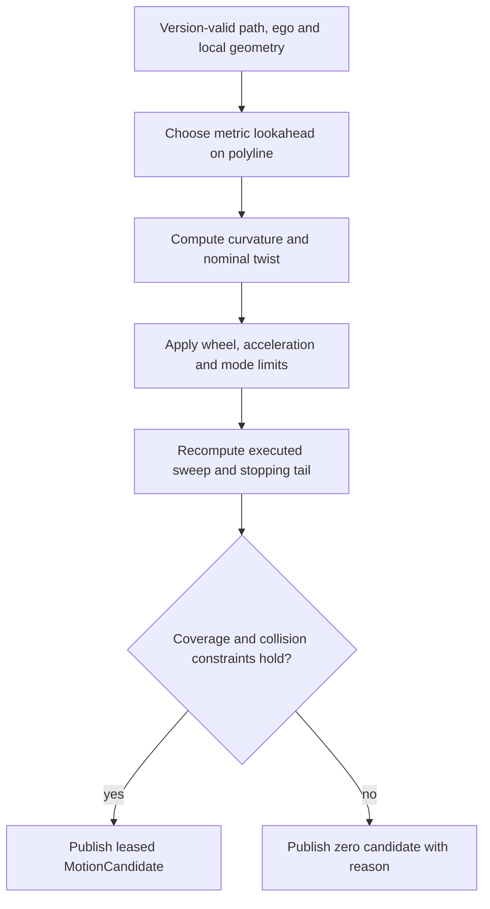
```mermaid
flowchart TD
    Input["Version-valid path, ego and local geometry"] --> Lookahead["Choose metric lookahead on polyline"]
    Lookahead --> Nominal["Compute curvature and nominal twist"]
    Nominal --> Limits["Apply wheel, acceleration and mode limits"]
    Limits --> Sweep["Recompute executed sweep and stopping tail"]
    Sweep --> Safe{"Coverage and collision constraints hold?"}
    Safe -->|yes| Candidate["Publish leased MotionCandidate"]
    Safe -->|no| Zero["Publish zero candidate with reason"]
```

Select a lookahead on the polyline at configured arc-length ahead, then calculate actual Euclidean `L²=xL²+yL²`. Do not use desired arc-length squared in the curvature formula when these differ. If L² is below tolerance, finish the position phase or align; if the target is behind, use a checked alignment phase instead of applying a forward pure-pursuit formula indiscriminately.

For curvature kappa, choose

\[
v_{nom}\le\min\left(v_{max},\frac{\omega_{max}}{|\kappa|},
\sqrt{\frac{a_{lat,max}}{|\kappa|}},v_{approach},v_{brake}\right)
\]

with infinite curvature-related caps at kappa=0, then `omega_nom=v_nom*kappa`. Apply wheel and normal acceleration limits, regenerate predicted trajectory and validate. For capture approach use `v=clip(k_d*(d-d_star),0,v_approach)*max(0,cos(beta))` only with fresh relative geometry and a separate heading controller. For a stationary aligned target, `e=d-d_star` has `e_dot=-k_d*e`; the draft opposite sign would move away. This argument does not prove convergence against a moving adversary or under saturation.

DWA-style fallback samples a finite set in reachable command space around measured twist, including zero/stop, and checks simulated actuator response and stopping tail. Its objective uses nonnegative normalized penalties; it does not waive collision constraints for a large tactical reward. Exhausting the time budget returns a previously verified still-valid candidate or stop, never the best unchecked sample.

### 12.4 Braking derivation and scope

For constant speed s during delay tau and deceleration b thereafter, braking time is s/b. Integrating speed yields

\[
\int_0^\tau s\,dt+\int_0^{s/b}(s-bt)\,dt
=s\tau+\frac{s^2}{2b}.
\]

Setting this ≤ effective clearance c gives `s²+2b*tau*s-2b*c<=0`, whose nonnegative root is

\[
s_{lim}=\sqrt{(b\tau)^2+2bc}-b\tau.
\]

Use the rationalized form for small c. `c=max(0,d-m)`, and cap by configured speed. The function accepts **speed magnitude**; a negative argument is invalid, not a zero stopping distance. Reverse uses abs(v) with separately verified rear geometry and reverse b. `d=+infinity` is not accepted from a sensor as proof of clear space; finite observed horizon caps d.

If speed can rise during delay, use

\[
d_{stop}=s\tau+\tfrac12a_+\tau^2+
\frac{(s+a_+\tau)^2}{2b}.
\]

Invert by a monotone bounded root solve or check sampled candidates; do not reuse the simpler inverse while ignoring a_+. The latency budget includes observation age, queue/processing, supervisor period and jitter, publication/driver transport and mechanical response. Count each once. If observation age exceeds its allowed budget, stop rather than extrapolate a certified empty corridor.

For an obstacle closing at speed bound u during stopping, add at least `u*(tau+s/b)` under the constant-speed latency model, plus its uncertainty and own-motion error. More general moving geometry uses time-indexed swept volumes. This still cannot guarantee no collision after our robot stops and another robot continues into it.

### 12.5 Swept checking and modification policy

Given initial measured pose/twist and a candidate, `predict_stop_sweep` includes response delay, command-following bounds and emergency braking, for both translation and rotation. A path is admissible only if every footprint in that tube is clear of obstacle envelopes and inside valid coverage. Obstacles' uncertain future motion enlarges their envelopes.

A practical discrete checker uses conservative interpolation: if a body has bounding radius r, boundary speed is bounded by `|v|+r*|omega|`. Between samples separated by dt, inflate by a sufficient motion bound (e.g. half-step bound when every point is within dt/2 of a checked sample and the bound holds), plus obstacle-motion and geometry errors. Adaptive refinement or exact swept primitives may tighten it. Finite sampling without such a bound is not a proof against tunneling.

Circular footprints centered on the rotation axis are rotationally invariant; real protrusions may require a polygon. Stopping linear motion while leaving angular motion untested is prohibited. If command scaling preserves desired curvature, actual transient curvature may still differ due to separate wheel dynamics, so recheck the executed trajectory envelope.

The supervisor can test a bounded ladder of curvature-preserving scales, including zero, only when their full sweeps pass. Admissibility need not be monotone in speed against moving obstacles; do not use unproved binary-search monotonicity for general dynamic collision checking. If none passes, request emergency zero and report `BRAKING_INFEASIBLE` if the current state already exceeds the safe stopping envelope.

### 12.6 Conditional safety statement

A stopping trajectory remains nonintersecting over its checked horizon if: initial state lies within the assumed error set; actuator response lies within the modeled tube; all relevant obstacles lie within their envelopes; observed-free coverage has no unmodeled hazard; numerical collision checks conservatively cover continuous motion; and the next safety/stop action occurs within the latency bound. The proof is set inclusion: actual robot occupancy is a subset of the checked robot tube, actual obstacle occupancy a subset of checked obstacles, and these are disjoint at every time. Failure of an assumption removes the claim. No isolated scalar inequality, QP, unit test or process boundary establishes all these assumptions by itself.

## 13. Runtime algorithms and sequence diagrams

### 13.1 Supervisor evaluator

`SafetySupervisor.evaluate(snapshot, now_ros_ns, now_steady_ns) -> SafetyEvaluation` is pure except for its explicit previous-state input. The ROS wrapper owns caches and publication. Required behavior:

```python
# Specification pseudocode: no ROS calls inside the domain evaluator.
def evaluate(snapshot, now):
    if snapshot.hard_fault or snapshot.stop_latched:
        return emergency_zero("HARDWARE_FAULT")
    if not fresh_authorized_match(snapshot.match, now):
        return emergency_zero("MATCH_INACTIVE")
    if not valid_ego_obstacles_execution(snapshot, now):
        return emergency_zero(first_failure_reason(snapshot))
    if not valid_candidate_for_active_instance(snapshot, now):
        return emergency_zero("STALE_CANDIDATE")
    if not calibrated_limits_apply(snapshot):
        return emergency_zero("LIMITS_INVALID")
    for command in bounded_candidate_modifications(snapshot):
        if work_budget_exhausted(snapshot):
            return emergency_zero("COMPUTE_OVERRUN")
        if wheel_and_normal_dynamics_admissible(command, snapshot):
            tube = predict_stop_sweep(command, snapshot)
            if covered_and_collision_free(tube, snapshot):
                return admitted_or_limited(command, snapshot)
    return emergency_zero("BRAKING_INFEASIBLE")
```

`work_budget_exhausted` enforces a deterministic bound on candidate/geometry operations in the pure core. The wrapper separately measures elapsed steady time; if evaluation exceeds the configured time budget, it discards any nonzero result, requests zero and reports `COMPUTE_OVERRUN`. A hang before return is handled by the independent watchdog.

`emergency_zero` is a **command request** with measured downstream stopping behavior, not an assertion that the robot has instantaneously stopped. Its status includes current speed and envelope violation. Healthy zero in freeze is a normal inhibition; a fault-latched stop requires the recovery protocol. Every cycle increments decision sequence only after evaluation completes, publishes command/status, and then emits heartbeat. A heartbeat timer independent of evaluation completion would mask a hung evaluator and is forbidden.

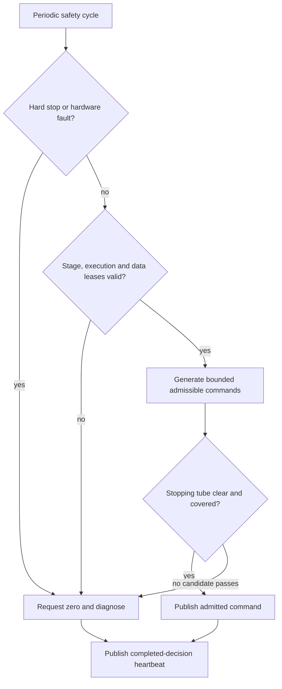
```mermaid
flowchart TD
    Tick["Periodic safety cycle"] --> Hard{"Hard stop or hardware fault?"}
    Hard -->|yes| Zero["Request zero and diagnose"]
    Hard -->|no| Leases{"Stage, execution and data leases valid?"}
    Leases -->|no| Zero
    Leases -->|yes| Limits["Generate bounded admissible commands"]
    Limits --> Sweep{"Stopping tube clear and covered?"}
    Sweep -->|yes| Admit["Publish admitted command"]
    Sweep -->|no candidate passes| Zero
    Admit --> Heart["Publish completed-decision heartbeat"]
    Zero --> Heart
```

### 13.2 Watchdog state machine

| State | Output | Transition |
|---|---|---|
| DISARMED | Stop zeros, no motion release | Valid arming policy and fresh completed decisions → READY |
| READY | Stop zeros while checking fresh candidate/stage/config | All release prerequisites met → ACTIVE |
| ACTIVE | No stop-topic traffic | Any lease/progression/authority failure → FAULT_LATCHED or normal DISARMED for freeze/end |
| FAULT_LATCHED | Stop zeros | Fault cleared plus authorized rearm → READY; never by heartbeat alone |

`SafetyMode.BRAKING` is a supervisor physical-response state; watchdog state mapping may publish it diagnostically but does not weaken stop output. Driver timeout remains independent. Watchdog must not subscribe to raw Twist as its only health signal because repeated stale commands contain no decision identity.

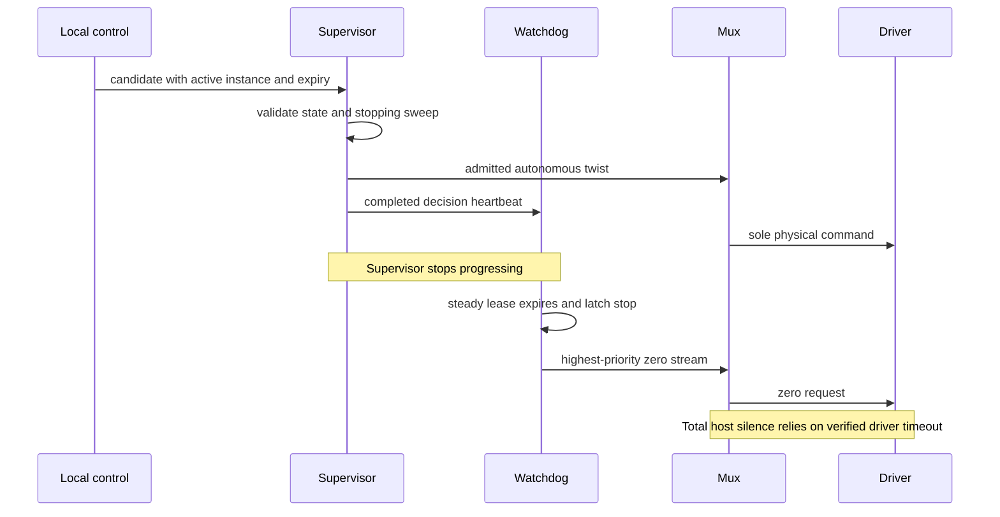
```mermaid
sequenceDiagram
    participant Nav as Local control
    participant Sup as Supervisor
    participant Wd as Watchdog
    participant Mux as Mux
    participant Base as Driver
    Nav->>Sup: candidate with active instance and expiry
    Sup->>Sup: validate state and stopping sweep
    Sup->>Mux: admitted autonomous twist
    Sup->>Wd: completed decision heartbeat
    Mux->>Base: sole physical command
    Note over Sup,Wd: Supervisor stops progressing
    Wd->>Wd: steady lease expires and latch stop
    Wd->>Mux: highest-priority zero stream
    Mux->>Base: zero request
    Note over Mux,Base: Total host silence relies on verified driver timeout
```

### 13.3 Option replacement sequence

```mermaid
sequenceDiagram
    participant Tac as Tactics
    participant Ex as Option executor
    participant Plan as Planner and control
    participant Sup as Supervisor
    Tac->>Ex: cancel old instance
    Ex->>Sup: execution authority revoked
    Ex->>Plan: cancel work and discard old results
    Ex->>Tac: cancellation result
    Tac->>Ex: submit new goal
    Ex->>Ex: validate initiation and versions
    Ex->>Plan: plan new instance
    Plan->>Ex: validated path
    Ex->>Sup: fresh execution identity authorized
    Plan->>Sup: candidate for new instance
```

A planner response from the old goal after cancellation is ignored. A topology update during planning makes the result provisional until revalidated; a localization epoch change rejects it outright. Network transport order is not assumed to be perfectly synchronous, so the supervisor checks identity on every candidate.

### 13.4 Nominal closed-loop sequence

```mermaid
sequenceDiagram
    participant S as Sensors
    participant W as World and track
    participant T as Tactics
    participant N as Navigation
    participant A as Safety supervisor
    S->>W: Time-valid observations
    W-->>T: Coherent versioned snapshot
    T->>N: ExecuteOption goal
    N-->>T: Goal accepted and execution lease
    loop Each control period
        N->>A: MotionCandidate
        S->>A: Ego-local and obstacle snapshot
        A-->>N: SafetyStatus
        A->>A: Admit or replace with zero
    end
```

### 13.5 Terminal-event and stage-reset sequence

```mermaid
sequenceDiagram
    participant R as Rule evaluator
    participant M as Stage manager
    participant E as Option executor
    participant A as Safety supervisor
    participant W as Stop watchdog
    R->>M: Estimated terminal event
    M->>E: Revoke and cancel active option
    M->>A: TERMINAL authority state
    A->>W: Completed zero decision heartbeat
    W-->>A: Stop health remains asserted or ready
    M->>M: Await official resolution or authorized reset
    M->>E: New stage identity only after reset
```

The stage transition revokes authority before clearing state. Reset creates a new `stage_id`, invalidates every old option/path/candidate, clears opponent temporal state, and preserves only data permitted by the selected memory profile. No message from the previous stage can become fresh by republication.

### 13.6 Fault response table

| Fault | Local response | System response |
|---|---|---|
| Missing cloud/coverage | Expire obstacle snapshot | Safety zero within configured lease/response bound |
| Recognition overrun | Drop old frame, retain bounded belief | Navigation may continue only within safety and option predicates |
| Localization jump | Increment epoch, invalidate global products | Cancel option, stop until coherent replacement |
| Planner crash | Candidate/ execution lease expires | Supervisor zero; watchdog does not need tactics to act |
| Supervisor hang/crash | Heartbeat progression stops | Independent watchdog stop channel |
| Watchdog crash | Its stop capability disappears | Supervisor continues normal safety; driver timeout covers total silence; restart/preflight required for release readiness |
| Mux crash | Physical command stream stops | Verified driver timeout stops; no bypass publisher |
| Clock reset | Clear temporal caches and new clock epoch | Reject pre-reset commands and reinitialize |
| Disk/log failure | Drop noncritical logs, bounded diagnostic | Do not block safety loop; release evidence may be incomplete |
| Corrupt policy/model | Hash/schema validation fails | Baseline FSM or tracker degraded mode; never load executable artifacts |

A watchdog crash while old stop input expires may remove an inhibition. Therefore arming/readiness requires watchdog health, and the supervisor must also subscribe to a leased watchdog-health record or use a validated mutual-health mechanism. Define `WatchdogHealth` as `ContractHeader meta; bool ready; bool stop_latched; text config_hash` on `/hsl/watchdog_health`; lack of fresh health forces supervisor zero with `STALE_WATCHDOG`. This closes the stop-release failure without adding a second physical writer. Mutual startup is resolved by READY/zero states before either side authorizes nonzero motion.

## 14. Simulation and calibration

### 14.1 Capability-separated simulator API

Do not give the policy an object exposing both `observe()` and truth getters. Define separate ports:

```python
class ObservationPort(Protocol):
    def observe(self, robot_id: str) -> SensorObservation: ...

class ActuationPort(Protocol):
    def command(self, robot_id: str, command: AdmittedCommand) -> None: ...

class SimulationControlPort(Protocol):
    def reset(self, scenario: ScenarioConfig, seed: int) -> EpisodeInfo: ...
    def step(self, dt_s: float) -> None: ...

class RefereeTruthPort(Protocol):
    def truth(self) -> GroundTruthState: ...
```

Only the evaluation harness owns reset/step/truth capabilities; each policy runner receives its own observation and admitted-actuation interface. `SensorObservation` contains time-tagged ranges/points, wheel/IMU estimates or synthetic detections according to a declared profile, never true rival state alongside noisy state. `GroundTruthState` belongs to the referee only.

```mermaid
classDiagram
    class PolicyRunner {
        +consume_observation()
        +propose_command()
    }
    class ObservationPort {
        +observe(robot_id)
    }
    class Plant {
        +apply_admitted_command()
        +integrate()
    }
    class Referee {
        +evaluate_true_events()
    }
    class TruthPort {
        +truth()
    }
    PolicyRunner --> ObservationPort
    ObservationPort --> Plant : sensor model
    Plant --> TruthPort
    Referee --> TruthPort
```

### 14.2 NumPy raycasting and observation models

A 2D ray is `o+t*d`, `t>=0`. Intersect all relevant wall segments and robot footprints; select the least valid positive t. Parallel/collinear ray-segment cases need explicit handling. Apply max/min range, blind sectors, dropout and noise. Convert hits to sparse points if using the same grid updater. Do not clear behind the nearest hit.

`observed_map` starts unknown and builds only from simulated observations. `approved_map` supplies a declared structural prior available to both compared methods. `oracle` may construct a graph directly from truth but is labeled an ablation and excluded from competition-representative training/claims. All use the same map→graph and spectral code on their respective inputs.

Synthetic opponent detection is drawn from a calibrated model conditional on visibility fraction, range, view, blind-zone state and dropout history. Add delayed timestamps, bias, association errors and missed detections where measured. “LOS implies instantaneous exact center plus tiny Gaussian noise” is a useful ideal ablation, not representative detection. GPIS is bypassed at the **measurement interface**, while filtering/belief remain shared. If testing GPIS in NumPy, supply a separate 3D rendered/recorded cloud mode and accept its runtime cost.

Plant dynamics include command delay, rate limits, wheel limits, slip/noise and collisions to the chosen fidelity. Commands go through the same safety logic; never feed nominal commands directly to the plant while claiming supervisor validation. Seed scenario, sensor and opponent random streams separately and record them.

### 14.3 MVSim and replay

Pin the simulator version and record actual supported APIs, sensor model and message types. The custom adapter methods are project interfaces, not alleged built-in MVSim methods. A successful generic 3D point-cloud launch does not establish MID-360 timing, nonrepetitive scan pattern, blind zone or reflectance behavior. If the chosen CPU profile cannot generate suitable 3D observations, label perception unvalidated and use real bags for that gate.

MVSim two-robot namespaces isolate commands, TF frames and observation topics. A robot may not subscribe to the other robot's true pose/odom or `/referee/*` truth. Static import checks alone do not detect a ROS truth subscription, so inspect the runtime graph too.

Replay mounts no serial/USB actuator devices, disables real hardware launch and sinks commands into logs. It uses bag time consistently and resets epochs on seeks. Replaying fixed observations after changing commands is not a physically consistent closed loop; use replay for estimator regression and the simulator for closed-loop control.

### 14.4 Calibration ownership

| Artifact/config | Contents | Update policy |
|---|---|---|
| `hardware.yaml` | Controller geometry, measured envelopes, authorized sensor/topic mapping, enabled modes | Explicit approved calibration change; immutable during a stage |
| `frames.yaml` | Extrinsics and TF ownership | Calibration with frame-ID validation |
| `perception.yaml` | Filters, model ID, gates, age/coverage policy | Validated on held-out bags |
| `tactics.yaml` | FSM parameters and utility schema | Offline promotion only |
| `score_profile.yaml` | Official rule parameters and separately labeled training rewards | Organizer evidence; official thresholds not genome parameters |
| `sim/kinematic/*.yaml` and MVSim vehicle/world files | Plant truth, friction, sensor effects, scenario variation | Training/test distribution; do not leak truth into controller configuration |
| `artifacts/calibration/braking_report.json` | Floor/load/battery ranges, response traces, fitted conservative b/tau and uncertainty | G1 measurements; invalidate outside tested domain |
| `artifacts/calibration/blind_zone_report.json` | Coverage/detection versus range, height, angle and relative motion | Actual hardware trials |

`tools/benchmark_latency.py` measures latency; it is not assumed to perform an entire safe braking experiment. Required `tools/calibrate_braking.py` orchestrates a permitted controlled trial and stores measured speed/time/displacement, stop request time and uncertainty. First validate the trial area and emergency stop operationally. Use several conditions and repetitions to choose conservative bounds; do not relabel a sample average “guaranteed minimum”. Calibration disagreement reduces allowed speed or invalidates deployment until resolved.

## 15. Learning, policies and artifact formats

### 15.1 Distinct data models

| Model | Key | Value | Meaning |
|---|---|---|---|
| Physical topology | topology version, node/edge ID | Geometry/connectivity/cost | Where motion may be possible |
| Opponent belief | track ID, support interval | Probability mass | Where rival may be now |
| Tactical abstraction | feature-schema ID, role, feature bins | Abstract state ID | Compressed information available to policy |
| Option transition table | abstract state ID, OptionKind, outcome state | Prior and count | Empirical option outcomes |
| Option value table | abstract state ID, OptionKind | Q and update metadata | Expected discounted return under training setup |
| Genome | parameter-schema ID | Bounded numeric vector | Weights, horizons and hysteresis, not physical constraints |

Feature extraction must not include simulator truth, arbitrary map node labels or unapproved competition coordinates. Local graph descriptors, goal relation and belief summaries must be reproducible from policy observations. Remaining time matters because explorer survival can win. Markov sufficiency is an empirical/modeling hypothesis; a compressed state may alias different histories.

### 15.2 Dirichlet update and option return

For K possible outcomes, positive prior alpha and counts n,

\[
P(p|D)=Dir(\alpha+n),\quad
E[p_j]=\frac{\alpha_j+n_j}{A},\quad
Var(p_j)=\frac{\bar p_j(1-\bar p_j)}{A+1}.
\]

Example K=2, alpha=(0.1,0.1), n=(3,1): means are `(3.1/4.2,1.1/4.2)`. One new second-category outcome yields `(3.1/5.2,2.1/5.2)`. Counts do not decrease; relative probability can. Alpha=0.1 is symmetric and favors boundary-concentrated distributions, not uniform density on the simplex. All-one alpha gives the latter.

If duration is tau and reward rate r(t), define

\[
R_o=\int_0^\tau e^{-\beta t}r(t)dt+e^{-\beta\tau}r_{terminal},
\quad
Q(s,o)\leftarrow Q(s,o)+\eta\left[R_o+
\mathbf1_{nonterminal}e^{-\beta\tau}\max_{o'}Q(s',o')-Q(s,o)\right].
\]

Discrete reward sampling uses the chosen integration convention with dt factors. Do not multiply a per-second penalty by steps without dt or double-count a terminal reward in both integral and impulse. Terminations include safety stop, cancel, feasibility failure and stage end. The dataset retains censored/truncated episodes with explicit labels rather than treating all as wins/losses.

For exact abstraction/fusion under discounting, require equal `E[R_o]` and equal `K_o(s,C)=E[exp(-beta*tau)*1{S'∈C}]` for all options and target classes, plus compatible action availability. Equal mean duration is insufficient: tau=1 deterministically and tau∈{0.5,1.5} equally have the same mean but different expected exponential discount for beta>0. With different destination/duration correlation, even equal marginal duration laws may fail class kernels.

### 15.3 Rewards and evolution

Keep three fields: `official_score`, `training_return`, `selection_fitness`. Before official points are supplied, official score is unavailable; use a labeled win/loss surrogate. Explorer uncaptured timeout receives the intended explorer-win surrogate. Do not penalize all elapsed time in a way that silently changes survival into failure.

Evolution algorithm for MVP:

1. Freeze baseline FSM, parameter bounds, opponent bank, training seeds and validation split.
2. Sample bounded genomes; keep original baseline as a candidate.
3. Evaluate both roles across training scenarios with identical paired seeds where useful.
4. Exclude candidates failing hard acceptance constraints; aggregate remaining outcomes with explicit role balance and risk metrics.
5. Select elites, apply a declared crossover or projected Gaussian mutation `theta'=project_bounds(theta+sigma*epsilon)`, and repeat within a compute budget.
6. Choose on validation data, evaluate once on held-out test data, then hardware/shadow gates. Report uncertainty, not only best training win rate.

This is bounded evolutionary search; calling it CMA-ES requires implementing covariance/step-size adaptation according to that algorithm. Tuning weights may produce different sequences of existing options but cannot create a new controller primitive. Structural option discovery is out of scope. Safety overrides are logged, but “a -500 penalty extinguishes unsafe genomes” is not a guarantee: hard disqualification criteria are separate from reward.

### 15.4 Policy artifact and transition log

`artifacts/policies/<policy_id>/manifest.json` contains `schema_version`, `policy_id`, `feature_schema_id`, `option_registry_hash`, `parameter_schema_id`, `core_version`, `training_dataset_hashes`, `opponent_bank_hash`, `seed_manifest_hash`, `validation_report_hash`, `artifact_sha256`, `deployment_mode` (`baseline`, `shadow`, `learned`), and `online_adaptation=false`.

`parameters.json` maps only approved tactical names to finite bounded values. `transition_counts.npz` contains state/option/outcome indices and alpha/count arrays; `values.npz` contains Q values and visit counts. Include shapes and dtype in manifest; avoid executable serialization. Artifacts must be compatible with current option/feature schemas, not just readable files.

Each `OptionTransition` JSONL record contains: schema/version, episode/stage/robot role, input feature state/hash, option instance/kind/parameters hash, start/end times, duration, outcome and next feature state, discounted reward components, official event if known, safety interventions, policy hash, sensor/map fidelity, scenario/opponent IDs and seed. A changed simulator fidelity requires separate evaluation strata, not indiscriminate pooling.

## 16. Class, object and function contract catalog

The signatures below are domain APIs. Type names not carried over ROS are internal typed records defined in the same module; they MUST have documented units and immutable snapshot behavior. Numerical routines return a typed `Result` with `ok`, `value` and `reason`, or raise `ValueError` for invalid programmer-supplied configuration. Adapters translate external failures into diagnostics and safe behavior. No function returns “success” with NaN or an empty movement path.

```mermaid
classDiagram
    class ContractHeader
    class EgoState
    class WorldSnapshot
    class OpponentTrack
    class OpponentBelief
    class MatchState
    class OptionGoal
    class PathPlan
    class MotionCandidate
    class SafetyStatus
    EgoState *-- ContractHeader
    WorldSnapshot *-- ContractHeader
    OpponentTrack *-- ContractHeader
    OpponentBelief *-- ContractHeader
    MatchState *-- ContractHeader
    OptionGoal *-- ContractHeader
    PathPlan *-- ContractHeader
    MotionCandidate *-- ContractHeader
    SafetyStatus *-- ContractHeader
    WorldSnapshot --> OpponentBelief : constrains support
    MatchState --> OptionGoal : grants authority
    OptionGoal --> PathPlan : realizes
    PathPlan --> MotionCandidate : tracks
    MotionCandidate --> SafetyStatus : evaluated by
```

The associations after the compositions denote semantic dependency, not ownership or source-code inheritance. Generated ROS messages, pure-domain dataclasses and adapters remain separate types connected by validated conversions.

### 16.1 Geometry, contracts and rules

| Module / API | Inputs and preconditions | Output and postconditions | Essential verification |
|---|---|---|---|
| `contracts.validate_header(meta, context, receipt) -> ValidationResult` | Expected stage/epochs, time domains and leases | Typed rejection or accepted metadata; duplicates do not extend leases | Future time, replay, stale-but-republished, wrong epoch |
| `contracts.validate_covariance(values, dim) -> ValidationResult` | Finite fixed-length row-major values | Symmetry/PSD checked with configured tolerances | Wrong length, negative eigenvalue, cross units documented |
| `kinematics.integrate_diff_drive_exact(pose,v,omega,dt) -> Pose2` | Finite twist, dt≥0 | Continuous sinc update, wrapped yaw | Straight, reverse mathematical case, pure rotation, tiny omega |
| `kinematics.wheel_rates(v,omega,r_w,b_w) -> WheelRates` | Positive calibrated geometry | Left/right angular rates | Sign, units, round trip |
| `kinematics.deskew_cloud(cloud,pose_history,T_B_L,t_ref) -> DeskewResult` | Per-point times, full history, extrinsics | Reference-time points plus unsupported-point mask | Static identity, turning wall, time offsets |
| `geometry.transform_polygon(poly,T_A_B) -> Polygon2` | Valid simple polygon and rigid transform | Same shape in new frame | Area preservation, round trip |
| `geometry.segment_intersection(a,b,c,d,tol) -> IntersectionKind` | Finite endpoints | NONE/POINT/OVERLAP with collinear handling | Both-side tests, tangency, separated collinear |
| `geometry.swept_footprint(path,footprint,bounds) -> SweptTube` | Time-indexed trajectory and error budget | Conservative continuous occupancy enclosure | High curvature and between-sample collisions |
| `rules.evaluate_capture(g,e,los) -> CaptureEvaluation` | Same frame/time, valid origin geometry | TRUE/FALSE/UNKNOWN and metrics | 0.45 strict, 45° inclusive, d=0 invalid |
| `rules.evaluate_capture_bound(estimate,error_bounds,los_tube) -> CaptureEvaluation` | Explicit bounded-error or confidence interpretation | Sufficient condition, never unconditional certainty | epsilon≥d invalid, obstructed uncertainty tube |
| `rules.capture_interval(r_g,r_e,margin,epsilon) -> IntervalResult` | Physical radii not preinflated | Open interval or empty with explanation | No uncertainty double count |
| `rules.first_arrival_event(trajectory,footprint,zone) -> EventInterval` | Accepted goal, initially outside | Earliest contact interval or absent | Enter-and-exit in one step, tangent contact, inside start |

Internal types: `ValidationResult(accepted,reason,details)`, `WheelRates(left_radps,right_radps)`, `CaptureEvaluation(predicate,distance_m,bearing_rad,los,reason)`, `IntervalResult(lower_m,upper_m,nonempty)`, `EventInterval(found,t_lower_ns,t_upper_ns,reason)`. `SweptTube` includes frame, time support, geometry pieces and inflation ledger. These are not unstructured dictionaries whose meaning changes per caller.

### 16.2 Maps and perception

| Class/API | Mutable state owner | Functions | Failure contract |
|---|---|---|---|
| `mapping.OccupancyMapper` | World process | `update_rays(observation,ego)`, `snapshot()`, `reset(profile)` | Invalid rays do not clear map; return diagnostics. |
| `mapping.LocalObstacleBuilder` | Fast obstacle process | `build(cloud,ego_local,coverage_model) -> LocalObstacleSnapshot` | Incomplete/old coverage explicitly unknown; bounded payload. |
| `topology.TopologyBuilder` | World worker | `extract(grid,footprint)`, `validate(graph)`, `match_versions(old,new)` | No spurious across-wall connector; old results discarded. |
| `topology.compute_spectrum(graph,scope,affinity) -> SpectralSignature` | Offline/slow worker | Pure eigensystem calculation | Missing eigenvalues flagged; optional failure never blocks safety. |
| `implicit_surface.HermiteGPISModel` | Read-only after load | `load(manifest)`, `evaluate(points)`, `gradient(points)`, `support_mask(points)` | Bad hash/schema or unsupported queries rejected. |
| `registration.GPISRegistrar` | Perception worker | `register(cluster,initial_pose,ego_uncertainty) -> RegistrationResult` | Bounded runtime; covariance/observability/coverage in result. |
| `segmenter.OpponentSegmenter` | Perception worker | `candidates(cloud,background,config) -> CandidateSet` | Ambiguity retained; no alteration of safety cloud. |
| `ekf_opponent.ConstantVelocityFilter` | Tracker owner | `initialize(z,R,t)`, `predict(t)`, `gate(z,R)`, `update(z,R,t)`, `snapshot()` | Reject invalid dt/R; gated outlier does not refresh last measurement. |
| `topological_belief.TopologicalBeliefTracker` | Tracker owner | `initialize_support(track,world)`, `propagate(t,bounds)`, `update_visibility(coverage)`, `reacquire(measurement)` | Preserve normalization and unknown mass; no teleport through walls. |

`RegistrationResult` fields: `accepted`, `pose_model_in_map`, `position_covariance`, `yaw_variance`, `yaw_valid`, `inlier_count`, `support_fraction`, `residual_cost`, `iterations`, `elapsed_ns`, `reason`. `CandidateSet` is an immutable bounded tuple of point clusters with origin/time and ambiguity scores; a cluster centroid is a feature, not a declared robot pose.

### 16.3 Planning, tactics and control

| Class/API | Functions | Preconditions/postconditions |
|---|---|---|
| `planning.astar.TopologicalAStar` | `plan(world,start,goal,cost_profile) -> PlanResult` | Known traversable connectors; returns version-bound path or NO_PATH. |
| `planning.intercept.solve_free_intercept(r,v_e,s_g,horizon) -> InterceptResult` | Pure root solution | No positive root means unavailable; not forced to t=0. |
| `planning.intercept.rank_portals(world,belief,ego,bounds) -> tuple[PortalOpportunity]` | Route-time bounds and hypotheses | Each result retains support probability/rank and feasibility assumptions. |
| `tactics.options.OptionRegistry` | `definition(kind)`, `check_initiation(goal,context)`, `check_invariant(goal,context,executing)`, `check_termination(goal,context,executing)` | Single source of option role/target and generic lifecycle predicates; unknown kinds and unresolved required zones rejected. Effect evidence is considered only in EXECUTING, must match the active option instance and carry an evidence ID. |
| `tactics.options.OptionAuthority` | `submit(action_id,goal,context)`, `mark_executing(action_id,context)`, `begin_replan(action_id,context)`, `request_cancel(...)`, `acknowledge_cancel(...)`, `tick(context)` | At most one active option; candidate authority is false until a current path passes invariant checks, and is revoked before cancel/replan/terminal publication. Action and option identities are not rebound; record capacity fails closed. |
| `tactics.fsm.TacticalSelector` | `select(snapshot,current,now) -> SelectionResult` | Role-specific feasible options and deterministic hysteresis. |
| `tactics.utility.score(features,parameters) -> UtilityResult` | Pure bounded feature scoring | Units and missing-feature policy explicit; no NaN ranking. |
| `control.regulated_pursuit.RegulatedPursuit` | `step(path,ego,limits) -> NominalCommand` | Recompute omega after v; final target/behind-target cases explicit. |
| `control.dwa_local.ArcEvaluator` | `select(snapshot,budget) -> NominalCommand` | Optional, bounded candidates; checked stopping tails only. |
| `control.braking.stopping_distance(speed,b_min,tau) -> float` | Constant-speed-delay model | speed≥0, b>0, tau≥0; finite result. |
| `control.braking.admissible_speed(clearance,margin,b_min,tau,speed_max) -> float` | Analytic inversion | Finite nonnegative inputs; zero effective clearance returns zero. |
| `control.braking.stopping_distance_accelerating(speed,a_plus,b_min,tau) -> float` | Delay-acceleration model | Applies only within calibrated response envelope. |
| `control.safety.SafetySupervisor` | `evaluate(snapshot,now_ros,now_steady) -> SafetyEvaluation` | All final commands checked or emergency zero; bounded work. |

`NominalCommand(v,omega,mode,reason)` has no authority until wrapped in a leased MotionCandidate. `SafetyEvaluation(command,status,heartbeat)` is emitted atomically by one cycle at the logical level; transport messages retain the same decision sequence. `PlanResult(status,path,reason)` separates success from movement/no-op semantics. `PortalOpportunity` includes target pose, guardian arrival interval, explorer arrival interval, belief support, visibility assessment and collision-free standoff requirement.

### 16.4 ROS adapters and executables

| Executable/class | Callbacks/state | Timer/work behavior |
|---|---|---|
| `ego_state_node / EgoStateNode` | Fused pose, twist, TF/extrinsic/time health | Publish coherent local/global ego records; no duplicate fusion logic. |
| `odom_fusion_node / OdomFusionNode` | Wheel/IMU input and selected localization implementation | Sole configured `odom→base_link` publisher; `map→odom` requires an explicitly selected localization owner. |
| `local_obstacles_node / LocalObstaclesNode` | Latest normalized cloud and ego-local history | Build bounded obstacle/coverage snapshot; never wait for identification. |
| `opponent_tracker_node / OpponentTrackerNode` | Cloud, world and ego; one filter/belief owner | Bounded worker; input-version check on completion. |
| `map_server_node / MapServerNode` | Occupancy evidence and approved map profile | Atomic grid revisions and persistence policy. |
| `topology_node / TopologyNode` | Grid revisions, footprint | Coalesce rebuild requests; publish latest validated graph. |
| `tactics_node / TacticsNode` | Match/world/track/belief/feedback/safety | Critical-event and periodic selection; one action client. |
| `option_executor_node / OptionExecutorNode` | Action goals/cancel, path/result state | Own action lifecycle and ExecutionState lease. |
| `global_planner_node / GlobalPlannerNode` | Accepted planning request and versions | Worker timeout; no candidate publication. |
| `local_control_node / LocalControlNode` | Active execution/path/ego/obstacles | 20 Hz target; no active identity means zero/no candidate. |
| `supervisor_node / SafetySupervisorNode` | Validated immutable caches, stop state | Independent process, periodic bounded safety evaluation. |
| `watchdog / StopWatchdogNode` | Completed heartbeat, stage, local steady receipt state | Separate process; assert highest-priority zero and publish WatchdogHealth. |
| `stage_manager_node / StageManagerNode` | Services, accepted zones, ego/track/world for rule evaluation, adjudication | Phase deadlines plus leased heartbeat; idempotent request journal. |
| `terminal_hud_node / TerminalHUDNode` | Read-only status/events | Human-readable status without blocking control. |

Every Python executable requires an existing module, `main(args=None)`, installed console script, launch target and smoke test. The changelog correctly removed entry points for nonexistent modules; restore each only with its implementation. A launch file that prints a scaffold message is not a running subsystem.

```mermaid
classDiagram
    class OptionExecutorNode {
        +admit_goal()
        +cancel_goal()
        +publish_execution_state()
    }
    class LocalControlNode {
        +cache_path()
        +control_tick()
    }
    class SafetySupervisorNode {
        +cache_valid_input()
        +evaluate_tick()
    }
    class StopWatchdogNode {
        +observe_decision()
        +watchdog_tick()
    }
    OptionExecutorNode --> LocalControlNode : active instance
    OptionExecutorNode --> SafetySupervisorNode : execution lease
    LocalControlNode --> SafetySupervisorNode : candidate
    SafetySupervisorNode --> StopWatchdogNode : completed decision
    StopWatchdogNode --> SafetySupervisorNode : health lease
```

### 16.5 Offline learning modules and state ownership

These classes live in `hsl_core/hsl_core/learning/` and are never imported by competition-critical ROS nodes. The existing mathematical model in §15 governs the diagram. `eta` is an optional *value-update* step size, not a Dirichlet concentration or a physical transition rate. An exact tabular Bellman evaluator need not have `eta`.

```mermaid
classDiagram
    class DirichletBeliefTransition {
        -float64[] alpha_prior
        -uint64[] outcome_counts
        -string outcome_schema_id
        +observe(outcome_id) ValidationResult
        +posterior_mean() ProbabilityVector
        +posterior_variance() ProbabilityVector
        +snapshot() TransitionPosterior
    }
    class OptionValueTable {
        -float64 beta_per_s
        -string feature_schema_id
        -string option_registry_hash
        -ValueEntry[] entries
        +evaluate_discounted_return(transition) float64
        +bellman_backup(state, option) ValueResult
        +update_from_episode(transition, eta) ValueResult
    }
    class TacticalGenomeEvolver {
        -ParameterBounds bounds
        -ScenarioBank training_bank
        -uint64 seed
        +mutate_bounded(genome, rng) Genome
        +crossover_bounded(a, b, rng) Genome
        +evaluate_paired(genome, bank) FitnessReport
        +select_on_validation(candidates) Genome
    }
    class PolicyArtifact {
        +string policy_id
        +string feature_schema_id
        +string option_registry_hash
        +string artifact_sha256
    }
    OptionValueTable --> DirichletBeliefTransition : optional posterior model
    TacticalGenomeEvolver --> PolicyArtifact : proposes frozen parameters
    OptionValueTable --> PolicyArtifact : exports evaluated values
```

| Module | Canonical boundary | Invariant and evidence |
|---|---|---|
| `learning/dirichlet.py` | `DirichletBeliefTransition` owns one `(state, option)` row with explicit outcome IDs; a repository/table owns the set of rows. | `alpha_prior[j]>0`, counts nonnegative and posterior sums to one; failures and cancellations have registered outcomes; prior is immutable. |
| `learning/option_value.py` | `OptionValueTable` consumes typed `OptionTransition` records, duration in seconds and `beta_per_s≥0`. | Discount is `exp(-beta_per_s * duration_s)`; terminal transition has no bootstrap; `eta∈(0,1]` only when using an incremental update, with a named learning schedule. |
| `learning/evolution.py` | `TacticalGenomeEvolver` changes bounded tactical parameters only. | Same seeds/opponents and both roles for paired evaluation; hard safety constraints exclude a candidate before fitness ranking. |

The class fields are conceptual private state, with precise array shape and dtype in the artifact manifest (§15.4). `ScenarioBank`, `ValueEntry`, `Genome` and `FitnessReport` are immutable offline records. A Kemeny–Snell-style exact abstraction claim requires matching availability, expected discounted rewards and discounted transition kernels for every option and target class (§15.2); a visual class association supplies no such proof.

### 16.6 Runtime nodes and adapter boundary

The next three class views partition the ROS graph by ownership. Subscription/publication names, QoS and rates are **exactly** those of §5; UML methods below identify callbacks and publication boundaries, not a second topic registry. `_cache` denotes validated immutable snapshots, and every callback validates schema/epoch/freshness before replacing it. A long worker discards output if its input version changed. All classes below are targets, not assertions that the named files exist.

```mermaid
classDiagram
    class OdomFusionNode {
        -FusionState _state
        +on_wheel_odom(msg)
        +on_imu(msg)
        +publish_odom_to_base()
    }
    class EgoStateNode {
        -EgoCache _cache
        +on_fused_odom(msg)
        +on_localization(msg)
        +publish_ego_local()
        +publish_ego_map()
    }
    class LocalObstaclesNode {
        -LocalObstacleBuilder _builder
        +on_points(msg)
        +on_ego_local(msg)
        +publish_obstacles()
    }
    class MapServerNode {
        -OccupancyMapper _mapper
        +on_observation(record)
        +on_memory_profile(profile)
        +publish_grid_revision()
    }
    class TopologyNode {
        -TopologyBuilder _builder
        +on_grid_revision(revision)
        +on_worker_result(result)
        +publish_world_snapshot()
    }
    class OpponentTrackerNode {
        -GPISRegistrar _registrar
        -ConstantVelocityFilter _filter
        -TopologicalBeliefTracker _belief
        +on_points(msg)
        +on_world(msg)
        +publish_track_and_belief()
    }
    OdomFusionNode --> EgoStateNode : fused odometry
    EgoStateNode --> LocalObstaclesNode : ego-local pose
    LocalObstaclesNode --> MapServerNode : occupancy evidence
    MapServerNode --> TopologyNode : grid revision
    TopologyNode --> OpponentTrackerNode : topology version
```

`OdomFusionNode` is the selected owner of `odom→base_link` only when the deployment chooses this node over a driver/fusion broadcaster; `map→odom` has exactly one separately configured localization owner. `EgoStateNode` does not create another TF edge. The tracker may consume world topology and the normalized cloud independently of the edge arrows. The local obstacle path emits collision geometry without waiting for GPIS. An internal grid-revision exchange must be typed and versioned; it is not a second public `WorldSnapshot` topic.

```mermaid
classDiagram
    class StageManagerNode {
        -StageMachine _stage
        -RequestJournal _requests
        +on_start_stage(req)
        +on_reset_stage(req)
        +on_set_goal_zone(req)
        +on_resolve_event(req)
        +on_rule_tick()
        +publish_match_and_events()
    }
    class TacticsNode {
        -TacticalSelector _selector
        +on_world(msg)
        +on_match(msg)
        +on_track_and_belief(msg)
        +on_safety_status(msg)
        +select_and_send_goal()
    }
    class OptionExecutorNode {
        -OptionRegistry _registry
        -ActiveInstance _active
        +on_execute_goal(req)
        +on_cancel_goal(req)
        +on_path_result(result)
        +publish_execution_state()
    }
    class GlobalPlannerNode {
        -TopologicalAStar _planner
        +on_plan_request(request)
        +on_world(msg)
        +return_plan_result()
    }
    class LocalControlNode {
        -RegulatedPursuit _controller
        +on_path(msg)
        +on_execution_state(msg)
        +on_ego_and_obstacles(msg)
        +control_tick()
    }
    StageManagerNode --> TacticsNode : leased stage
    TacticsNode --> OptionExecutorNode : action goal
    OptionExecutorNode --> GlobalPlannerNode : typed plan request
    GlobalPlannerNode --> LocalControlNode : versioned path
    OptionExecutorNode --> LocalControlNode : execution lease
```

`on_plan_request` and `return_plan_result` refer to a **typed internal planner interface**; they do not create an unnamed ROS service. If planner and executor run as separate processes, their transport, cancellation ID, deadline, request/result types and QoS must be registered before launch; the simplest conforming deployment keeps this request in one process and still retains the separate pure `TopologicalAStar` class. Likewise, `on_ego_and_obstacles` stands for the two §5 subscriptions, not a new combined message. `TacticsNode` owns the action client, `OptionExecutorNode` owns the action server and publishes the one `ExecutionState` lease.

```mermaid
classDiagram
    class SafetySupervisorNode {
        -SafetySupervisor _evaluator
        -SafetyCache _cache
        +on_candidate(msg)
        +on_execution_and_stage(msg)
        +on_ego_obstacles_health(msg)
        +evaluate_tick()
        +publish_decision_and_heartbeat()
    }
    class StopWatchdogNode {
        -WatchdogMachine _machine
        -StopLatch _latch
        +on_supervisor_heartbeat(msg)
        +on_match_state(msg)
        +on_rearm_request(req)
        +watchdog_tick()
        +publish_stop_and_health()
    }
    class TerminalHUDNode {
        +on_status(msg)
        +on_rule_event(msg)
        +render_text()
    }
    SafetySupervisorNode --> StopWatchdogNode : completed heartbeat
    StopWatchdogNode --> SafetySupervisorNode : health lease
    SafetySupervisorNode --> TerminalHUDNode : read-only status
```

The combined callback labels in the supervisor are shorthand for distinct subscribers in §5. Watchdog and supervisor run in separate processes; both use receiver-local steady receipt times. `RearmSafety` belongs to the watchdog with supervisor coordination (§6.3). Only supervisor sends autonomous commands, only watchdog sends zero on its stop input, and only mux writes the physical topic. `TerminalHUDNode` cannot arm or command the robot.

For each `ros_ws/src/hsl_*/hsl_*/adapters.py`, use module-level pure functions `decode_<record>(msg, context)->ValidationResult[Record]` and `encode_<record>(record)->Msg`; do not instantiate six competing adapter classes. The converter accepts a generated ROS type, produces the corresponding immutable core record, and propagates every field and metadata value exactly. These are module functions, so the table is the correct structural view:

| Adapter file | Decodes / encodes | Called by | Rejection boundary |
|---|---|---|---|
| `hsl_perception/adapters.py` | Ego, local obstacles, opponent track/belief and normalized point observations | Ego, obstacle and tracker nodes | Invalid sensor time, frame, covariance, coverage and model provenance |
| `hsl_world/adapters.py` | Topology/world, zones and grid revision boundary | Map and topology nodes | Broken graph ID/version or invalid accepted zone |
| `hsl_decision/adapters.py` | Tactical snapshots, option goal/feedback/result | Tactics node | Role/option/version mismatch |
| `hsl_navigation/adapters.py` | Option action payload, execution state, path and candidate | Executor, planner and control nodes | Revoked instance, stale path or wrong frame |
| `hsl_safety/adapters.py` | Candidate, ego-local, obstacles, match/execution leases, safety status and heartbeat | Supervisor and watchdog | Bad authority/time/limits; external failure yields zero |
| `hsl_match/adapters.py` | Match, rule event, goal zone and stage service request/response | Stage manager | Unauthorized, duplicate/conflicting request or wrong stage |

Adapter conversion never mutates source messages, creates fresh observation time, reads wall clocks or returns a valid motion record after losing provenance. Round trips test integer nanoseconds, enum values, array order, IDs, valid flags, invalid payloads and bounded size; separate tests cover each adapter's semantic gate. `hsl_bringup` launch/config and `hsl_interfaces` IDL have no runtime adapter class.

### 16.7 Kinematic simulator object model

The simulation core uses NumPy where useful but preserves the same typed observation, rule, safety and command boundaries. Objects exposing truth or control of an episode are available only to the harness. `Vector2DRaycaster` stores finite wall segments as a read-only `float64[N,4]` array of `[x_0,y_0,x_1,y_1]`, plus explicit dynamic geometry; using this storage layout is a target design, not an alleged requirement of a simulator dependency.

```mermaid
classDiagram
    class KinematicEngine {
        -ScenarioConfig _scenario
        -PlantState _truth
        -RandomStreams _rng
        +reset(config, seed) EpisodeInfo
        +apply_admitted_command(robot_id, command)
        +step(dt_s)
        +truth_for_referee() GroundTruthState
    }
    class Vector2DRaycaster {
        -float64[N,4] _wall_segments
        -DynamicShape[] _objects
        +cast(origin, directions, ranges) RayResult
    }
    class SyntheticOpponentSensor {
        -DetectionProfile _profile
        +sample(visibility, range_m, view, rng) Detection
    }
    class ScenarioLoader {
        +load_and_validate(path) ScenarioConfig
        +instantiate(config, seed) ScenarioInstance
    }
    class KinematicObservationAdapter {
        +observe(robot_id) SensorObservation
        +command(robot_id, admitted_command)
    }
    class RestrictedPlantPort {
        +sample_observation(robot_id) SensorObservation
        +submit_admitted(robot_id, command)
    }
    class Referee {
        +evaluate_true_events(truth, interval) RefereeEvent
    }
    ScenarioLoader --> KinematicEngine : validated scenario
    KinematicEngine --> Vector2DRaycaster : query geometry
    KinematicObservationAdapter --> SyntheticOpponentSensor : optional detector
    KinematicObservationAdapter --> RestrictedPlantPort : holds only this capability
    RestrictedPlantPort --> KinematicEngine : harness constructs
    Referee --> KinematicEngine : harness-only truth
```

| File | Concrete ownership | Testable invariant |
|---|---|---|
| `sim/common/ports.py` | The four Protocols of §14.1 | Policy cannot type or runtime-cast its own port to `RefereeTruthPort`; runtime separation and import graph checked. |
| `sim/common/scenario.py`, `sim/kinematic/scenarios/` | Versioned static geometry, start states, seed partitions, sensor/plant profiles | Invalid penetrations and inaccessible initial positions rejected. Scenario files are data, with no runtime classes per file. |
| `sim/common/referee.py` | Truth-only capture/arrival/timeout evaluation | Continuous or bracketed earliest event; ambiguous order preserved. |
| `sim/kinematic/engine.py` | Plant state and command-delay/wheel/collision dynamics | Deterministic under recorded seeds and profile; only admitted commands accepted. |
| `sim/kinematic/raycaster.py` | First-hit intersections and coverage | Parallel/collinear cases, blind sectors, no clearing behind hit. |
| `sim/kinematic/sensors.py` | Profile-dependent wheel/IMU/range/detection observations | Observation time and noise provenance, finite outputs, no truth field. |
| `sim/kinematic/adapters.py` | Implementation of restricted observation/actuation ports | Truth capability never reaches policy object. |
| `sim/mvsim/adapter/simulation_adapter.py` | Version-verified simulator connection | Declared fidelity; no unverified native API assumptions. |

The diagram's `truth_for_referee` is protected by `RestrictedPlantPort`: `KinematicObservationAdapter` receives only that wrapper, **never** a direct reference to the engine object bearing the truth method. The harness constructs the wrapper and keeps the engine and referee capability private. Enforce this with a runtime capability test, not merely a Python type annotation. Each robot has a distinct adapter namespace and observation stream; the referee receives the only truth handle.

### 16.8 Tools and artifact flows

Scripts are callable programs with `main(args=None)->ExitCode`, argument/schema validation and explicit artifacts. They do not need fabricated long-lived UML classes. This activity view fixes the GPIS dataflow and ownership:

```mermaid
flowchart TD
    Source["Verified mesh or aligned robot scans"] --> Validate["Validate units, frame and source hashes"]
    Validate --> Samples["Sample oriented surface, derivative and offset constraints"]
    Samples --> Fit["Fit regularized compact Hermite GP"]
    Fit --> HeldOut["Evaluate origin bias, observability and runtime"]
    HeldOut --> Decision{"Validation gates pass?"}
    Decision -->|yes| Artifact["model.npz, manifest.json, validation.json"]
    Decision -->|no| Reject["Reject model with diagnostic report"]
    Artifact --> Runtime["Hash-checked registrar load"]
```

No `.dae` file is presumed to exist or to contain the complete visible robot. If present and verified, it is one acceptable source. Training and validation views must be disjoint. The manifest binds units, `T_B_M`, kernel/support/noise choices, data hashes and schema; `model.npz` uses non-executable arrays. Physical braking calibration has a separate activity:

```mermaid
flowchart TD
    Setup["Permitted trial, safe area and robot identity"] --> Trace["Record command, odometry and time traces"]
    Trace --> Fit["Bound response delay and braking over conditions"]
    Fit --> Scope{"Valid floor, load and battery scope?"}
    Scope -->|yes| Report["braking_report.json with uncertainty and evidence"]
    Scope -->|no| Disable["Disable unsupported speed or motion mode"]
    Report --> Profile["Release hardware limits profile"]
```

| Tool | Inputs → outputs | Required check |
|---|---|---|
| `train_gpis_prior.py` | Geometry/scans and config → candidate GPIS arrays/manifest | Derivative blocks, units, support, conditioning; no promotion alone |
| `validate_gpis_prior.py` | Frozen candidate and held-out observations → validation report | Bias, yaw observability, support, runtime by view/occlusion |
| `calibrate_braking.py` | Authorized controlled trials → `braking_report.json` | Repeat operating conditions; conservative bounds tied to traces |
| `benchmark_latency.py` | Instrumented topic and command traces → latency distribution | Includes age, scheduling, transport and observed worst value |
| `validate_config.py` | Schema, profiles and artifacts → typed validation report | Required fields, units, cross-profile IDs and §17 inequalities |
| `preflight_check.py` | Frozen release identity, config and read-only graph probes → arming report | Owner/QoS/TF/topic uniqueness, health, hashes; no actuator motion |
| `bag_replay_eval.py` | Bag and replay profile → estimator regression report | Seek epochs and no hardware access |
| `benchmark_policy.py` | Frozen policy, scenario/opponent bank → paired report | Both roles, fixed seed registry, no oracle leakage |
| `check_no_sim_imports.py` | Import graph → violation report | Critical modules cannot import truth APIs |
| `check_ros_graph_authority.py` | Live graph snapshot → authority report | One physical writer and no policy truth subscription |
| `release_freeze.py` | Validated code/profile/model/policy IDs → immutable manifest | Hashes, provenance and approved metadata; rejects incomplete gates |

Tool scripts and launch files are functions/configuration; UML class boxes would imply object state they do not possess. The table specifies their callable and artifact interfaces, while the activities show the data transformations.

### 16.9 File-to-contract coverage registry

| Repository region | Normative representation | Primary contract sections |
|---|---|---|
| `hsl_core/types.py`, `contracts.py`, `geometry.py`, `kinematics.py`, `rules.py` | Immutable type/message class views (§4.5, §16), signatures and equations | §§3–4, 10, 12, 16.1 |
| `hsl_core/mapping.py`, `topology.py`, `perception/*` | Graph object view, perception flow and API catalog | §§7–9, 16.2 |
| `hsl_core/planning/*`, `tactics/*`, `control/*` | State/action/flow views and API catalog | §§10–13, 16.3 |
| `hsl_core/learning/*` | Class view and transition/artifact contracts | §§15, 16.5 |
| `ros_ws/src/hsl_interfaces/{msg,srv,action}` | Normative IDL records and relations | §§4–6 |
| `ros_ws/src/hsl_{perception,world,decision,navigation,safety,match}` | Runtime class views, node ownership table and adapter function registry | §§5–6, 16.4–16.6 |
| `ros_ws/src/hsl_{bringup,diagnostics}` | Profile/launch contracts and read-only node | §§2, 5, 16.4, 16.6, 18 |
| `sim/common/*`, `sim/kinematic/*`, `sim/mvsim/*` | Capability and simulator class views | §§14, 16.7 |
| `tools/*`, `config/schema/*`, `docker/*`, `kobuki/*` | Tool activity/artifact contracts and boundary tables | §§5, 14, 16.8, 18 |

Every behavior-bearing target file is mapped to an owner, signature or callback set and an input/output contract. Declarative files are specified through IDL, schema or artifact constraints. This is a **target design** aligned with the reported repository structure; determining which files already exist still requires inspecting the live checkout.

## 17. Verification matrix and numerical fixtures

### 17.0 Configuration invariants and release bounds

The configuration loader validates all enabled-mode parameters before arming. `LimitsProfile` includes `limits_id`, `calibration_id`, physical footprint, wheel geometry/rate limits, forward/reverse speed limits, yaw/acceleration limits, `b_forward_min`, optional `b_reverse_min`, angular braking bound, delay acceleration bound, latency components, state-error bounds and operating-condition validity. Reverse and independent rotation require their own coverage/braking evidence. An absent bound disables its associated mode.

`TimingProfile` includes supervisor/control/watchdog periods, maximum measured jitter, candidate/execution/ego/obstacle/match/heartbeat/health leases, processing budget, driver and mux timeouts, and allowed clock skew. All are finite positive durations except explicitly allowed zero skew; no runtime default silently substitutes for missing calibration. Required inequalities include:

- `producer_period + accepted_jitter + accepted_transport < consumer_lease` for each periodic lease under normal operation.
- `watchdog_stop_period + accepted_jitter + accepted_transport < mux_stop_input_timeout` while stop is asserted.
- The verified worst allowed fault-detection plus transport/mechanical delay is included in `tau_response`; longest relevant driver-timeout fallback is evaluated as a separate failure envelope.
- Candidate horizon covers the command exposure and stopping prediction; a short validity lease does not justify truncating the physical stopping tail.
- `freeze_duration < stage_duration`, map grid resolution >0, footprint radius >0, all uncertainty margins ≥0, b_min>0, `t_coast<t_lost`, normalized belief tolerance >0.

Example deployment values in rev1 (0.5 m/s, 0.85 m/s², 0.075 s, 0.23 m wheel separation, 0.22 m footprint radius) are not jointly accepted calibration. They must not be copied into a release profile without supporting measurements.

### 17.1 Mathematical and contract tests

These are **required repository tests**, not tests claimed to have been run against the absent source checkout. The document's numeric fixtures and consistency checks are separately checked during this revision.

| ID | Test | Expected result |
|---|---|---|
| T01 | Capture at d=0.449, beta=0, clear LOS | TRUE |
| T02 | Capture at d=0.45 exactly | FALSE (strict distance) |
| T03 | d=0.4, beta=pi/4 then pi/4+1e-6 | TRUE then FALSE |
| T04 | d=0.4 with UNKNOWN/FALSE LOS; coincident origins | No certified capture; coincident input invalid |
| T05 | Circle radius 0.22 approaches zone edge x=1 | First contact center x=0.78; x=0.90 already penetrates |
| T06 | v=0.5, omega=0, dt=2; pure turn; omega=1e-12 | Straight displacement 1 m; turn does not translate; continuous limit |
| T07 | Deskew stationary wall under known motion/extrinsics | Corrected residual within generated-noise tolerance |
| T08 | 4-state filter gate and Joseph update | Outliers rejected, last measurement unchanged, covariance PSD |
| T09 | Axisymmetric model and partial-view centroid | Yaw invalid; origin bias not silently accepted |
| T10 | U-shaped corridor polyline with 3 unit segments | Length 3 m despite endpoint chord 1 m |
| T11 | A* compared to Dijkstra on same nonnegative graph | Equal cost; wrong/negative units rejected |
| T12 | Stopping/inverse fixtures below | Exact within numerical tolerance under stated simple model |
| T13 | Angular command after v limiting and noncircular rotation | Rechecked trajectory; collision-causing pure rotation rejected |
| T14 | Capture interval rG=rE=0.17,m=0.01,epsilon=0.01 | (0.36,0.44) nonempty; rG=rE=0.22 fails this robust construction |
| T15 | Path3 normalized Laplacian | Eigenvalues [0,1,2]; add isolated node → nullity 2 |
| T16 | Node permutation and uniform inverse-length scaling | Same normalized spectrum within tolerance |
| T17 | k-hop induced subgraph versus global submatrix | Tested as distinct operators; no interchangeable descriptor |
| T18 | Equal-prior negative likelihoods 0.05 and 1 | Posterior [0.047619...,0.952381...] |
| T19 | Long graph edge and finite speed | No belief mass at far endpoint before minimum travel time |
| T20 | Stale observation republished with fresh header time | Rejected by observation-age check |
| T21 | Old option candidate after cancel/new action | Rejected by instance/ExecutionState identity |
| T22 | Clock/localization epoch jump | Prior paths/tracks/commands invalidated |
| T23 | Serialization all revision-2 records | Exact IDs/times/enums and numerical order preserved |
| T24 | Negative/nonfinite speed, b≤0, invalid polygon/covariance | Explicit rejection; never NaN command |
| T25 | GPIS derivative blocks and online pose Jacobian | Finite-difference agreement, PSD regularized covariance |
| T26 | GPIS query outside all compact support | No accepted surface match despite near-zero mean |
| T27 | Equal mean duration, unequal discounted kernel | Fusion rejected |
| T28 | Unresolved goal or farthest dead end | No fabricated ACCEPTED zone or arrival event |
| T29 | Opponent blocks narrow corridor | Edge physically blocked for both roles; structure retained |
| T30 | Transient-local stale MatchState on restart | Cannot authorize motion |

Numerical fixtures for the simple braking model (SI units):

- `stopping_distance(0.5,0.85,0.075) = 0.18455882352941178 m`.
- For `d=0.20,m=0.05,b=0.85,tau=0.075`, the uncapped admissible speed is approximately `0.445233 m/s` (derive from the formula; do not use the draft 0.31 value).
- For `d=0.22,m=0.05,b=0.85,tau=0.075`, the uncapped limit is approximately `0.477604 m/s`; therefore v=0.45 is below this scalar limit. This says nothing about its angular sweep or moving obstacles.
- Zero effective clearance gives exactly zero admissible speed; a large finite verified clearance caps at `speed_max`.
- For an uncertain speed start already above the limit, reducing requested speed does not prove the current state can stop before the obstacle; report envelope violation.

Spectral fixtures: an undirected three-node path with unit weights has normalized spectrum `[0,1,2]` and null vector proportional to `[1,sqrt(2),1]`; a triangle has spectrum `[0,1.5,1.5]`. Uniform inverse-length scaling preserves normalized spectra; these tests do not claim geometric uniqueness.

### 17.2 Integration and fault injection

| ID / gate | Scenario | Evidence and pass criterion |
|---|---|---|
| I01 / G0 | Cold start with no sensor/MatchState | Zero only; watchdog asserted; no accidental cached nonzero output |
| I02 / G0 | Simultaneous autonomy, test teleop and stop | Stop priority 200 wins; only mux writes physical topic |
| I03 / G0 | Kill planner, supervisor, watchdog and mux separately | Measured response for each failure meets release lease/driver bounds; mutual-health response tested |
| I04 / G0 | Freeze, terminal, lost stage heartbeat | No nonzero output; stage time cannot be reset by repeated start |
| I05 / G0 | Wrong QoS, future/old timestamps and source restart | Incompatible/stale data cannot grant authority |
| I06 / G1 | Minimum 0.1×0.1×0.15 m obstacle at ranges/angles | Detected with sufficient stopping/coverage margin at enabled speeds |
| I07 / G1 | Rear obstacle and rotating protrusion | Reverse disabled until validated; unsafe rotation stopped |
| I08 / G1 | Thermal/CPU/logging load with dropouts | End-to-end latency, jitter and watchdog gaps remain in budget or trigger measured safe degradation |
| I09 / G2 | Maze junction/cycle/unknown frontier and inserted obstacle | No wall shortcut, no corner cutting, replanning and holds bounded |
| I10 / G3 | Rival stationary, partially occluded, blind range, reappears | Error/coverage and false association within preregistered acceptance thresholds |
| I11 / G4 | Action cancel race and delayed old plan | Revoked candidate never reaches accepted output |
| I12 / G4 | Arrival/capture/timeout inside same simulation interval | Continuous event logic and ambiguity handling agree with refined reference |
| I13 / G4 | Missing goal metadata | Explicit unresolved status; no invented base; fallback policy works |
| I14 / G4 | Two robot namespaces and truth subscription inspection | No cross-robot truth leakage or physical output in sim/replay |
| I15 / G5 | Learned versus baseline paired held-out evaluation | Report win/score intervals, safety metrics and calibration; promotion only under defined criterion |
| I16 / G6 | Offline cold start and two full stages | Same hashes, approved reset/retention, no network download, complete logs |

The stopping response budget separates detection/command latency from physical braking time. For example, “command zero within 100 ms” does not mean “robot stopped within 100 ms”. Release criteria specify both maximum zero-request delay and measured stopping distance/time over the accepted speed range. Do not impose an unsupported universal 50 Hz ±2 ms hard-real-time guarantee on an ordinary Python/ROS/Linux process.

### 17.3 Metrics and reports

Record task outcomes by role, stage completion, official score when known, time-to-event, capture false positives/negatives, robot-origin error, yaw-valid fraction, uncertainty calibration, localization resets, path failures, minimum physical clearance, contacts, emergency stops, candidate limits/vetoes, observation ages, dropped samples, and p50/p95/p99/worst-observed end-to-end latency. Also record CPU/memory/thermal load and profile hashes.

Do not infer energy efficiency from a shorter path alone. If energy is evaluated, record an available permitted power measurement or clearly label a proxy such as integrated speed/turn effort. Compare policies using the same information access, simulator fidelity, initial conditions and opponent bank. Aggregate safety failures separately from performance reward.

## 18. Blueprint conformance and unresolved-input register

### 18.1 Cross-view consistency rules

This blueprint contains several views of one system, not alternative designs. A conforming implementation satisfies all of the following simultaneously:

1. Every canonical topic has exactly the producer named in §5; diagnostic mirrors never execute commands.
2. Every public record uses the §4 field semantics, units, frame, time and version rules. Adapters may rename external driver fields but may not weaken the contract.
3. Every runtime class in §16.4 delegates mathematical behavior to the pure APIs in §§7–12 and §16.1–16.3; ROS callbacks do not become a second implementation of the algorithms.
4. Every state-machine transition in §§10–11 preserves command revocation and stage/option identity. A sequence diagram cannot override a state-machine guard.
5. Every motion path ends at the supervisor and mux chain in §5. No tactical, planning, visualization, replay or simulation component writes the physical driver topic.
6. Every optional feature fails closed or degrades to the named baseline. Spectral features, GPIS yaw, learned policy and arc search are never prerequisites for emergency obstacle handling.
7. The same symbol has one meaning across equations, records and code. A new alias requires a versioned glossary change, adapter and serialization test.

### 18.2 Configuration and parameter ownership

| Configuration family | Sole semantic owner | Consumers | Change consequence |
|---|---|---|---|
| Frames/extrinsics and robot identity | Calibration manifest | Acquisition, mapping, perception, control | New `calibration_id`; invalidate dependent artifacts |
| Footprint, wheel and braking bounds | Hardware limits profile | Planning, control, safety, simulation comparison | New `limits_id`; repeat affected physical evidence |
| Timing, leases and timeouts | Timing profile | All runtime nodes | New `config_hash`; revalidate inequalities in §17 |
| Occupancy/topology thresholds | World profile | Mapping, topology, belief | New world profile and topology version |
| GPIS kernel/model | Model manifest | Registrar only | New `model_id`; repeat held-out registration validation |
| Rule and stage semantics | Match profile | Stage manager, tactics, evaluator | Requires rule provenance and regression fixtures |
| Tactical weights/hysteresis | Policy artifact | Tactical selector | New `policy_id`; safety contracts unchanged |
| Simulator plant/sensor truth | Simulator profile | Observation generator/evaluator | Never copied silently into controller knowledge |

Configuration files contain values, not hidden algorithms. Units are encoded in field names or schema documentation; unknown fields and missing required fields are errors. Profiles are immutable while a stage is ACTIVE. Hashes included in records refer to canonical serialized content, not filenames.

### 18.3 Remaining measured or organizer-dependent inputs

| Input | Owner | Safe unresolved behavior | Required closure |
|---|---|---|---|
| Goal/start-zone designation and authorized metadata | Team lead + organizer | Goal UNRESOLVED; no claim of arrival/defense capability | Documented provider and geometry/frame/provenance |
| Map retention and stage memory | Team lead + organizer | `online_only`, reset rival/transient data | Approved profile |
| Stage start and timing interpretation | Team lead + organizer | No inferred start; zero until valid trigger | Validated operational trigger and timing profile |
| Numerical scoring and simultaneous events | Team lead + organizer | Surrogate training labels; ambiguous event hold | Official score/tie policy |
| Authorized supplied sensors and reference frames | Hardware lead | Only confirmed sources; no extra sensor assumptions | Inventory, frame-origin measurement |
| Footprint, braking, delay and blind-zone bounds | Hardware/control lead | Restricted speed or DISARMED | G1 artifacts tied to operating conditions |
| Actual driver timeout and mux expiry behavior | Integration lead | No autonomy if fail-stop behavior unknown | Fault-injection traces |
| Complete GPIS source geometry and model-to-base transform | Perception lead | Position-only validated fallback or no capture certification | Held-out origin-error evidence |
| Installed MVSim sensor/API capability | Simulation lead | Label limited fidelity; use bags for perception | Version-pinned capability report |
| CPU/thermal scheduling budget | Integration lead | Bounded work and stop on expiry | Stress-tested latency/lease evidence |

These are explicit acceptance dependencies, not invitations for an implementation agent to guess. The architecture supports unresolved semantic goals and optional learning, but it cannot make unknown physical limits safe by software definition.

### 18.4 Blueprint change-control rules

A proposed architectural change identifies the affected owner, records, frames, clock domains, state transitions, equations, error behavior and verification fixtures. Changes to authority, geometry, timing or rule predicates update both companion documents in the same revision. A rename includes a compatibility decision and cannot leave two canonical terms. A changed wire schema increments its version and rejects unsafe mixed revisions. A changed measured bound carries new evidence and an explicit validity range. Diagrams are updated together with their underlying tables; when a diagram and table appear to conflict, the normative ownership/contract table governs until the inconsistency is resolved.

The blueprint intentionally does not prescribe a development sequence, sprint, phase plan or staffing schedule. It defines the target system structure and the conditions under which an implementation conforms.

## 19. Sources and evidence boundaries

**Supplied primary competition source:** `Регламент HSL26 - v06092026(1).pdf`, six pages. Page 4 defines platform/maze/obstacles; page 5 stage conduct, restrictions and outcomes; page 6 contour contact, capture and adjudication. The rulebook was read as supplied; no claim is made about later organizer amendments.

**Supplied project evidence:** `HSL26_SESSION_CHANGELOG.md` (especially §§7, 9–10) for reported readiness/corrections; `HSL26_REPO_STRUCTURE.md` for intended package layout; previous architecture and `rev1.md` for reviewed design proposals. Assertions about unprovided earlier monographs or the live repository are not treated as verified facts.

**External primary documentation consulted on 2026-09-24:**

- [ROS 2 Clock and Time design](https://design.ros2.org/articles/clock_and_time.html): ROS versus steady clocks, simulation time and jumps. This specification's lease/epoch policy is our engineering contract.
- [ROS 2 Humble QoS documentation](https://docs.ros.org/en/humble/Concepts/Intermediate/About-Quality-of-Service-Settings.html): offered/requested compatibility, history, durability, deadline and lifespan. Application checks remain required.
- [MVSim documentation](https://mvsimulator.readthedocs.io/en/latest/) and [upstream project](https://github.com/MRPT/mvsim): simulator interfaces and capability context. The installed project version must still be verified.

Equations are provided with assumptions and intermediate reasoning so their use does not depend on unverifiable reviewer authority. All performance numbers beyond exact mathematical fixtures are targets or examples until measured. This blueprint defines system structure, semantics and conformance contracts; it does not claim that the software exists or replace integration and physical acceptance evidence.
